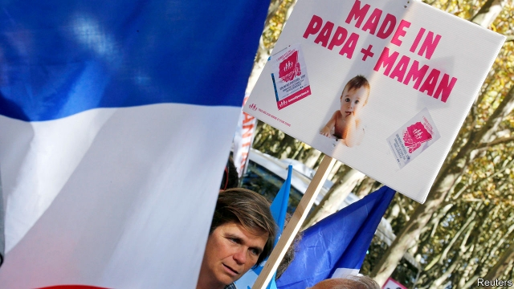

###### One tummy, two mummies

# IVF for lesbians pits French progressives against traditionalists 

 

> print-edition iconPrint edition | Europe | Oct 3rd 2019 

SINCE BELGIUM legalised the use of IVF by gay female couples in 2007, its fertility clinics have been overwhelmed by demand—and not only from its own citizens. At one Belgian clinic in the French-speaking region of Wallonia roughly a third of patients are now from over the border in France. The reason is simple: strict French laws still restrict the use of IVF to heterosexual couples only. 

France is now liberalising those rules. The consequence is a new skirmish in its hard-fought culture war. 

The draft law, which went to parliament on September 24th, will for the first time give gay female couples and single women the right to use IVF and other forms of assisted reproduction. This will end rules that put France at odds with most of its neighbours (though Germany still applies similar restrictions). France will also let both mothers be identified on a birth certificate. For women under the age of 43, the cost of treatment will be fully reimbursed by the state. 

During his election campaign in 2017 Emmanuel Macron said he favoured liberalisation, denouncing the existing rules as a form of “intolerable discrimination”. Around 25,000 children in France each year, or 3% of the total, are born thanks to fertility treatment, at a cost to the taxpayer of about €300m ($328m). The government estimates that another 2,000 women a year would be treated after the change in the law, at an extra annual cost of no more than €15m. France, it argues, needs to catch up with the times. “The criterion that defines a family,” declared Agnès Buzyn, the health minister and a medical doctor, “is the love that unites a parent and a child.” 

Such views have cracked open the old division between liberals and family-values traditionalists. Having mobilised hundreds of thousands onto the streets against the legalisation of gay marriage six years ago, protesters are now planning their first big demo against Mr Macron’s law on October 6th. A group of over a dozen associations, including the Manif pour Tous, which organised the rallies in 2013, argues that “one cannot deliberately deprive a child of a father”. Their slogan, naturellement, is “liberty, equality, paternity”. 

The issue has agitated the political right. Marine Le Pen, leader of the National Rally (formerly the National Front), claimed that “the state is going to lie” to a child by stating it has two mothers. Her niece, Marion Maréchal, a young former deputy and unofficial champion of ultra-Catholic conservatives, organised a “convention of the right” in Paris, where one speaker railed against the “extermination of the white heterosexual male”. Giving gay couples access to IVF, says Ms Maréchal, is part of a “stupid injunction to ‘be modern’”. Her pitch echoes the views of the Catholic church. “I’m not sure that the figure of the father is optional,” Michel Aupetit, the Archbishop of Paris, told French radio this week, claiming that “most psychiatrists today say there is a need for a male reference, who is not just an uncle.” 

The bill’s opponents claim it is the first step towards granting broader rights to gay couples, notably over surrogacy, which is illegal in France. During his campaign Mr Macron ruled that out, though he did promise to grant clear legal status to children born through surrogacy abroad. Marc-Olivier Fogiel, a well-known French broadcaster, has done much to help normalise such families by publishing a book last year about his and his husband’s quest to become parents via surrogacy in America. Mr Macron has yet to fulfil his promise. 

Recent French presidents have tended to pass their own piece of landmark progressive social legislation. Valéry Giscard d’Estaing legalised abortion in 1975; François Mitterrand abolished the death penalty in 1981; François Hollande legalised gay marriage. This is Mr Macron’s signature bill: a way for him to distinguish his liberal, centrist politics from those of the conservative right. Yet France remains fragile after the civil disorder of the gilets jaunes protests, and Mr Macron has already delayed the bill for fear of fresh unrest. Those fighting France’s culture wars are a somewhat different crowd, but no less determined to make their voices heard. ■ 

