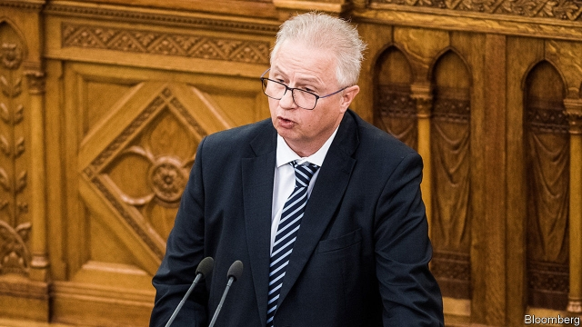

###### Parliamentary privilege

# Two European Commission nominees fall at the first hurdle 

 

> print-edition iconPrint edition | Europe | Oct 3rd 2019 

FEW PEOPLE expected the European Commission’s proposed new team to emerge intact from the confirmation hearings that started in the European Parliament this week. Claiming the scalp of at least one aspiring commissioner has become a tradition for the EU’s elected legislature. But the decision of a parliamentary committee to rule out two nominees before the full hearings had even started, an unprecedented move, suggests that the parliament’s vetting process will be even spikier this time round. By the time The Economist went to press the fate of three more nominees, including France’s Sylvie Goulard (a close associate of President Emmanuel Macron) appeared uncertain. 

The first casualty was Laszlo Trocsanyi, Hungary’s former justice minister. In a secret ballot the parliament’s legal-affairs committee, charged with poring over the nominees’ financial declarations before hearings begin, declared him unfit to be commissioner. The committee’s digging revealed that a law firm bearing his name had been contracted to provide legal services to Hungary’s state-owned nuclear power plant while he was minister. Mr Trocsanyi says that he no longer owns shares in the firm, adding that it had not won any new government contracts during his ministerial term. But parliamentarians also pounced upon the appointment of one of the firm’s owners as his personal adviser in the justice ministry. 

Eyebrows were raised higher when it emerged that the power plant’s main contractor was Russia’s state-owned nuclear energy corporation. This is not Mr Trocsanyi’s first flirtation with Moscow: as justice minister, he ignored an American request to extradite a Russian father-and-son arms-dealing duo. Instead, he sent the pair back home, where they were promptly released. As his portfolio, enlargement policy, was supposed to include cultivating diplomatic ties in the western Balkans, Russia’s backyard, parliamentarians fretted about a conflict of interest. 

Rovana Plumb, Romania’s candidate for the transport portfolio, was also summoned before the committee after failing to declare two loans worth nearly €1m ($1.1m). One was intended to cover a donation to her party, whose former leader was imprisoned in May for putting party loyalists on the public payroll. Her aspiration to become Europe’s transport commissioner was dashed when she could not explain how she intended to pay back her debts. She strongly denies any wrongdoing. 

At first, the leaders of Hungary and Romania stood by their candidates. Viktor Orban said Mr Trocsanyi’s only sin was withholding support for Brussels-backed proposals to share responsibility for refugees. Viorica Dancila blamed Romania’s opposition for mounting a character assassination. But Ursula von der Leyen, the new commission’s German president-elect, swiftly demanded that new candidates be picked, a request both prime ministers have now met. 

As the two rejects hail from the parliament’s centre-right and socialist groups, rumours swirled that a liberal, preferably from western Europe, would be next. In her hearing on October 2nd, parliamentarians took Ms Goulard to task over an ongoing probe into the alleged use of European Parliament funds to pay party employees. Equally incendiary was her role as a paid adviser to an American think-tank. 

Along with the nominees from Poland and Sweden, she faces another round of questioning. Her supporters suspect she is being scapegoated to pay back Mr Macron for thwarting the centre-right group leader’s ambition of running the commission. The process could get bloodier yet. ■ 

