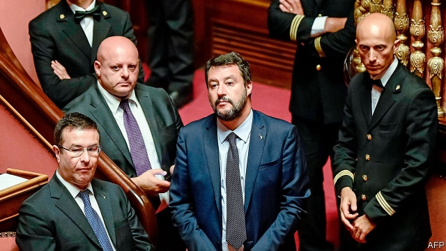
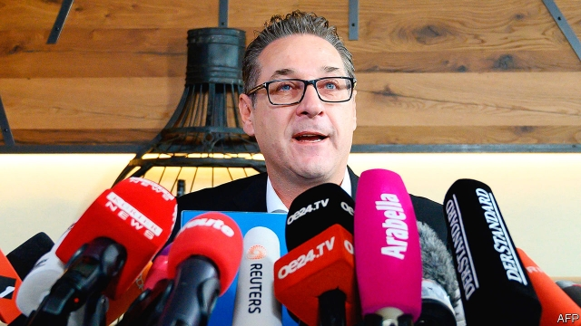

###### Populists under pressure

# Voters turn against the populist right 

 

> print-edition iconPrint edition | Europe | Oct 3rd 2019 

LOOK BACK a year, and remember how disquieting European politics seemed. Matteo Salvini, by far the most popular politician in Italy, and France’s equally xenophobic Marine Le Pen had just teamed up with Steve Bannon, Donald Trump’s former strategist, as part of what Mr Bannon called The Movement. This alliance of nativist parties of the right, soon to acquire a “gladiator school” based in a monastery near Rome, intended to sweep the forthcoming European elections and tilt the continent’s politics firmly away from the liberal centre ground. They had their difficulties, of course. The Eurosceptic and anti-migrant Alternative for Germany (AfD) decided to steer clear of Mr Bannon, and other right-wingers were wary too. But, with or without the American Svengali, populists seemed in the ascendant. In France the gilets jaunes (yellow jackets), who drew support from the radical right and left, were about to explode onto the streets. 

The scene today is rather different. The European Parliament elections in May dashed Mr Bannon’s hopes. Mr Salvini’s Northern League did do well. But elsewhere the parties of the hard right fell back, or at best marked time. Since then, things have on the whole got worse for them. Mr Salvini is out of Italy’s government, having bungled an attempt to secure uncontested power, and has fallen back in the polls; in Hungary, Viktor Orban’s populist ruling party faces the threat of losing control of the country’s capital, Budapest, and perhaps other cities at local elections later this month. The gilets jaunes have been tamed by President Emmanuel Macron. And this week came the news that another key component of the populist right, Austria’s, has come to grief at the ballot box. 

All of these setbacks are partial and reversible. Even where the right-wingers have fallen back in places, they are far from a spent force. In Poland, for instance, the Law and Justice party, another example of the populist right, is expected to be re-elected on October 13th; the AfD also did well in state elections in Germany last month. 

But liberals can be excused a little satisfaction as they look at recent events. Take Austria first. In May the government collapsed after two German newspapers revealed footage from a video shot inside an Ibiza villa in 2017, showing Heinz-Christian Strache, Austria’s vice-chancellor and the leader of the hard-right Freedom Party (FPö), discussing corrupt deals with a woman posing as a Russian oligarch’s niece. The election on September 29th, triggered by the scandal, was a disaster for the FPö. It took just 16% of the vote, almost ten points less than in the 2017 election, and lost 20 MPs. Many voters defected to the centre-right People’s Party (öVP), which until Ibiza-gate was the FPö’s senior partner in government. Its young leader, Sebastian Kurz, will now sound out the Greens, the other big winner, as a coalition partner. Mr Strache has quit politics. 

Mr Kurz had invited the FPö into coalition in 2017, telling concerned European leaders that he could tame its worst impulses. That seems to have been optimistic. The government was scarred by scandal during its short life, ranging from racist incidents involving FPö officials to an illegal raid on the domestic intelligence agency orchestrated by Herbert Kickl, an FPö hardliner who served as interior minister. 

Being out of office does not, of course, mean that the FPö has vanished. The party hopes to recuperate in opposition. History suggests it will do so. It has been a fixture of Austrian politics for over 60 years, exploiting popular frustration with the long duopoly of the öVP and the Social Democrats, and the corporatist Proporz system that divvied up public jobs and doled out patronage between the parties. Its xenophobia has been less of an electoral handicap in a country that did not go through a German-style post-Nazi reckoning. So when one or other mainstream party has grown tired of grand coalitions it has usually had nowhere to turn but to the FPö. Expect to hear from the party again in due course. 

The same is true in Hungary. Mr Orban’s Fidesz party remains all-powerful in villages and small towns, but faces a strong challenge from the (almost) united opposition in Budapest and larger provincial cities at local elections due on October 13th. The Fidesz party machine has responded with both the potato and the stick: in Budapest’s 11th district, 10 kilo sacks of potatoes were sold for less than a euro, with a picture of the local Fidesz mayor attached, and a recipe for rakott krumpli, a Hungarian potato, egg and sausage delicacy. 

There have also been fierce attacks on Gergely Karacsony, the united opposition candidate for mayor, who is running neck and neck with Istvan Tarlos, the Fidesz-backed incumbent, according to polls. After coming to power in 2010, Mr Orban changed Hungary’s electoral law to create a system that favours the strongest party—his own. It has taken the other parties, from left to right, years of squabbling and in-fighting to realise that the only way to challenge him is to band together, using primaries. Now they have done so. If they succeed, they will have a useful platform from which to challenge Mr Orban at the next parliamentary elections, due in 2022. 

But it is in Italy that the fortunes of the populists have suffered the most consequential reverse. The European election was a resounding success for Mr Salvini. His party took more than a third of the votes in Italy. His non-stop campaigning and uncompromising stance on immigration helped his party to unprecedented heights in the polls. By early July, it was averaging 37.5%—a level of support that tempted him to take the misguided decision the following month to bring down the government of which he was part in the hope of forcing an election. 

 

The effect, instead, was to catapult his coalition partners in the anti-establishment Five Star Movement (M5S) into the arms of the centre-left Democratic Party (PD), creating a new parliamentary majority that underpins Giuseppe Conte’s second government. Since it was sworn in last month, Mr Salvini has plainly shrunk in stature. Deprived of power and the attention it attracts, he can no longer force himself to the top of the news agenda. Support for the League has fallen to below 32%. 

Still, the League remains Italy’s biggest party, more than ten points ahead of either the PD or the M5S in the polls. Though down, Mr Salvini is certainly not spent. By removing himself from office, he has avoided having to reconcile his extravagant promises to the electorate with the reality of Italy’s public finances. On September 30th the new government approved a framework document that proposes an increased budget deficit of 2.2% of GDP. That may yet prove too much for Brussels, provoking a fresh showdown. 

Mr Salvini’s prospects will depend on two factors. The first is immigration. The new government has scrapped his policy of closing Italian ports to the NGOs that rescue migrants from the Mediterranean. It is hoping instead to extend a scheme agreed last month with France, Germany and Malta for the voluntary redistribution of asylum seekers landing on Italian shores. But a surge in arrivals would boost Mr Salvini’s popularity. Though still low, the number has risen sharply since he left office. 

However popular Mr Salvini becomes, the League will not get back into power unless the current coalition falls. So how the government manages the tensions between its component groups will be decisive. The PD and the M5S have a long record of mutual animosity, and a split in the PD caused by Matteo Renzi, a former prime minister, has not helped. The new government is trying to change an electoral system that, thanks to its large number of first-past-the-post seats, helps the League. Much depends on whether the new coalition lasts long enough to do it. 

As for Mr Bannon, he now faces being kicked out of his monastery by the authorities who say his associates there, who deny any wrongdoing, have failed to meet their financial obligations. But in Italy, as elsewhere, the battle is never over. ■ 

