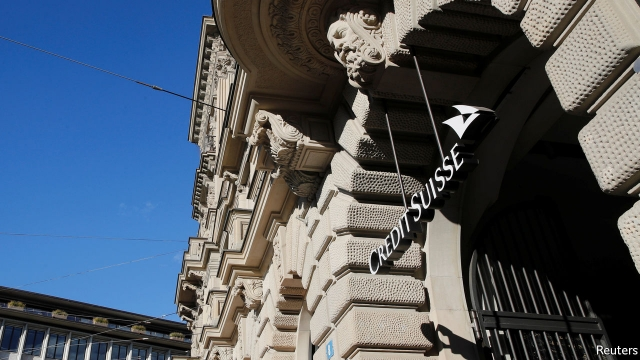

###### Discredit Suisse

# A spying furore rocks Credit Suisse 

 

> print-edition iconPrint edition | Finance and economics | Oct 3rd 2019 

AT NOON ON September 17th, in central Zurich, Iqbal Khan confronted a man he suspected of following him. The suspicion was correct. The incident sparked a criminal investigation, still under way, and a speedy inquiry by Homburger, a law firm, for Credit Suisse, Mr Khan’s former employer. The inquiry led on October 1st to the resignation of Pierre-Olivier Bouée, the bank’s chief operating officer, and Remo Boccali, its head of security. 

Until July Mr Khan oversaw Credit Suisse’s wealth-management business outside Switzerland and Asia. He was a star. The chief executive, Tidjane Thiam, was reorienting the bank towards wealth management and away from the riskier bits of investment banking, and after a rocky start the bet was paying off. In the second quarter of 2019 the bank’s return on equity was 9.7%, a shade under the 10% that investors regard as par. Revenues and profits in Mr Khan’s division had grown nicely. 

Alas, Mr Thiam and his talented, ambitious protégé had fallen out. Living next door to each other made matters worse. Mr Thiam was reportedly annoyed by Mr Khan’s lengthy building works; Mr Khan, by Mr Thiam’s planting of trees on the boundary. Eventually Mr Khan quit the bank. On August 29th UBS, Credit Suisse’s bigger local rival, said he would become its co-head of global wealth management. 

According to Homburger’s report, Mr Bouée decided to have Mr Khan observed, fearing that he would try to poach employees or clients. The fact that Mr Khan continued to socialise with ex-colleagues while on gardening leave added to his worries. The report says Mr Bouée admitted acting alone, telling no other executives or board members, including Mr Thiam. Homburger found no evidence that Mr Thiam knew anything until the day after Mr Khan spotted his shadow. The lawyers noted that they had no access to police or prosecutors’ files, and that some messages between Mr Bouée and security staff had been deleted. But a trawl of messages between Mr Thiam and Mr Bouée yielded nothing. 

Despite his exoneration—and the robust support of both the biggest shareholder and the chairman, Urs Rohner—the slightly farcical affair is a blow to Mr Thiam. He has lost two of his top brass within three months. The split with Mr Khan may have been inevitable, but Mr Bouée was a colleague of long standing. He was one of only a few outsiders Mr Thiam brought in when he took over at Credit Suisse in 2015; despite the bank’s troubles, he liked most of what he saw. Mr Bouée was chief risk officer at Prudential, a British insurer which Mr Thiam headed before making the leap to banking, and the two had also worked together at Aviva, another insurer, and McKinsey, a consulting firm. As chief operating officer at Credit Suisse, Mr Bouée was instrumental in the tighter cost control that, with the push into wealth management and greater investment in Asia, has been a hallmark of Mr Thiam’s tenure. Operating costs have been cropped by 18% in the past four years. 

On October 1st Mr Rohner apologised to staff, clients and shareholders—and to Mr Khan. Neither the surveillance nor the Homburger probe found any evidence that he had tried to poach anybody. He took up his job at UBS the same day. 

The affair seems to have cost something far more important than reputations and jobs. On September 24th a middleman who, on Credit Suisse’s behalf, had hired the firm that watched Mr Khan died, apparently by his own hand. ■ 

