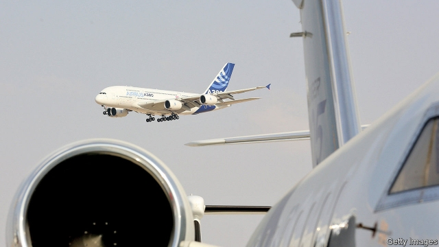

###### Plane clash

# America is preparing to hit $7.5bn-worth of European imports with tariffs 

 

> print-edition iconPrint edition | Finance and economics | Oct 3rd 2019 

MOST MUSEUM exhibits are beautiful—or at least old. But an exhibition in 2015 at the World Trade Organisation (WTO) included 60 cardboard boxes of documents. The point was to give a sense of the scale of two of the body’s longest and largest legal disputes, over American and European subsidies for aircraft manufacturers. Now the fight is moving out of the paperwork phase. That means tariffs are coming. 

On October 2nd the WTO published its decision to allow the Trump administration to put tariffs on $7.5bn-worth of imports from the European Union. That is intended to match the harm done to Boeing, an American manufacturer, by the EU’s subsidies for Airbus, Boeing’s European rival. It is the largest retaliation the WTO has ever approved. Senior officials at the United States Trade Representative (USTR) called the victory “historic”. 

The dispute has been long and bitter. In October 2004 America complained to the trade body about loans offered by EU governments to Airbus on easy terms. The following June the EU filed a complaint about the harm to Airbus from subsidies to Boeing, in the form of tax breaks and generous contracts with the Department of Defence. Since then there has been enough legal back-and-forth to bore the most ardent plane-spotter. The WTO ruled against both subsidisers. Each made some adjustments supposed to resolve the other’s complaints—but neither was satisfied. The latest judgment comes as the EU’s claim of compliance is still being assessed. In around eight months, the WTO is likely to authorise the EU to put tariffs on American imports, completing the tit for tat. 

In a narrow sense, this is the multilateral rules-based trading system working as intended. Both parties went through the proper channels to receive an official judgment. Neither took matters into its own hands. The tariffs America is about to impose on Europe are not unilateral bullying, but an enforcement mechanism of last resort. They would probably have been applied by any president, even one less tariff-happy than Donald Trump. 

In a broader sense, it shows how vulnerable those multilateral rules are to timewasters. In a sector like aircraft manufacturing, where subsidies are ubiquitous, it has always been clear that America and the EU needed to agree to mutual disarmament. Instead, they have talked past each other, each complaining at various points that the other was unwilling to negotiate. Most recently it has been the EU that has submitted proposals to America, only to be rebuffed. Meanwhile, the boxes have been piling up and the lawyers raking in fees. 

The Trump administration wasted no time in starting the formalities at the WTO that will allow it to apply the tariffs. That means the EU can expect tariffs on October 18th. As well as tariffs of 10% on large aircraft and 25% on agricultural and industrial goods, the list the USTR published on October 2nd included Italian Parmesan, Scotch whisky and German waffles. Even if a product is not on the list it may still be hit, as items could be shuffled in and out. 

For all the fuss the dispute will generate among connoisseurs of European cheese, the biggest impact will be on aircraft, of which America imported $5.1bn-worth in 2018, mostly from France and Germany (the USTR has said that only a portion will be hit). It could have been worse—the Americans could have applied a tariff of up to 100%—but even one of 10% will bite. American airlines fear that tariffs will raise the price of Airbus aircraft, and that Boeing will lack the capacity to expand supply. 

Perhaps the WTO will find that the EU has removed its subsidies, and the Americans will stand down. Or in eight months’ time, when the WTO authorises the EU to place retaliatory tariffs on American imports as part of the Boeing dispute, the two sides might finally negotiate away their differences. By then Mr Trump’s appetite for tariffs may have been sated, and he might abandon separate threats to put tariffs on European cars and car parts. But it is also possible that trade disputes between the two sides become fiercer. America is blocking the appointment of judges to the WTO’s court of appeals. If either side makes a move that the other judges an infraction, and a complaint to the WTO cannot be heard for lack of judges, that could be the end of playing by the rules. ■ 

