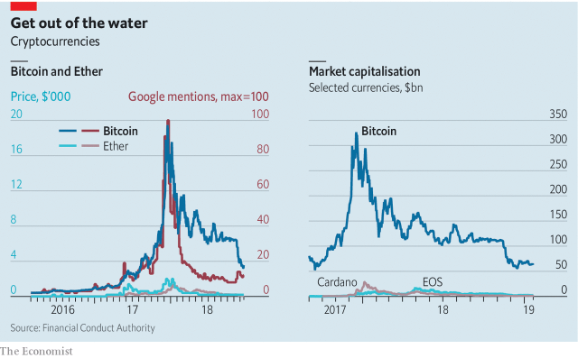

###### Too dicey

# Betting on bitcoin prices may soon be deemed illegal gambling 

 

> print-edition iconPrint edition | Finance and economics | Oct 3rd 2019 

ON SEPTEMBER 24TH the price of a single bitcoin, the best-known cryptocurrency, fell by $1,000 in 30 minutes. No one knows why, and few people cared. There have been similar drops nearly every month since May. Yet for one obscure corner of the market, it mattered. Exchanges that sell “long” bitcoin derivatives contracts, with which traders bet that prices will rise without buying any coin, soon asked punters for more collateral. That triggered a stampede. By the end of the day $643m-worth of bitcoin contracts had been liquidated on BitMEX, a platform on which such contracts trade. Bets on other cryptocurrencies also became toxic. 

Crypto-derivative products, which include options, futures and more exotic beasts, are popular. More than 23bn have been traded so far in 2019, according to Chainalysis, a research firm. But tantrums such as last month’s have put them in regulators’ cross-hairs. Japan is considering stringent registration requirements. Hong Kong bars retail investors from accessing crypto funds; Europe has had stiff restrictions since last year. Now the Financial Conduct Authority (FCA), a British watchdog, is proposing a blanket ban on selling crypto-derivatives to retail investors. A consultation ended on October 3rd. Its decision is expected in early 2020. 

It would take an earthquake for the FCA not to press ahead. In the real world, importers buy derivatives as a defence against slumps in their domestic currency. But crypto-monies are not legally recognised currencies. They do not reliably store value, rarely serve as a unit of account and are not widely accepted. Peddlers of crypto-derivatives, the FCA says, cannot claim their wares are needed for hedging purposes. 

That explains why most such derivatives are marketed as investment products. Yet they are not tempting places to park savings. The assets they track are hard to value: virtual monies promise no future cash flows. Prices across cryptocurrencies are strongly correlated, suggesting that demand does not stem from usage or technological advances. Instead it responds to hype (for which Google searches are a proxy; see chart). Thin trading means that prices differ widely between crypto-exchanges, making them a poor reference for derivative contracts. Illiquidity also amplifies swings: bitcoin is four times more volatile than risky physical commodities. 

 

The FCA thinks crypto amateurs fail to understand all this. It estimates that investors in Britain made total losses of £371m ($492m) on crypto-derivatives from mid-2017 to the end of 2018 (net profit was £25.5m, but was mostly captured by the largest investors). Two other features can make losses catastrophic: leverage (platforms typically allow derivative traders to borrow between two and 100 times what they put in) and high trading costs. The FCA thinks its mooted ban could reduce consumer losses by up to £234m a year. 

Insiders disagree. “This is a knee-jerk reaction,” says Jacqui Hatfield of Orrick, a law firm. “Crypto-derivatives are just as risky as other derivatives.” A ban could mean consumers invest directly in unregulated cryptocurrencies instead. Exchanges could relocate. In any case, says Danny Masters of CoinShares, which sells crypto vehicles, the regulator should not be choosing which technology thrives or fails. 

Yet it is part of the FCA’s mandate to protect consumers against predators. Nearly $1bn in virtual coins were stolen from crypto-exchanges and infrastructure last year, 3.6 times more than in 2017. Such thefts hit the value of derivatives. Manipulation is also rife. “Retail investors are diving in a pool of sharks,” says David Gerard, a bitcoin sceptic. As regulators close in on market abuse, defenders of crypto-derivatives are swimming against the tide. ■ 

