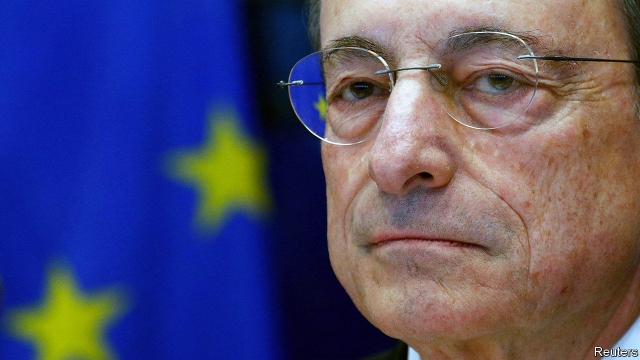

###### Calming the hawks

# Can Germany cool its monetary-policy debate? 

 

> print-edition iconPrint edition | Finance and economics | Oct 3rd 2019 

NOTHING INSPIRES German newspaper illustrators like the European Central Bank’s monetary policies. Bond-buying is represented as a tsunami of cash. An uptick in inflation becomes a euro-gulping great white shark. After Mario Draghi, the ECB’s outgoing president, pushed deposit-rate cuts and a promise to restart quantitative easing (QE) through its governing council last month, Bild, a tabloid, depicted him cloaked and fanged, as “Count Draghila”. 

German complaints are long-standing. The ECB’s Strafzinsen (“punishment rates”) expropriate savers. Banks suffer from negative rates they cannot pass on to customers. Cheap money fuels housing bubbles. The ECB is stealthily extending its mandate beyond price stability to redistribution. This week Oliver Bäte, the boss of Allianz, Europe’s largest insurer, joined the attack, lambasting the ECB in an interview with the Financial Times for “multiplying risk”. 

Some fear such attacks risk weakening support for the single currency in its largest economy. But criticism from mainstream German politicians is now more muted than in 2016, when Wolfgang Schäuble, a former finance minister, blamed easy money for the rise of far-right populism. Inside the ECB council, the idea of sometimes using unorthodox monetary tools is no longer contested. On the big questions, Mr Draghi leaves office vindicated. 

Yet his tactics are increasingly questioned. At least seven council members are reported to have objected to restarting QE. Dissenters worried that additional unconventional stimulus might do more harm than good. Several central-bank governors took their concerns public. On October 2nd Jens Weidmann, the Bundesbank’s hawkish head, said he would oppose any effort to lift caps on bond-buying which the ECB will probably eventually hit. For his part Mr Draghi fears that airing dirty laundry damages the bank’s credibility. 

Mr Draghi has consistently urged governments with fiscal space to relieve the pressure on the ECB by spending more. In Germany public debt is low, borrowing costs are negative, investment needs are acute and recession appears imminent. Yet the coalition clings to its “black zero” principle of no net borrowing. A serious downturn would probably inspire some sort of stimulus, but it could come too late. 

Henrik Enderlein of the Hertie School of Governance in Berlin fears that the ECB’s stimulus gives Germany’s politicians an excuse not to act. “It gives governments a signal that we are there to rescue you,” he says. But Frederik Ducrozet, an ECB-watcher at Pictet Wealth Management, notes that lower interest payments make it easier to loosen fiscal policy. The Bundesbank reckons low rates saved the German state €368bn ($402bn) in the decade to 2018. 

Later this month the German finance ministry must name a replacement for Sabine Lautenschläger, a monetary hawk who unexpectedly resigned from the ECB’s executive board in September. One favourite is Isabel Schnabel, a member of Germany’s advisory Council of Economic Experts. She has criticised the shrill tone of the country’s monetary-policy debate. Such a choice would signal the German government’s desire to cool the temperature. Christine Lagarde, who replaces Mr Draghi on November 1st, would surely be grateful; three days after that, she gives her first speech as ECB president—in Berlin, at an event to honour Mr Schäuble. ■ 

