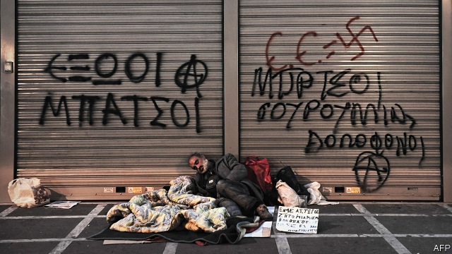
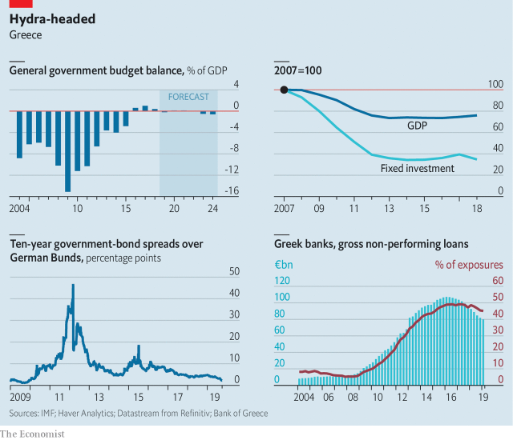

###### To hell and back

# Can Kyriakos Mitsotakis ensure the Greek economy starts growing again? 

 

> print-edition iconPrint edition | Finance and economics | Oct 3rd 2019 

THE AIRPORT at Hellinikon, a few miles south of Athens, closed in 2001. Planes belonging to Greece’s now-defunct national carrier still litter the runway. Nearby a stadium built for the Olympics in 2004 gently crumbles. In the distance, a marina borders the glistening Aegean. In 2011, when Greece was in the throes of a sovereign-debt crisis, the government put the site, which is three times as large as Monaco, up for sale. In 2014 it was snapped up by a consortium that planned to build homes, hotels and a casino. At an expected cost of some €8bn ($8.7bn), it was Greece’s largest investment project. 

Five years on, ground has yet to be broken. When Syriza, a left-wing party, formed the government in 2015, it reopened the terms of the sale. Ambivalent ministers held up licences. The authorities demanded numerous archaeological surveys. Locals sued. Apart from boats docking in the marina and the occasional security guard on patrol, the site now lies desolate. 

Officials from the IMF and European Union who flew into Athens’s new airport in September are thus not short of examples of the difficulties of doing business in Greece. When the sovereign-debt crisis struck they bailed the country out on condition that it enact deep fiscal cuts and far-reaching regulatory reforms. Last year the EU struck a debt-relief deal, allowing Greece to exit its third and final bail-out, despite a public-debt burden of 180% of GDP. It required Greece to continue with reforms while hitting eye-watering targets for the primary-budget surplus (that is, before interest payments) of 3.5% until 2022, and then 2.2%, on average, all the way to 2060. In return it offered some interest-rate relief and extended the maturity of some loans. 

The centre-right government led by New Democracy, which took over from Syriza in July, is preparing to present a draft budget to parliament on October 7th. The process of assessing those plans against that debt deal has begun. A primary surplus of 3.5% this year appears to be in the bag. But the government hopes to negotiate leniency next year so that it has fiscal space to cut taxes. Wrapping up its annual mission to Greece on September 26th, the IMF blessed lower fiscal targets, pointing to the damage austerity had inflicted on public investment and social spending. 

Kyriakos Mitsotakis, the prime minister, wants to transform Hellinikon into a symbol not of the hurdles to doing business in Greece, but of the country’s new openness to commerce. Permits have been fast-tracked, and the developers hope to bring in the bulldozers next year. But it will take much more than the approval of one big project to revive Greece’s economy. Mr Mitsotakis must deal with twin legacies of the crisis: paralysed banks and cripplingly tight fiscal policy. He must also try to reform a bureaucracy that is more typical of a developing country than of a member of a huge and sophisticated currency bloc. 

Greece’s economy began expanding in 2016, after years of depression. But annual GDP growth rates have been anaemic, at 1-2%. Unemployment is still 17%; the youth rate, twice that. On the current trajectory, the IMF says the economy will labour below its potential until 2023. Nor is the calculus of debt-sustainability likely to change soon. Even as investment elsewhere in southern Europe has recovered, says Kathrin Muehlbronner of Moody’s, a credit-rating agency, in Greece it has collapsed. It is still 60% below its 2007 peak. 

In Greece’s long agony during the euro-zone crisis, borrowers defaulted, saddling lenders with bad debts. A bank run in 2015 led to a liquidity crunch and capital controls. The last of the controls were lifted only in September. Gross non-performing loans (NPLs) have fallen by a quarter since 2016. But they still amount to €80bn, or 45% of exposures. As banks have been forced to make provisions for these assets and deprived of income from interest, lending has seized up. The stock of credit has shrunk every year since 2010, starving productive projects of capital. 

Mr Mitsotakis wants to lower the NPL ratio to single digits by 2021. That would imply a big acceleration in the pace of resolutions. He plans to copy Italy, where banks securitise bad loans with government guarantees. But that alone is unlikely to be enough to do the job. 

Even if businesses could access credit easily, a thicket of regulations deters expansion. It keeps foreign investors out, too: the stock of inward direct investment relative to GDP is much lower than in the rest of the EU. The government is trying to improve Greece’s image. One investor recounts how a friend who complained about red tape on Facebook was rung up by a senior civil servant promising to solve the problem. A lawyer recalls being phoned up late on a Saturday by a minister inquiring if the approvals he needed had been received. 

The first hurdle businesses face is registering property, which, according to the World Bank’s “Doing Business” report, is as complicated in Greece as in Somalia. Some of the delays at Hellinikon, for instance, were because of uncertain land-use designations. The country has begun work on a land registry. But it is already delayed, and resolving any ownership conflicts uncovered along the way will take years. 

Others require root-and-branch reform. Most businesses will become ensnared in litigation at some point, says Alexios Papastavrou of PotamitisVekris, a law firm, because starting legal action is largely costless, and judges will hear even frivolous cases. Disputes that have supposedly been settled can be reopened: he recounts a case where former employees sued their employer, even though they had signed a deal outside court. The courts are clogged up. On average, resolving a business dispute takes over four years. 

By far the biggest complaint from businesses, however, is about high tax rates. Alexis Pantazis, co-founder of Hellas Direct, an online car-insurance platform that operates in Cyprus and Greece, says that more than half of gross pay goes on taxes and social-security contributions. The result is that the cost of workers is 30-40% higher in Greece. It therefore makes sense to locate senior staff in Cyprus whenever possible. That is dismal news for a country already suffering from brain drain. According to Ms Muehlbronner, the number of 25- to 34-year-olds shrank by 380,000 between 2010 and 2018—equivalent to 6% of the workforce—mostly as they left the country in search of better fortunes abroad. 

 

Mr Mitsotakis says most of the reforms needed are “win-win”. The budget will include corporate- and income-tax cuts, and he hopes that the EU will grant him some fiscal space to do so. 

But austerity alone is not to blame for high tax rates. They also reflect choices made by successive governments. Although the rates of income and value-added taxes are higher than the EU average as a share of GDP, the revenue collected is lower, thanks to what the IMF tactfully calls a “weak payment culture”, and a narrow tax base. The gap between the expected revenue from value-added taxes and the actual sum raised was around 30% in 2018. The tax-free threshold for income tax is set at 60% of average pay, nearly three times the EU average. The result, says Miranda Xafa of the Centre for International Governance Innovation, a think-tank, is that over half of Greeks pay no income tax at all. 

Mr Mitsotakis has shown little interest in widening the tax base. Instead, like several predecessors, he has set up a tax-amnesty scheme, allowing taxpayers who come clean about past underpayment to pay their arrears in instalments in order to boost revenue. But such schemes perpetuate the weak payment culture, says Ms Xafa. Taxpayers wait for the next amnesty, rather than coughing up straight away. 

On the spending side, better-targeted benefits could make growth more inclusive. The IMF points out that Greece spends more on government wages and on old-age pensions, as a share of GDP, than the average euro-area country. Meanwhile relatively little is spent on benefits for the young and the unemployed, who are more likely to be poor. In the run-up to the election the previous government worsened the imbalance when it restored the pre-crisis practice of a bonus “13th month” pension. 

Mr Mitsotakis’s government is still in its honeymoon period. Businesses are delighted by an avowedly centre-right administration. Economic sentiment is at a 12-year high. Investors are bullish: the gap between Greek ten-year bond yields and those on German bunds has halved since the start of the year. It is easy to imagine that optimism starting a virtuous cycle. As the economy grows, reforms become easier. Being brought into the tax net is less painful when your pay is rising. Similarly, rebalancing public spending by ratcheting up working-age benefits at a higher rate than pensions would be more politically palatable than making cuts to pensions. 

But if fixing a country were easy, Greece would already have caught up with the rest of the EU. And a government’s honeymoon period can be wasted—particularly when the payoff from many of the needed reforms will take years—much like the completion of building work at Hellinikon. Mr Mitsotakis’s government has managed to get Greece’s economy as far as the runway. What happens next will determine whether it finally takes off. ■ 

