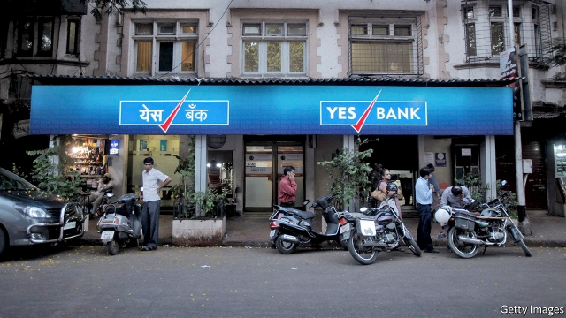

###### Lots of No-Nos

# It has been a torrid week for Indian banks 

 

> print-edition iconPrint edition | Finance and economics | Oct 3rd 2019 

BUSINESS DAYS now begin in India with a scan of the headlines and then a click to check on the shares of Yes Bank, the country’s fourth-largest private bank. They peaked at 394 rupees ($5.64) in August 2018, and have staggered downwards ever since. On October 1st they hit 32 rupees after a 23% drop on the day, before rising by 23% on October 3rd as The Economist went to press. 

Yes is not alone in its troubles. The shares of Indiabulls Housing Finance, the second-largest home lender—and, not coincidentally, a big borrower from Yes—have also plummeted. Late last month the Reserve Bank of India (RBI), the central bank, suddenly capped withdrawals from a small lender, Punjab and Maharashtra Co-operative Bank. That brought into the open what a police investigation now alleges was a vast lending fraud. Rumours of similar issues at other financial institutions prompted the RBI to tweet on October 1st reassuring “the general public that the Indian banking system is safe and stable and there is no need to panic”. 

That is unlikely to help. Such words from a financial authority are prone to be heard as a signal to stampede. Even if that is averted, India’s banks are obviously faltering. They are still dealing with the overhang from a splurge of bad lending years ago. Yes Bank is merely a particularly marked example. The RBI has been concerned about the source of its seemingly impressive growth for some time. 

But only in January this year did the regulator push out the bank’s founder and chief executive, Rana Kapoor. Write-offs followed, but there are worries about what remains to be uncovered. A report by Credit Suisse estimated that 9.4% of Yes Bank’s loans are in the process of being restructured—far higher than the 2.8% average for India’s other banks. It will probably need to raise capital, but that will be hard. 

Although Yes’s problems are real, market movements may be exaggerating them. Some of the selling pressure has come from the forced liquidation of a large stake that had been retained by Mr Kapoor but pledged as collateral for loans. Holding companies linked to him have also sold shares to cut their debt. These sales created a vicious circle that may now be exhausted. The optimistic case for India’s banks is that something similar is playing out across the financial system: real problems, and an overheated market response. But for the market-watchers who have become accustomed to shocks, India’s banks steadying themselves would be a real surprise.■ 

