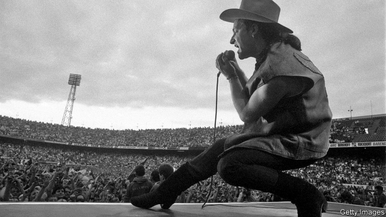
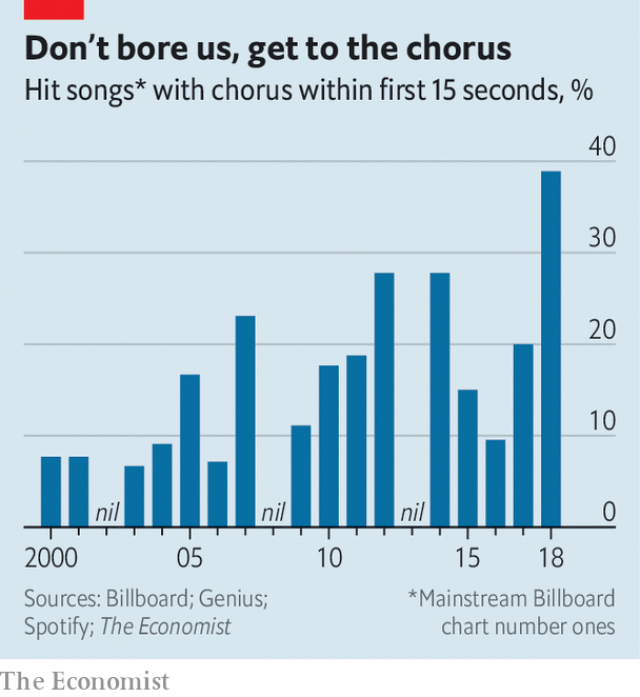

###### Don’t stop me now

# The economics of streaming is changing pop songs 

 

> print-edition iconPrint edition | Finance and economics | Oct 5th 2019 

“WHERE THE streets have no name”, the first song on U2’s blockbuster 1987 album, “Joshua Tree”, begins with 40 seconds of ambient noise. A guitar arpeggio enters and accelerates into the driving rhythm of the drums and bass that arrive around 1:10. Nearly two minutes pass before Bono breathes the first lyrics. Such leisurely intros are no more, says Justin Kalifowitz of Downtown Music Publishing, a rights manager. Streaming platforms like Spotify have reshaped the music business—and pop songs. The gist of it: songwriters now get to the good stuff sooner. 

From sheet music to MP3s, technology has long influenced the form of music. Ever since songwriters have been paid royalties, however, one thing was constant: compensation was tied to sales. But last year streaming accounted for almost half the industry’s revenues of $19.1bn. In America, the share was 80%. 

Artists are paid per play—provided the listener stays tuned for at least 30 seconds. Each stream earns a tiny fraction of a cent. And just 13% of that goes to the songwriter, says David Israelite of the National Music Publishers Association, an American trade group. To make half-decent money, a song needs millions of plays. 

The pressure is greater since overall revenues are lower than in the music industry’s heyday around the turn of the millennium. Global revenues are at least recovering from a low of just $14.3bn in 2014, when piracy was rampant and business models had yet to adapt to the digital age. 

 

It helps to be included on a streaming company’s playlist. These account for roughly a third of all streams. Tracks are selected by opaque algorithms, but by analysing performance data you can work out what the bots like, says Chiara Belolo of Scorpio Music, a boutique label. Composers are adapting to what they think is being looked for. Hit songs are shorter. Intros have become truncated, says Mr Kalifowitz, “to get to the point a bit faster”. 

Choruses are starting sooner (see chart). Take this year’s most-streamed Spotify track. The first notes on “Señorita”, by Shawn Mendes, preview the refrain, which arrives 15 seconds in and is a fixture throughout the playing time of 3:10. 

 

The dominant model splits streaming revenues between artists in proportion to their share of total streams. Some think this is overly generous to superstars. They prefer a “user-centric” alternative, in which revenues brought in by a particular customer are doled out in proportion to streams, but only among the artists that customer listens to. The difference is that if two users bring in the same revenue, each stream by the lighter user is worth more to the artist. 

Deezer, a French streaming service, is planning to move to a user-centric system next year. A Finnish study in 2017 suggested that would boost the earnings of artists of middling popularity—though Spotify’s former director of economics thinks it neglected to account for higher administrative costs. To the extent that playlists are filled with blockbuster songs, and are disproportionately popular with the heaviest listeners, the study is probably right. “Until we try, we will not know,” says Alexander Holland of Deezer. But one thing is a near certainty: long, atmospheric intros are unlikely to make a comeback. ■ 

