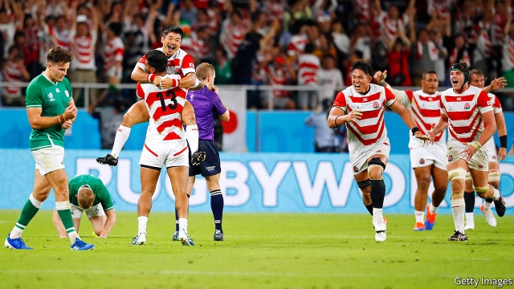
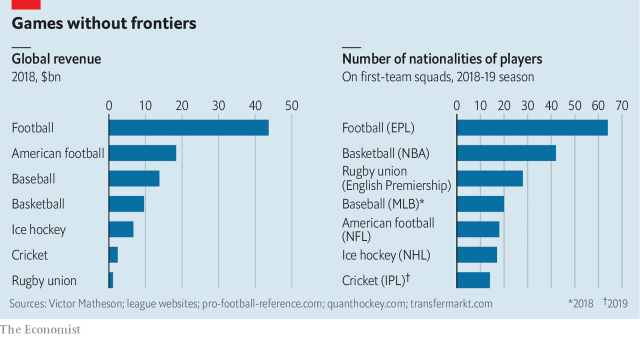

###### Ahead of the game

# Competition between sports for fans’ money and attention is increasingly fierce 

 

> print-edition iconPrint edition | International | Oct 5th 2019 

THE EARLY stages of this year’s rugby World Cup provided one of the greatest upsets in the event’s 32-year history. On September 28th, in the sweltering heat of the Shizuoka Stadium, the hosts, Japan, beat Ireland, then the second-best team in the world, for the first time ever. The result sparked raucous celebrations around the country. Japanese TV presenters bowed in front of images of the victors before reading the news. The commissioner of the Japan Sports Agency boasted that his country had rewritten sporting history. 

The sport’s bosses are hoping that such standout events will attract more than its usual followers. Rugby and other games are increasingly concerned about their commercial future. Technology allows fans to watch any game at any time from anywhere. That, combined with a growing world population, means that in terms of sheer numbers, sports audiences are bigger than ever. But growth in revenues has slowed, according to PwC, a consultancy. Attention spans are shrinking. The “stickiness” of viewers—the number of minutes of a game that they watch—is dwindling, says Kevin Alavy, the head of Futures Sport, another consultancy. An annual decline of 3% in the number of minutes watched per game per sport per year is common. Sports that drag on for hours, if not days, such as cricket, are particularly vulnerable, as viewers impatiently resort to alternative entertainment on their smartphones—including clips of the highlights. Cricket sells the rights to show such clips separately from those to screen whole matches. 

This pressure is leading to increasingly intense competition between sports for fans’ money and attention. The stakes are high. Sport is a serious business, generating around $90bn a year, reckons Victor Matheson, a sport economist at the College of the Holy Cross in Massachusetts. 

In America major sports are still extremely valuable to advertisers and pay-TV providers because almost every other type of entertainment offered on television has suffered far worse declines in viewership. MoffettNathanson, a research firm, found in a recent survey of 5,000 Americans that half watched sports at least once a month, and that of those, 90% still subscribe to pay-TV. Only 67% of the respondents who do not watch sports have pay-TV. So while Netflix has eroded pay-TV viewership, the live sporting match remains a draw that is less replaceable—except by other live sporting matches. 

Football remains indisputably the world’s favourite sport. It generates revenues of around $40bn a year, says Mr Matheson, almost twice as much as the next most lucrative sport, American football, five times as much as basketball and 20 times as much as cricket (see chart). Its overall market share has grown since 2000, according to Futures Sport. It is simple to play and easy for fans around the world to follow. FIFA, the sport’s governing body, has invested huge sums of money in emerging markets. The women’s game has galvanised the sport still further; this year’s women’s World Cup was watched by more than a billion viewers. And football’s popularity has soared in China and America, especially among young people. 

 

No sport will dislodge football. But others can learn from its success. Three big lessons have become apparent. Sports need to adapt to modern viewing habits. They need to break into new markets. Doing so involves more than simply staging matches in new countries—it means finding home-grown stars from these markets. 

No game has reinvented itself for a time-poor age as successfully as cricket. In 2003, a marketing survey saying that people wanted shorter matches led to the launch in England of professional Twenty20 (T20) cricket. Games last just three hours compared with eight hours for “one-day” cricket and as long as five days for Test matches. T20 now is the most watched version of cricket worldwide. It appeals to a much younger fan base, explains Mr Alavy. Cricket’s success has been inspirational. Rugby sevens, in which matches consist of two halves lasting seven minutes, compared with the usual 40 minutes, featured in the Olympic games for the first time in 2016. Three-a-side basketball, in which games last ten minutes as opposed to 48 minutes for National Basketball Association (NBA) matches, will make its Olympic debut next year. 

Cricket’s reinvention has paid off. Mr Matheson reckons that over the past decade its revenues have grown faster than those of any other big sport. Much of that is thanks to India. The Indian Premier League, the T20 domestic league in India, is by far the fastest growing major league of any sport, says Mr Matheson. Sports can hope to increase their revenues either by gaining new fans or by relying on existing fans becoming wealthier. Cricket is betting on the latter. India will overtake China as the most populous nation in the world sometime in the 2020s and its middle class is growing fast. 

So central is India to cricket’s calculations that its elimination early in the 2007 cricket World Cup led to the decision to cut the number of teams in the tournament in future from 16 to ten, the lowest of any comparable men’s competition. The team’s premature exit meant that it played just three matches that year. The restructuring means it is guaranteed to play nine in the group stage, a crucial factor in generating cash from broadcasters and advertisers. 

Cricket is unusual in relying so heavily on one market for revenue growth. Most other sports must look farther afield. To start, they can open international tournaments to new players. Since 2002 basketball has doubled the number of teams in the men’s World Cup to 32. Rugby is considering boosting its cup from 20 countries to 24. The rationale is simple: viewership in countries is inevitably higher when they compete in a world cup. “The more inclusive you make sports, the wider the market is going to be,” says Dave Berri, a sports economist from Southern Utah University. Football is, once again, the world leader in this regard. It recently expanded its World Cup to allow 48 teams to compete. The next women’s cup will include 32 countries, compared with 24 in the most recent one. 

Holding such competitions in new markets also helps. Rugby has been cautious, but after taking the 2019 World Cup to Japan—the first time the event has been staged outside the sport’s traditional strongholds—it now intends to hold either the 2027 or 2031 tournament in America. “It would certainly accelerate some possibilities in that part of the world, which would be good for everyone because the revenue would go back into the game,” Brett Gosper, World Rugby’s boss, recently mused. Basketball’s next World Cup will be held in Japan, Indonesia and the Philippines. 

Sports can venture abroad even without a world cup. The major American leagues in American football, baseball and basketball are all playing regular season matches in London in 2019. They are already attracting crowds beyond homesick Americans. The National Football League says that it sold tickets to one game played in London to every neighbourhood in Britain. 

Such efforts can go alongside squeezed sports’ third gambit—spotting star players in the markets they are eyeing up. These athletes are a powerful recruitment tool, keeping new fans watching. The success of basketball in China—which hosted this year’s World Cup—is a slam-dunk example. 

Basketball’s achievements in China are partly down to one man. In 2002 Yao Ming became the first Chinese player to be the top pick in the NBA draft. That marked the start of a brilliant career in America. Finding a star always involves luck. But the NBA improved its chances through its grassroots work in China. It established offices there as far back as 1992. It has played exhibition games in China since 2004, long before any other professional American sports league. 

The NBA has capitalised on Mr Yao’s popularity and used it to expand basketball’s reach still further. It now has three academies in China, as well as others in Australia, Mexico, India and Senegal. In the past, the league has been “more passive in terms of the development of that next generation of international players,” said Adam Silver, the head of the NBA, last year. He reckons that if the organisation can nurture outstanding players in such markets, it will increase interest in basketball hugely. The Basketball Africa League, which includes teams from nine African countries, will launch next year as a collaboration between the NBA and FIBA, the global governing body for basketball. 

Such investment helps explain why basketball players in America have become a markedly more international bunch. In 1980 the league had only four foreign players, from just four countries beyond America. By 2000 the league had 36 non-American players, from 24 different countries. It now boasts 108, representing 42 nationalities. The figure remains well short of Premier League football in Britain, whose players hailed from 64 countries last year. But it comfortably outstrips similar leagues in other sports. 

Yet perhaps the biggest lesson of all from the NBA’s success is the extent to which playing a sport makes people watch it. According to its research, the NBA reckons that in newer territories, people who participate in a particular sport are 68 times more likely to be committed fans. There are now 600,000 basketball courts in China, giving players plenty of places to dream of becoming the next Mr Yao. 

Increasing audiences in new markets requires commitment, time and money, says Mr Alavy. Sports that put on one-off matches and hope to gain devoted followers as a result will probably be disappointed. In 2015 a set of T20 matches between teams captained by Sachin Tendulkar and Shane Warne, two cricket legends, were staged in America. The organisers claimed these would spark interest in cricket there. In fact, once the tickets had sold, little serious investment went into developing American interest in the sport. 

Basketball has done better than its competitors at heeding the lessons of football’s success. PwC reckons that among the big sports other than football, basketball will see the greatest increase in revenues in the coming years. The world seems to have settled on its second-favourite sport. ■ 

