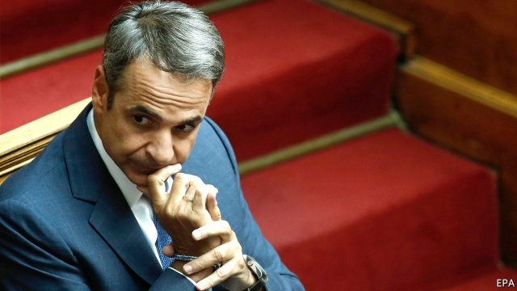
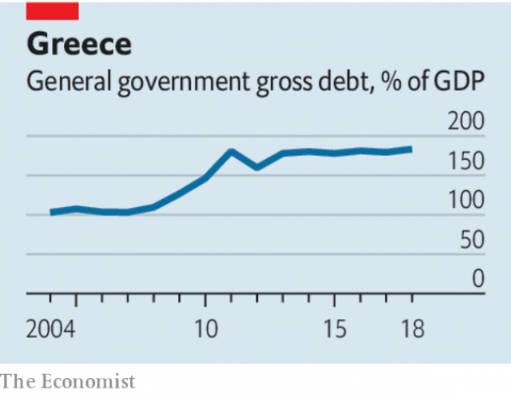

###### End extend and pretend

# Greece’s debt odyssey 

 

> print-edition iconPrint edition | Leaders | Oct 3rd 2019 

TEN YEARS ago this month George Papandreou, then the newly elected prime minister of Greece, announced to the world that the government’s books had been cooked and that the budget deficit in 2009 was in fact double previous estimates. Investors panicked and Greece lost access to capital markets, eventually forcing it to seek help from the European Union and the IMF. A severe financial crisis, together with swingeing spending cuts demanded by the creditors, plunged Greece into one of the deepest downturns experienced by a rich country since the second world war. 

Now another new prime minister, Kyriakos Mitsotakis, is trying to get Greece back on its feet (see article). Though the economy has begun expanding again, growth is lacklustre and output is nearly a quarter below its level in 2007. The country left its third bail-out last year with a public debt of 180% of GDP. It is now subject to the terms of a debt-relief deal struck with its European creditors. This deal was designed to look tough in order to be palatable to electorates in the north of Europe, who hate the idea of bailing out southerners, but experts agree that it is wildly unrealistic. The time has come to stop pretending and settle Greece’s finances once and for all. 

The agreement of 2018 extends the maturities of some of Greece’s loans and offers some interest-rate relief. In return, as well as continuing reforms, Greece must hit draconian fiscal targets. It must run a primary surplus (ie, before interest payments) of 3.5% of GDP a year until 2022, and of 2.2%, on average, until 2060. The question of debt relief is not to be revisited until 2032. 

 

That these targets are fanciful is an open secret. Only a handful of countries have pulled off such a feat—most were resource-rich and thriving. To expect Greece to commit to such fiscal masochism for four decades is not sensible. As the IMF points out, it will eventually need real debt relief. And as the economy is still depressed, there is a strong case for some fiscal loosening now. 

The penal terms of the deal of 2018 reflect mistrust. Northern politicians could not sell a deal at home that appeared to let Greece off the hook. As recent attacks in Germany on the doveish policies of the European Central Bank illustrate, suspicions in the north that they are underwriting the south are still alive. 

For its part Greece has shirked the reforms needed if it is to start growing fast enough to catch up with the rest of the euro area. The previous government, led by Syriza, a left-wing party, hit its fiscal targets but slid back on reform. Banks are stuffed with dud loans and the framework for dealing with them is incomplete. Tax revenues rely on too narrow a base, in turn requiring high rates that deter hiring. In registering property or resolving business disputes, the World Bank’s “Doing Business” report ranks Greece in the bottom third of countries. 

There is a way out. When Greeks voted in July for Mr Mitsotakis, who stood on a platform of reform, they turned their back on populism. Creditors should take that as a sign of good faith. They should also set out a new goal—that, in exchange for more reforms, Greece should get a debt write-down that is big enough to allow it to service its debts sustainably without running a primary surplus. During this period, provided Greece passes milestones on reforms, its fiscal-surplus targets should gradually be relaxed. As a goodwill gesture, the EU could meanwhile release over €1bn a year of profits from a bond-buying scheme to give Greece extra fiscal space. 

Yet Mr Mitsotakis has been slow to honour his promise of reform. He needs to roll up his sleeves. He has won public support and impressed the markets—the premium of Greek ten-year government bond yields over German ones has fallen by half this year. He must persuade northerners that Greece has earned some flexibility. This means facing up to the problems that hold back the economy. For ten years governments and creditors have muddled through. Greeks deserve better. ■ 

