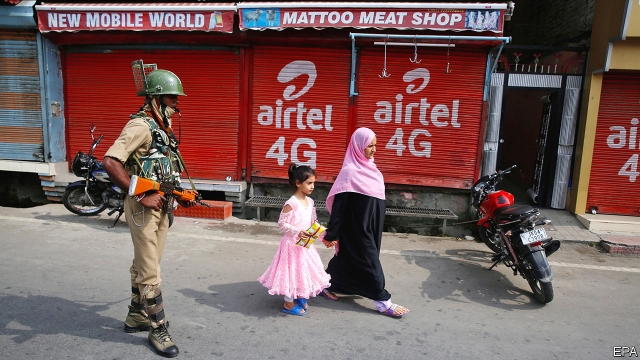

###### Vale of tears

# The courts’ refusal to curb repression in Kashmir 

 

> print-edition iconPrint edition | Leaders | Oct 5th 2019 

IT IS TWO months now since India’s parliament abruptly amended the constitution to downgrade Jammu & Kashmir from a partly autonomous state to a territory administered by the central government. That means it is also two months since the Indian authorities detained some 2,000 prominent Kashmiris—politicians, businessmen, activists, journalists—to prevent them from protesting. They continue to be held without charge, many in unknown places. Meanwhile the 7m-odd residents of the Kashmir valley, the state’s main population centre, are under a lockdown of a different sort. Mobile phones and the internet remain cut off; getting around is hard and getting in or out is possible only on the authorities’ say-so. In theory the ruling Bharatiya Janata Party (BJP) is integrating Kashmir into the rest of India. In practice it has turned the valley into a vast open-air detention centre. 

That the BJP has it in for Kashmiris is hardly news. The manifesto the party put out before it won its thumping victory in national elections earlier this year called for the scrapping of Jammu & Kashmir’s special status. The state is the only one in India with a Muslim majority, and the Hindu-nationalist BJP dislikes anything that smacks of privileges for Muslims. The BJP also likes to parade its defiance of Pakistan, which controls a slice of Kashmir and claims the rest, and has vehemently denounced the upheaval in the valley. For Narendra Modi, the prime minister and leader of the BJP, picking on Kashmir presents an easy opportunity to pose as a resolute nationalist who will not hesitate to confront his enemies. 

But if Mr Modi’s actions are not that surprising, the reaction of the courts has been (see article). India’s judges are notoriously meddlesome and difficult. No question is beneath their scrutiny: what destinations state-owned airlines should fly to, say, or just how close a liquor store can be to a highway. They have dealt all sorts of embarrassing defeats to the central government in recent years, inventing a previously unknown right to privacy that almost scuppered a huge biometric identification scheme, and voiding a lucrative auction of mobile-telephone licences. Yet on the many glaring abuses occurring in Kashmir they have remained resolutely—and shamefully—silent. 

Although the courts in Kashmir are in theory functioning, lawyers are striking, making it hard for petitioners to get anywhere. The chief justice of the Supreme Court in Delhi has declared that he is simply too busy to hear all the cases related to the government’s actions in Kashmir. He passed them to other benches of the Supreme Court, one of which gave the government a further month to contemplate its response. Conveniently enough, that pushes any ruling about whether or not the government’s downgrading of Jammu & Kashmir from a state to a territory was constitutional until after the change takes effect, on October 31st. It will also mean, in all likelihood, a further month of detention without trial for the Kashmiris rounded up by the authorities and another month during which humbler Kashmiris will be deprived of rights that other Indians take for granted. 

Few of those other Indians will care very much. The Kashmir valley is hemmed in by the Himalayas at the northern extreme of the country, far from most Indians’ thoughts and experience. It has been in some degree of turmoil since partition and independence 72 years ago. It suffers separatist violence, now mostly home-grown rather than instigated by Pakistan, which demands a response from India’s security services—though that does not justify today’s wholesale lockdown. To the extent that the rest of the country gives Kashmiris any thought, it tends to see them as troublemakers, if not traitors. Many Indians are toasting Mr Modi for at last giving them their comeuppance. 

Both gleeful and indifferent observers ought to be more worried. Mr Modi’s authoritarian instincts are not confined to Kashmir. If the courts continue to let him, he will doubtless continue to reshape India in keeping with the BJP’s plainly stated goals. That includes stripping 1.9m poor and illiterate residents of the state of Assam of their citizenship, for example, if they do not have the correct paperwork to prove that they are Indian citizens. Then there is the BJP’s plan to finish the job begun by Hindu zealots in 1992 by building a temple on the site of the mosque they demolished. Events in Kashmir show that the government is ready to trample Indians’ civil rights in order to squelch resistance to its actions. If the Supreme Court is willing to look away today, who is to say that the government will not feel free to carry on? ■ 

