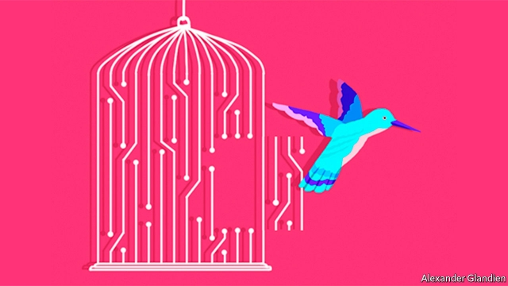

###### Open season

# The rise of open-source computing 

 

> print-edition iconPrint edition | Leaders | Oct 3rd 2019 

TO THE AVERAGE capitalist “open source” software may seem like a pretty odd idea. Like most products, conventional computer software—from video games to operating systems—is developed in secret, away from the prying eyes of competitors, and then sold to customers as a finished product. Open-source software, which has roots in the collaborative atmosphere of computing’s earliest days, takes the opposite approach. Code is public, and anyone is free to take it, modify it, share it, suggest improvements or add new features. 

It has been a striking success. Open-source software runs more than half the world’s websites and, in the form of Android, more than 80% of its smartphones. Some governments, including Germany’s and Brazil’s, prefer their officials to use open-source software, in part because it reduces their dependence on foreign companies. The security-conscious appreciate the ability to inspect, in detail, the goods they are using. It is perfectly compatible with making money. In July IBM spent $34bn to buy Red Hat, an American maker of a free open-source operating system, which earns its crust by charging for ancillary services like customer support and training. 

Now the model is spreading to chips. RISC-V is a set of open-source designs for microchips that was initially developed a decade ago at the University of California, Berkeley. These days it is attracting attention from many big technology firms, including Google, Nvidia and Qualcomm (see article). In August IBM made its Power chip designs open-source. These moves are welcome, for two reasons. 

The first is economic. The chip business is highly concentrated. RISC-V competes with closed-source designs from Arm, a Japanese-owned firm which monopolises the market for tablet and smartphone chips, and is a dominant presence in the fast-growing “internet of things”. IBM’s Power will challenge Intel’s grip on desktops and data-centres. A dose of competition could lower prices and quicken innovation. 

The second reason is geopolitical. America and China are waging a technological cold war; it threatens to damage a computer industry that has become thoroughly globalised. The open-source model, were it to be widely adopted, might help defuse these tensions, by giving both sides at least some of what they want. 

Start with China. In May America blacklisted Huawei, a Chinese tech giant which makes both smartphones and mobile-network equipment. That underlined, to other Chinese firms and to the country’s leadership, the risks of a model in which Chinese tech firms build their products on American software and hardware designs. Under the label “Made in China 2025”, the country is investing billions to try to boost its domestic capacity. 

Open-source components offer an alternative supply chain, less subject to any individual country’s control. Alibaba, a Chinese e-commerce giant, has already shown off a machine-learning RISC-V chip. Xiaomi, a maker of smartphones and other consumer gadgets, is planning to use RISC-V chips in its fitness bands. Were Android not open source, Huawei would be in an even deeper hole than it already is. 

Other countries are interested, too. India’s government has been investing in RISC-V development in the past year; it is also keen to develop a technology ecosystem that minimises foreign dependence (see article). In an effort to reassure the companies using its technology, the RISC-V Foundation is moving from America to neutral Switzerland. 

Many in the West, meanwhile, see China’s growing technological prowess as a malign development. One worry is that Chinese products may be Trojan horses, allowing a repressive dictatorship to steal secrets—or, worse, to sabotage societies that are increasingly dependent on networked computers. 

Here too, open-source technologies can begin to change the mood. Most Chinese products remain closed-source “black boxes” containing software and hardware whose inner workings are unknown. Particularly for software, and to some extent with hardware, an open-source model would give buyers the ability to compare what they have with what they were promised. To the extent that they can verify, they will not have to trust. 

The tech war is a battle for influence between an incumbent superpower and an aspirant one. A complete rupture would be extraordinarily costly and force most countries to take sides. Open-source computing can help calm tempers. That would be good for everybody. ■ 

