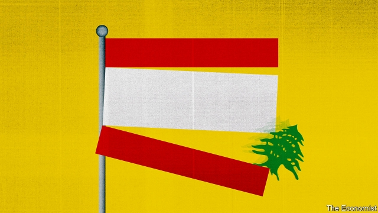
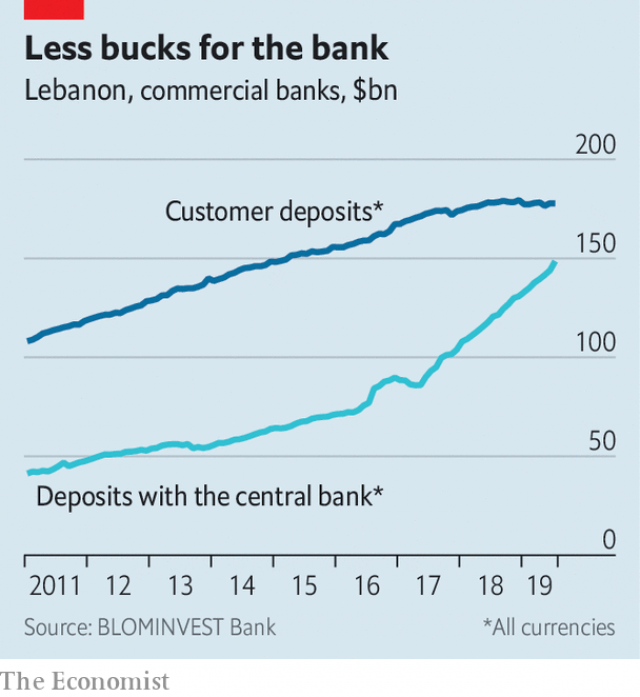

###### Broke in Beirut

# A long-feared currency crisis has begun to bite in Lebanon 

 

> print-edition iconPrint edition | Middle East and Africa | Oct 3rd 2019 

IN THE LOBBY of a Beirut bank, three customers stuff wads of $100 bills into plastic bags. Each note has its serial number recorded on a receipt, as local law requires. One man’s receipt was so long it trailed on the ground as he left the branch. Surreal as it seems, this scene would be common—if banks had dollars to spare. Over the past few weeks customers have queued for hours only to learn that they cannot access their money. One was told that his branch had less than $2,000 in the vault. 

Long an immutable fixture of life, the dollar has become an obsession. Lebanon’s currency, the pound, has been pegged at 1,500 to the dollar since 1997. Receipts are printed in both currencies; shopkeepers make change with a mix of dollars and pounds. Officially nothing has changed. But the panic points to a different reality. Protests in Beirut on September 29th heightened the sense of crisis. 

Many ATMs have stopped dispensing dollars. Banks have quietly lowered withdrawal limits to $1,000 a day and imposed arbitrary rules, like banning dollar transactions after 5pm and on weekends, that in effect bar workers from using their accounts. Businesses are forced into a black market, where a dollar now fetches 1,600 pounds, and occasionally up to 1,750. The government insists the situation is under control. The value of such reassurances is depreciating almost as fast as the pound. 

First to suffer are businesses that need hard currency. Petrol stations, for example, sell fuel in pounds but buy it in dollars. They briefly went on strike on September 26th to protest against a dearth of dollars at the official rate. Worried drivers queued in bumper-to-bumper traffic. Wheat millers have the same problem and have warned of possible bread shortages. 

On September 30th the central bank promised to provide dollars at the official rate for firms that import fuel, medicine and wheat. The guarantee should prevent any immediate scarcity. It could also leave Lebanon with, in effect, a two-tier exchange rate. A shortage of dollars is not all bad news, since it should discourage imports and trim a current-account deficit that was 25% of GDP last year. But it will be painful for a country that relies so much on imported goods. 

Such a decision is well beyond the mandate of most central bankers. Not Riad Salamé, who has run the Banque du Liban (BDL) since 1993. Admirers praise him for keeping the currency stable through years of political chaos. The BDL looks well-capitalised, with $37bn in foreign reserves at the end of July. It should have no troublefinancing essential imports, which runbetween $4bn and $5bn a year. 

Yet the bank’s assets are in fact dwarfed by its liabilities, say former bank officials. To preserve the currency peg it borrows dollars from commercial banks at above-market rates. For a few years this was a viable arrangement. Banks, many controlled by politicians and their relatives, made healthy profits and the BDL had a supply of dollars to cover Lebanon’s cavernous twin deficits. Last year’s fiscal shortfall was 11% and public debt is more than 150% of GDP, among the highest in the world. 

Like a pyramid scheme, however, this works only with a constant supply of new money. After a decade of steady growth, deposits in commercial banks have begun to shrink (see chart). Interest rates as high as 20% fail to attract dollars. But banks keep pouring money into the BDL. They had $147bn (in dollars and pounds) deposited with the central bank at the end of July, a 23% year-on-year jump. About 57% of the banking sector’s total assets are now at the BDL, up from 51% a year ago and the highest level this decade. 

 

The country needs economic growth and a smaller deficit. Neither is likely to happen. A 2019 budget approved in July is meant to trim the deficit to 7.6%. Much of this looks to be an accounting gimmick: the Lebanese Centre for Policy Studies, a think-tank, estimates that 46% of the savings comes from postponing payments to contractors. The government has made little progress trimming the bloated public sector or reducing subsidies to the state electric firm of $2bn a year (or 4% of GDP). 

The spending plan is also based on projected 1.2% growth. That may be optimistic: Last year GDP rose by just 0.3%. The IMF expects a deficit above 9%. Few industries are doing well. Retailing is grim. Construction, which accounts for about 10% of jobs, has stalled. The number of new building permits issued in the first eight months of 2019 was down by 17% from last year. High interest rates make loans unaffordable for many businesses. (A rare bright spot is tourism, which had its best summer since 2011.) 

In years past wealthy Gulf states might have offered a bail-out. They are less generous today, in part because of frustration with a Lebanese government seen as too tolerant of Hizbullah, the Iranian-backed militia and political party. An international aid package of $11bn (mostly in concessional loans) agreed to last year is frozen until Lebanon implements promised reforms. The government will find it increasingly hard to raise capital abroad. Fitch, a ratings agency, recently downgraded Lebanon’s debt to CCC, deep into junk territory. On October 1st Moody’s put its junk status under review for a possible downgrade. 

As ever, the warlords and oligarchs who run Lebanon are busy bickering. The cabinet did not even meet for six weeks this summer after two ministerial aides were killed in a shoot-out. And the prime minister, Saad Hariri, was embarrassed by a New York Times report that he gave $16m to a South African bikini model he met at a party. Hundreds of employees of Mr Hariri’s businesses have been laid off this year or had their salaries delayed. Needless to say, the model was paid in dollars. ■ 

