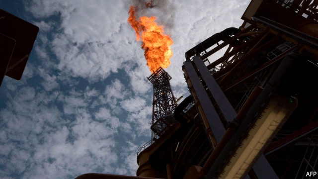
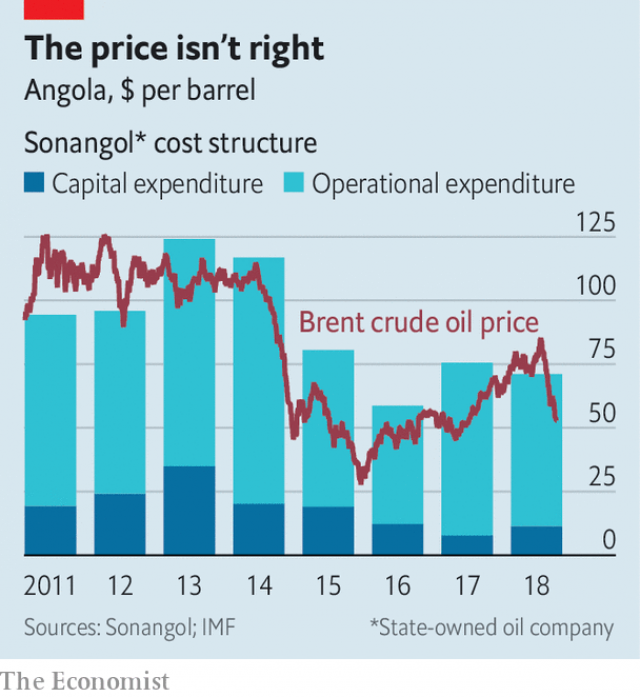

###### Running out of gush

# Angolan oil production is in decline 

 

> print-edition iconPrint edition | Middle East and Africa | Oct 3rd 2019 

A  HUGE JET of flame bursting from the Kaombo Norte oil platform lights up the sea some 260km (160 miles) off the coast of Angola. The processing platform, part of a $16bn project that takes oil from wells drilled under nearly 2km of water, ought to be one of the crowning achievements of an industry that has endured 27 years of civil war. Instead, it may be a swansong for sub-Saharan Africa’s second-biggest oil producer: Angola’s offshore oil fields are running dry. 

Daily oil production has tumbled from its high of almost 2m barrels a day in 2008 to around 1.4m today. Since oil provided 95% of export revenues and almost two-thirds of government revenues, the fall in output—as well as a slump in the price of crude—has thrashed the economy. GDP has shrunk for three years in a row. This year the IMF expects growth of just 0.3%. The fall in output is not because the country has no oil—its reserves are second only to Nigeria in the region—but because of underinvestment. 

The government is trying to reverse the decline in oil production. It has slashed the tax rates on smaller oilfields from 20% to 10%. And the agency in charge of auctioning oil blocks recently went on a roadshow, hoping to drum up investor interest. Meanwhile Sonangol, the state-owned energy giant, plans to sell off some of its eclectic collection of assets—which include a convent in Portugal and stakes in the state diamond miner and state airline—in order to free up money to invest in oil production. 

Yet no matter how much Angola might sweeten the terms of new investment, it may not be able to lure back all of the international oil companies that once flocked to the country’s oil-rich offshore basins. Firms including ExxonMobil and France’s Total spent freely, ordering hulking offshore rigs in the 2000s when oil prices approached and then exceeded $100 per barrel. Prices crashed in 2008, but were back above $100 by 2011. In 2014 they plummeted to less than half that. Most oil firms retreated from big risky projects in deep waters to focus on the shale fields of Texas and North Dakota, where capital investments are smaller and operating costs are lower. 

By contrast production and capital costs in Angola have been stubbornly higher than the oil price (see chart). Unless high prices return, oil companies may not, either. “From the moment oil prices go down or flirt with $50, deep and ultra-deep offshore investments such as the ones that Angola has been offering become less attractive,” says Gonçalo Falcão, head of the Angola practice at Mayer Brown, a law firm. A handful of new projects are in the works, but America’s Energy Information Administration expects their completion merely to sustain current levels of output. 

 

Angola’s government has not prepared the country for this slump. Between the end of its civil war in 2002 and 2014, GDP rose from $15bn to $146bn. José Eduardo dos Santos, president for 38 years, squandered the wealth, turning Luanda into a gleaming capital but investing in little else. João Lourenço, who took over as president in September 2017, is trying to diversify the economy, but progress is slow. 

Last December the IMF agreed to lend Angola $3.7bn on condition that it implement tough economic reforms. The fund has already handed over more than $1.2bn, but the reform programme has fallen far behind schedule. For instance, the government promised that it would introduce a value-added tax in January, but delayed the implementation twice before finally bringing it into force on October 1st. With oil production falling steadily, it does not have time to waste. ■ 

