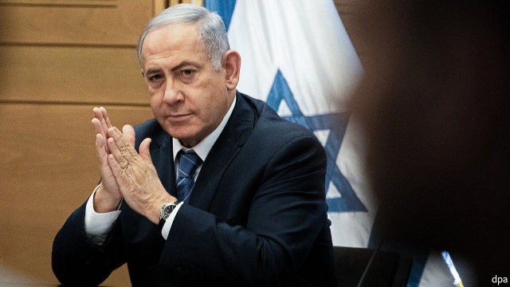

###### Bibi makes his case

# Binyamin Netanyahu’s last chance to avoid indictment 

 

> print-edition iconPrint edition | Middle East and Africa | Oct 3rd 2019 

THE FIRST ten days of the Jewish new year, between Rosh Hashanah and Yom Kippur, are known as the days of atonement. It is a time in which observant Jews take stock of their sins in the preceding year. That Israel’s attorney-general, Avichai Mandelblit, a deeply devout man, decided to hold the country’s most important legal proceeding during this period hardly seems coincidental. 

On October 2nd lawyers representing Binyamin Netanyahu, the prime minister, began making the case that their client should not be charged with corruption. Mr Mandelblit, who will make the final decision, has already said there is enough evidence for indictments on counts of bribery, fraud and breach of trust. The hearing, spread over four days, is Mr Netanyahu’s first chance to challenge that evidence—and last chance to avoid going on trial. He would be the first sitting prime minister put in the dock. 

The potential charges stem from three cases assembled over three years. In two Mr Netanyahu is accused of trading, or attempting to trade, regulatory favours for positive press coverage. In the third case prosecutors assert that Mr Netanyahu accepted gifts from wealthy businessmen in return for political favours. Three former close aides to the prime minister will serve as witnesses for the state. Mr Mandelblit himself was Mr Netanyahu’s cabinet secretary before the prime minister appointed him attorney-general. 

The hearing is closed, but Mr Netanyahu’s lawyers are expected to claim that there is no evidence he traded favours, that most politicians seek better press coverage and that the prime minister’s wealthy patrons are also friends. “The hearing has the potential to change everything,” says Uri Korb, a former state attorney who successfully prosecuted Ehud Olmert, a former prime minister, on corruption charges. “The strength of the state witnesses’ testimony has yet to be tested and the evidence is largely circumstantial.” (Mr Korb says he declined a request from Mr Netanyahu to help with his defence.) 

Even if he is indicted, Mr Netanyahu intends to stay on as prime minister. The law does not require him to step down until a final conviction. His opponents or public watchdogs, however, may ask the Supreme Court to intervene. As it is, Mr Netanyahu is holding on by his fingertips. In an election on September 17th his coalition of right-wing and religious parties failed to win a majority, a near-repeat of the result of an election in April. But the fractured opposition also lacks the seats needed to form a government and remove Mr Netanyahu. 

The political and legal timelines are converging. The attorney-general is expected to announce his decision within weeks. It would be a shock if he does not indict Mr Netanyahu on at least some charges. Around the same time Mr Netanyahu will face a deadline to form a government. His remaining supporters may begin to have second thoughts about sticking with a prime minister about to stand trial. His day of judgment is drawing close. ■ 

