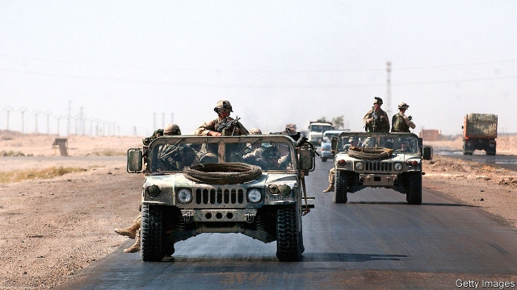

###### Roads to ruin

# Did American road-building in Iraq lead to more violence? 

 

> print-edition iconPrint edition | Middle East and Africa | Oct 3rd 2019 

DRIVERS CALLED it the “highway through hell”. Attacks on the road linking Baghdad to Amman occurred so often in 2014 that truckers were paid three times the normal rate to haul goods along the artery. Gangs and militias were a constant threat. The jihadists of Islamic State set up roadblocks, charged drivers a tax of around $300 and even handed out receipts. The road, officially called Highway 10, was recently secured by the Iraqi army. But those who drive on it still face the threat of extortion or attack. 

America spent loads improving Highway 10 after 2003, the year it toppled Saddam Hussein, Iraq’s former dictator. Over the next decade, as the war in Iraq dragged on, America spent nearly $12bn on infrastructure in the country. President George Bush touted the improved roads, hoping they would boost the local economy and lead to a reduction in violence. But a working paper presented at this year’s meeting of the European Economics Association suggests that the effort may have had the opposite effect. 

The paper’s author, Tamar Gomez, a doctoral student at Imperial College London, had plenty of data with which to work. Digitised maps showed where new roads were built (the length of the road network increased by 21% between 2002 and 2011). American agencies kept track of spending on reconstruction. And a research centre at the University of Maryland logged the location and timing of attacks. Ms Gomez gathered the material and used regression analysis, a statistical technique, to look for relationships between road-building, economic progress and violence in Iraq. 

She found that, far from stabilising Iraq, road-building led to more political violence. Even as GDP rose as a result of reconstruction, so too did the number of attacks. “In other words, the political and military mechanisms linked to road-building overpower the wished-for economic effects,” writes Ms Gomez. (Oddly, she did not find a correlation between spending on roads and violence, but this is probably because much of the money was lost to corruption.) 

Why did road-building in Iraq lead to more attacks? One explanation is that roads are important not just for commerce, but also for military operations. American soldiers used the new roads to mount missions and transport supplies—becoming targets for insurgents’ ambushes and improvised explosive devices. The insurgents, too, used the roads to move around and launch attacks. A study in 2010 of America’s war logs from Afghanistan found that 86% of insurgent violence took place near a road. There is little reason to think that the Iraq war was much different. 

Ms Gomez also offers another explanation, rooted in the politics of reconstruction. “Roads are a politically charged infrastructure,” she says. Those funded by America were viewed by insurgents as the embodiment of an unwelcome occupation and became “privileged targets”. American officials have admitted that they often failed to win local support for their big projects. The roads to hell were, as ever, paved with good intentions.■ 

