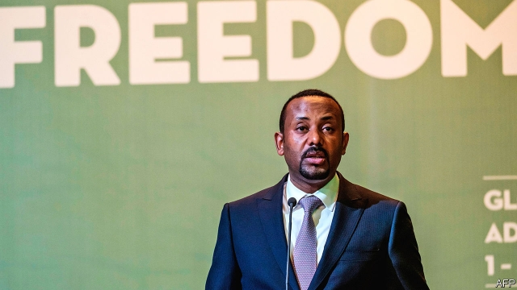
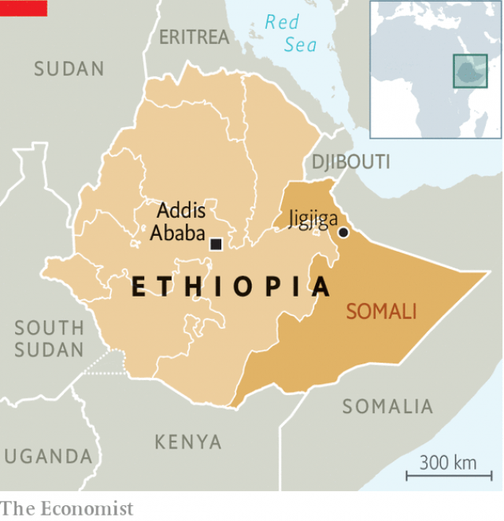

###### Lessons from an open-air prison

# Ethiopia’s most repressive state is reforming 

 

> print-edition iconPrint edition | Middle East and Africa | Oct 3rd 2019 

“HOW IS DEMOCRACY?” asks Bashir Ahmed Hashi, smiling broadly, as he bounds out of his jeep towards the gates of Jigjiga prison. Entering the courtyard, the commissioner is greeted by a loud cheer. Excitable inmates jostle to shake his hand and pat him on the back. “For 24 hours a day we are happy now,” says one. Bashir, who was appointed prison chief for eastern Ethiopia’s Somali Regional State less than a year ago, looks a little bashful. “I’m popular here,” he explains. 

Before August 2018 the Somali region was the most ill-treated place in all of Ethiopia, tyrannised by its then state president, Abdi Mohamed Omar, who had waged a scorched-earth campaign against secessionist rebels for more than a decade. Backed by the central government, Abdi and his heavily armed special police force, the Liyu, murdered and raped civilians, imprisoned and tortured tens of thousands of alleged rebels, and, according to Human Rights Watch, committed crimes against humanity. “It was like a giant prison,” says Mohammed Gurey, one of hundreds of thousands of Ethiopian Somalis to have fled abroad in recent decades. 

That all changed last year when Abiy Ahmed became Ethiopia’s prime minister. Abiy, who deposed Abdi and put him on trial in Addis Ababa, the capital, invited Mustafa Omer, an exiled activist and UN staffer whose own brother had been killed by the Liyu, to take over as acting state president. Dissidents and rebels returned in droves. Mohammed became the region’s deputy security chief. The infamous central prison in Jigjiga, the state capital, was closed. Thousands of prisoners were freed. 

Since then Mustafa has overseen the most dramatic turnaround in the region’s recent history. “It is the safest place in Ethiopia right now,” says Kamal Hassan, another recent returnee. When your correspondent visited Jigjiga in the final months of Abdi’s rule, former detainees refused to meet in public for fear of reprisals. Today many of them are in government. The old prison is to reopen as a museum, and Bashir takes visiting journalists and human-rights workers on tours—revealing, for example, the toilet cubicles where political prisoners huddled in solitary confinement and the underground pit where human waste was dumped on them as punishment. Meanwhile separatist leaders of the Ogaden National Liberation Front (ONLF) have ditched their weapons and plan to contest elections next year. 

The contrast with other parts of Ethiopia, where recent democratic reforms have been accompanied by a surge in violence and lawlessness, is striking. But even in the Somali region, the process is imperfect and fragile. Some critics allege that Mustafa is keener to take revenge on the old guard than to strengthen state institutions. “He treats everyone who worked for Abdi like they are Hitlers,” complains an associate of the former regime. Locals bristle at a government dominated by well-heeled diaspora types. Others resent a lack of consultation. “Transparency is not very strong,” sniffs Abdirahman Mahdi, the ONLF’s secretary-general. Some worry about a return to strong-arm tactics: in recent days nearly 600 youngsters were indiscriminately rounded up in Jigjiga on vague allegations of criminality and taken out of the city for “rehabilitation”. About a tenth have since been released. 

 

Reforming such an authoritarian set-up is tricky. Take the Liyu. One of Mustafa’s first moves was to recall its top commanders to Jigjiga to undergo a two-month evaluation. The most notorious were fired, the rest given lessons in human rights and the constitution. Rubber batons replaced live ammunition for crowd control. 

These days reports of serious abuses are rarer. But reforms will need to go further. In the past the Liyu answered only to the president, in effect acting as a private army. Re-educating the troops is a “very cursory” solution, notes the ONLF’s Abdirahman. A more lasting one is likely to involve integrating them into the state’s regular police. In recent years all of Ethiopia’s regional governments have built up special police forces which they are loth to give up. 

Even more vexing is the question of justice for past crimes. Only Abdi and some of his closest associates have been put on trial. Mustafa calls it a “moral dilemma”. Stability, he says, was the priority when he took office: “We had to balance the need for justice with the pragmatic reality that we need a special force here to keep peace.” 

Yet many Ethiopian Somalis are demanding that those responsible for atrocities be held to account. “Everywhere you go this is the complaint: people who committed crimes are still living among them,” says Mustafa’s human-rights adviser, Jemal Kalif Dirie. Mohammed Mohamud Mohammed, a former detainee, recalls seeing one of his tormentors working for the Liyu as a security guard at the ONLF’s homecoming ceremony last year. “I couldn’t believe my eyes,” he says. “I just froze.” 

To this end the government plans to establish a regional commission to investigate atrocities going back decades. And it has set up a committee with the ONLF to work out how best to pursue what lawyers call “transitional justice”. So far, a few people have been identified to go on trial. “You cannot have reconciliation without having accountability,” says Mustafa. 

Such challenges are found throughout Ethiopia. In February Abiy’s government established a national reconciliation commission, the first in the country’s history. But what happens in the Somali region in the coming months and years may be instructive. “What we want the commission to recommend is how to get out of this mess,” says Jemal. “There has to be a departure from this cycle of killing.” ■ 

