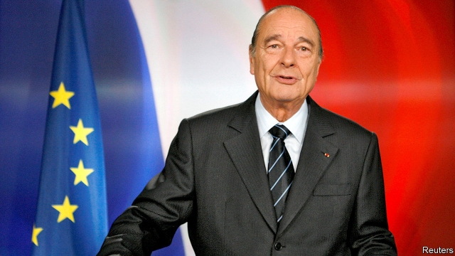

###### Le Bulldozer

# Obituary: Jacques Chirac died on September 26th 

 

> print-edition iconPrint edition | Obituary | Oct 3rd 2019 

FANS PRAISED his wit and tactile warmth (unlike most French politicians, he enjoyed hobnobbing with the voters, preferably over a beer or slice of saucisson in an unpretentious zinc-clad bar). Jacques Chirac was successful, too: mayor of Paris, twice prime minister and twice president, from 1995 to 2007. He may have bought a chateau in la France profonde, but it was a “little one”, sniffed a snobbish predecessor, Valéry Giscard d’Estaing. For the French, his love of France and its people made him sympa. Yet cynicism was also his hallmark. 

Abroad, he seemed to favour dictators over democrats. He told African strongmen not to worry about elections. He sold a nuclear reactor to Saddam Hussein’s Iraq. A Russian-speaker (as a student, he translated Pushkin’s “Eugene Onegin”), he counted Vladimir Putin as a personal friend and loathed the “badly brought up” east Europeans with their high-minded talk and Atlanticist outlook. 

Where others had principles, he had prickles. A proud defender of the French language, he stormed out of a summit meeting when a French businessman dared to use English (he also said, only half-jokingly, that Britain’s deplorable cuisine made it inherently untrustworthy). Despite a happy student summer at Harvard, he bridled at America’s overweening ways, arguing for a “multi-polar world” as a way to counter its post-war dominance. Equally, he set up France 24 to rival the “Anglo-Saxon imperialism” of the BBC and CNN. He was contrarian too, resuming nuclear testing in the Pacific to international dismay. 

At home, he was better at campaigning than governing. The candidate who had vowed to mend the “social fracture” bequeathed worse public finances and deeper social divisions. His disillusioned people lost faith both in the European ideal (voting against a draft constitution in 2005) and largely in their own governing class—not least, in him. He won a second presidential term by a fluke landslide: a first-round upset meant that his opponent was a far-right extremist, Jean-Marie Le Pen. His one-time reformist zeal mutated into a fear of upsetting the status quo. By the end of his ill-starred second term, Mr Chirac was the Fifth Republic’s most unpopular president (though François Hollande later beat that dismal record). 

It was easy to see why. The country was suffering from what he himself admitted was a “profound malaise”, playing a humiliating second fiddle to a resurgent Germany in European politics. His nadir came when he lay low for a week while rioting engulfed the big cities in 2005. He was prone to petulance and rudeness in official meetings, bore mammoth grudges, and took some spectacularly bad gambles, notably calling a parliamentary election in 1997 which the opposition Socialists won easily. 

Much of his energy was devoted to dodging impertinent questions, of which there were many. In his 18-year stint running Paris he bloated the city payroll (particularly with jobs for party workers). He threw huge, lavish parties for his supporters, while cultural notables and other influential friends gained chic municipal apartments. Hence the caustic slogan from the 2002 election, “Vote for the crook, not the fascist”. 

The stink rose with him. Even the most world-weary could not shrug away the stories of bundles of cash, foreign bank accounts and murky quid pro quos. One puzzle was Japan. A keen Japanophile, even to the point of wondering whether he might become a sumo wrestler (it had taught him all he needed to know about life, he said), Mr Chirac made dozens of private trips there. Nobody knew why. A son? A mistress? Perhaps both? Or several? Pre-#MeToo, the indiscretions were scandalous. His chauffeur wrote a scabrously detailed book about the president’s energetic private life, for which he was dubbed: “trois minutes, douche comprise” (three minutes, shower included). 

He was shamelessly unbothered about it. A favourite toast was “Allons boire à nos femmes, à nos chevaux et à ceux qui les montent” (“Let us drink to our women, our horses and those who mount them”). For most of his misdeeds, loyal lieutenants took the rap. Prosecutors landed only one belated blow: in 2011 he was convicted of misconduct in office, with a suspended two-year sentence (he declined to give evidence, pleading ill health). 

Yet no sooner had he left power than the French began to miss him. He had aroused American fury by threatening to use the French veto in the UN Security Council to block a resolution authorising the use of force in Iraq. That split the EU and damaged the West. But it looked brave and prescient later. So did his appeal against climate change—“our house is burning and we are looking elsewhere”—in 2002. A product of France’s elite schools, including ENA, he was better linked in the public mind with his love of rural Corrèze, where his grandfathers came from: its paysans, itscattle, its cheeses. Compared with his brash successor, Nicolas Sarkozy, he seemed a model of understatement, one of the last French presidents who seemed to embody the nation. By 2010 he was France’s most admired political figure. 

His ineffectual latter years belied formidable willpower and political talent, which earned him the nickname, as Prime Minister Georges Pompidou’s troubleshooter in the 1960s, of “the bulldozer”. He could charm, too. In 1968 he negotiated a truce with the leaders of protests that had taken France to the brink of chaos. Unlike previous generations of public figures, he was personally untouched by the controversies of the second world war. Perhaps thanks to that, he lanced a historical boil. In a speech in 1995, just two months after taking office, he ended decades of blame-dodging by accepting that France—not just the Vichy regime—bore moral responsibility for the Nazi deportation of 76,000 Jews, most of whom perished. In remarks that seem unremarkable now, he said the “homeland of the Enlightenment…committed the irreparable”. He left France with many burdens. But not that one. ■ 

