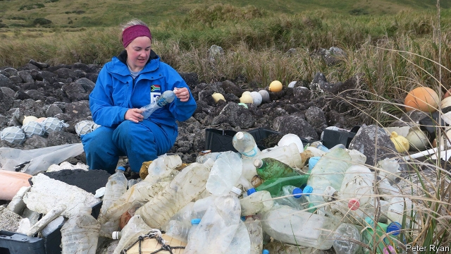
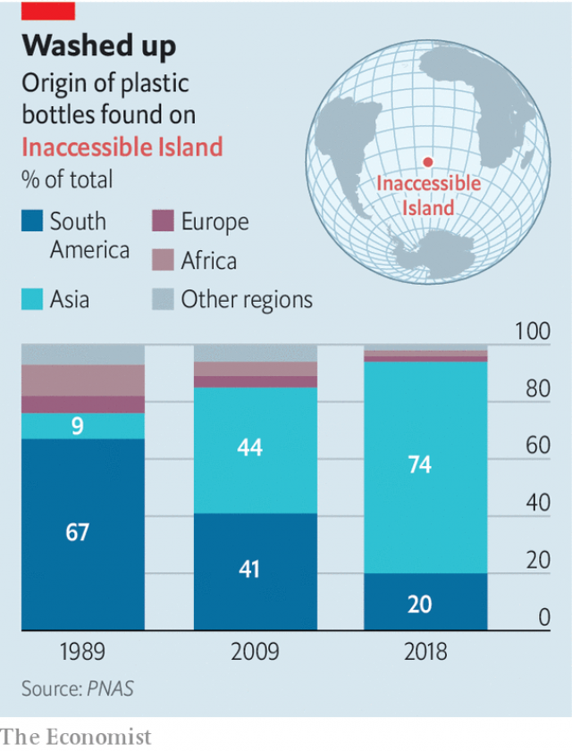

###### Oceanic pollution

# Inaccessible Island’s rubbish problem has been bottling up for years 

 

> print-edition iconPrint edition | Science and technology | Oct 3rd 2019 

INACCESSIBLE ISLAND is well named. It is an uninhabited rock in the South Atlantic ocean that belongs to Tristan da Cunha, a British dependency which itself vies with Easter Island for the honour of being the most remote inhabited place on the planet. Go there, though, and you will find its coast is covered with litter. 

That, at least, has been the experience of Peter Ryan of the University of Cape Town, in South Africa. Since 1984 Dr Ryan, an ornithologist, has been visiting Inaccessible and, along with his other studies, recording the litter stranded on the island’s beaches. This week, in the Proceedings of the National Academy of Sciences, he has published the results. 

Though Inaccessible is indeed remote, being near the South Atlantic’s midpoint, the nature of oceanic circulation means that this is exactly the sort of place where floating rubbish tends to accumulate—at the centre of whirlpools thousands of kilometres across, called gyres. Dr Ryan’s particular interest was where all the litter came from before it was swept into the gyre. And he found that this has changed a lot over the decades he has been visiting the island. 

 

To impose some order on the question, he and his colleagues focused on one particular class of litter: bottles. Their definition of a bottle included jars and aerosol containers, and encompassed things made of metal, glass or polymer. Most, though, were of polyethylene terephthalate, a light plastic, and had once held drinks. 

A particular advantage of picking bottles to investigate is that they are often stamped with their country of manufacture. That enabled Dr Ryan to analyse the history of oceanic littering. As the chart shows, he picked three recording points, corresponding to field trips to the island, and analysed the proportions of bottles from various geographical sources. In 1989 the preponderance of them (67%) was South American. Twenty years later, in 2009, bottles made in Asia contributed more or less equally (44%) with South American ones (41%). By 2018 the overwhelming majority (74%) were Asian. 

This geographical shift speaks volumes. The first sample suggests most litter arriving on Inaccessible had been washed off the land or dropped from coastal shipping—South America being a relatively nearby continent. The other two, with their rising proportions of trash from Asia, which is too far from the island for it to have floated there, strongly suggest it was crews’ empties being flung from ocean-going vessels. 

Such littering is banned by Annex V of the International Convention for the Prevention of Pollution from Ships—which, ironically, came into force in 1989, the year of Dr Ryan’s first survey. But evidently a lot of ships’ captains do not care. They permit the dumping of rubbish over the side, regardless.■ 

