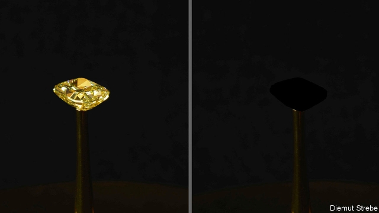

###### Optics

# Nanotube forests that are darker than night 

 

> print-edition iconPrint edition | Science and technology | Oct 5th 2019 

ON SEPTEMBER 13TH a 16.78-carat yellow diamond, worth $2m, which was on display at the New York Stock Exchange, disappeared from view. Police were not, however, called to the scene. The disappearance was intentional. The diamond, part of an artwork called “The Redemption of Vanity”, had been coated in a “super-black” layer of carbon nanotubes which, by absorbing 99.995% of the visible spectrum, made the usually sparkling gemstone seem practically invisible inside its dark case. 

“The Redemption of Vanity” was a collaboration between Diemut Strebe, artist-in-residence at the Massachusetts Institute of Technology, and Brian Wardle, the institute’s professor of aeronautics and astronautics. Whatever moral message this artistic endeavour might or might not have been intended to convey, it was a stark demonstration of allotropy—the fact that a single element can come in many guises, depending on the arrangement of its atoms. For, like Dr Wardle’s nanotubes, diamonds are made of carbon. And that allotropic diversity is one of the reasons why carbon is such a useful material. 

The idea of creating super-black surfaces out of carbon nanotubes is not in itself new. Vantablack was developed by Surrey NanoSystems, a British company, and put on the market in 2014. Vantablack, however, absorbs only 99.965% of the light incident upon it. As Dr Wardle’s work shows, things have moved on since then. 

Nanotubes, which have an atomic structure similar to graphite’s, are naturally black. To make them super-black means growing them as forests that rise upward from the surface to be blackened. That way, once light enters the forest, it bounces from tube to tube—with each encounter bringing a high chance that the light will be absorbed. Few photons survive this process long enough to escape from the top of the forest canopy and be reflected from the surface. The effect is uncanny. A ball coated in a super-black would appear more like a hole in the air than a solid object. 

The nanotubes involved in super-black surfaces are created by encouraging carbon atoms that start off in gas molecules such as carbon dioxide to crystallise into small cylinders which grow outward from the surface to be coated. Conventionally, this is done at a temperature of about 700°C. The target surface is coated with tiny particles of iron. These act both as catalysts for the carbon-liberating reaction and as nuclei for the growth of the cylinders. 

Dr Wardle’s team has been experimenting with aluminium surfaces instead of iron nanoparticles, and employing substances like baking soda and salt to prepare the aluminium. These materials remove the thin oxide layer that forms naturally on the metal when it is exposed to air. The sodium in them also seems to act as a catalyst in the way that iron does. The result is a process that operates at 400°C instead of 700°C, and which produces one of the superest blacks around. The involvement of aluminium means, of course, that to create “The Redemption of Vanity” the team had first to coat the diamond at the artwork’s centre with aluminium—but aluminising things in this way is a well-established process. Indeed, that is part of the point. Substituting aluminium for iron should make super-blacking things easier. 

Since the introduction of Vantablack, super-blacks have moved on commercially as well as artistically. Vantablack was so delicate that, once applied, it could not be touched. It had to be secured behind a protective layer. Surrey NanoSystems’s more recent products incorporate elements other than carbon. As with diamonds, these dopants change a crystal’s properties. (Pure-carbon diamonds are colourless; the yellowness of the stone in “The Redemption of Vanity” is caused by traces of nitrogen.) Correct doping of nanotubes creates a less fragile arrangement—more akin to a coral reef than a forest. Some modern super-blacks, indeed, are robust enough to withstand being sprayed onto suitably prepared surfaces at room temperature. 

Moreover, besides their decorative applications super-blacks are used in manufactured products, particularly optical devices. Since they absorb more stray light than other coatings, using them to cover the interior surfaces of lenses can result in clearer images with better contrast and colour definition. According to Ben Jensen, chief technical officer at Surrey NanoSystems, the firm is collaborating with an as-yet-unnamed Japanese company to develop cameras which work on this principle. Certain European carmakers are, he says, also eyeing up super-blacks to improve the accuracy of sensors such as those employed to guide autonomous vehicles. And there are, naturally, military applications—though these remain secret. 

Altogether, then, this allotrope of carbon looks likely to have a profitable future. Whether it will be as profitable as its cousin diamond’s is remains to be seen. But in this case, to say that things look black for it is not a pessimistic assessment.■ 

