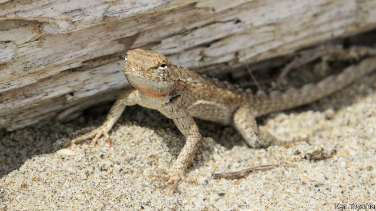

###### Animal behaviour

# Some lizards swim through sand as though it were water. Why? 

 

> print-edition iconPrint edition | Science and technology | Oct 3rd 2019 

AFICIONADOS OF “Dune”, Frank Herbert’s novel about a planet covered by Sahara-like desert, will be familiar with the idea of animals that swim through sand. Giant worms which do just that are a feature of the book. Back on Earth, though, there are sand-swimmers, too. And these ones are real. At least eight groups of lizards have a habit of diving headfirst into sand, if it is available, and making paddling motions with their limbs to carry them below, as if they were submerging themselves in a body of water. The question is, why? 

Obvious hypotheses include evading predators and controlling body temperature. However, Ken Toyama of the University of Toronto has a third: that the animals are ridding themselves of skin parasites. And he has data to back his theory up. 

Skin-grooming, which is crucial to any vertebrate’s health and hygiene, can be a struggle for lizards. The layout of their skeletons means they cannot rotate their heads around far enough to reach certain parts of their bodies, in order to nibble parasites away. Nor, for want of the neural apparatus needed to keep track of favours given and received, can they easily play the mammalian game of “you scratch my back and I’ll scratch yours”. These facts, plus recent research conducted in the scrublands of Florida, which showed that a sand-swimming lizard species local to the area had far fewer skin parasites than other lizards present, led to the idea that swimming around in abrasive sand might help lizards scrub unwanted bugs from their exteriors. 

Mr Toyama decided to test this thought by looking at Pacific iguanas (pictured). These animals dwell in the forests and on the beaches of north-western South America. They are known to be susceptible to skin parasites, and readily sand-swim when given the chance. And examination shows that forest-dwelling members of the species tend to have more skin parasites than do beach dwellers. He therefore went to Peru and collected, from a local forest, 20 Pacific iguanas that each had more than ten parasites attached to them. 

This done, he transferred the animals to one of two laboratory habitats. The first had sand pits to swim in. The second did not. He fed the lizards and then left them to do as they pleased for 48 hours while recording what they got up to. After this he collected them, inspected them for parasites and released them back into the wild. 

All the lizards that had had access to sand pits swam in them at least ten times each. And, as Mr Toyama reports this week in the Science of Nature, by the end of the experiment the parasite load of these animals had dropped by 40%. Animals with no access to sand also shed parasites, but at half the rate of the others. Even though the experiment was small, the statistical difference between the groups was such that there is only one chance in 80 of this result having happened at random. 

Mr Toyama is not suggesting that hiding from predators and regulating body temperature are not also benefits of sand swimming. But he has shown for sure that this odd behaviour does indeed help keep lizards’ parasites under control.■ 

