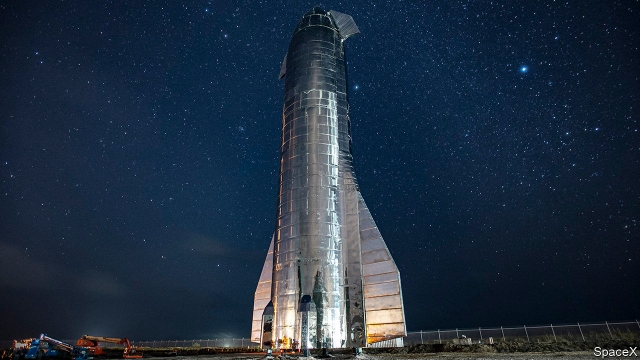

###### Space travel

# SpaceX’s Starship is a new kind of rocket, in every sense 

 

> print-edition iconPrint edition | Science and technology | Oct 5th 2019 

IT LOOKED for all the world like something that might have graced the cover of a 1950s comic book. On September 28th, on a warm Texas evening, Elon Musk, the boss of SpaceX, a rocketry firm, unveiled his company’s newest machine, Starship Mk1. It stands 50 metres tall and is made from shiny plates of stainless steel. Despite its name, it is not in fact an interstellar spacecraft. But it is a prototype of an interplanetary one. Mr Musk hopes, one day, to use its successors to ferry passengers to the Moon or to Mars—or perhaps even, according to one piece of SpaceX concept art, all the way to Saturn. 

In the 17 years since its founding, SpaceX’s cheap, reusable machines have revolutionised the rocket business. The firm’s ultra-low prices have seen it grab a dominant share of the commercial satellite-launching market. Along with Boeing, an American aerospace giant, SpaceX is responsible for ferrying supplies to the International Space Station. It may soon fly astronauts there as well. But all of this commercial success is merely a necessary first step in Mr Musk’s bigger plan, which is to make humanity into a “multiplanetary species” by establishing colonies elsewhere in the solar system. 

That is where the Starship comes in. The prototype on display in Texas is only one half of an enormous rocket stack designed with planetary colonisation in mind. When paired with a Falcon Super Heavy booster, which is also being developed, the result should be capable of lifting around 150 tonnes into orbit. That would make it the most powerful rocket ever built, squeaking ahead of the Saturn V, which propelled astronauts to the Moon in the 1960s and 1970s. And unlike the Saturn, whose three stages were abandoned to the sea or to space as their fuel was used up, the Starship and its booster will be reusable, which should keep costs down. 

It is a bold plan. Mr Musk’s shorter-term plans are bold too. Besides designing a new spaceship and booster, SpaceX’s engineers are busy working on a new, more efficient engine to power them. Called Raptor, it is designed to burn super-cold methane rather than the kerosene that fuels the company’s current Merlin engines. The Starship will sport six Raptor engines. But each Super Heavy booster will need somewhere between 24 and 37. The result will be a plumber’s nightmare. 

Mr Musk has said, perhaps optimistically, that a Starship prototype might be ready for a test flight all the way to orbit (albeit without its booster stage) within six months. That would be of a piece with its frenetic development schedule. The rocket-building industry is used to generous government contracts that are about job creation as much as rocket creation. SpaceX has brought a different sensibility, closer to the rapid-fire development practices of the software industry. 

 

The Starship prototype, for instance, was welded together in a matter of months. It was built out in the open, rather than in a carefully controlled factory environment. The firm has two teams competing against each other to produce the best design. Ideas are tested quickly, taken forward if they work, and scrapped if they do not. The Starship was originally to be made of a carbon-fibre composite. But the company soon abandoned that idea, destroying its production tools. Steel, noted Mr Musk, has a higher melting point than carbon fibre, making re-entry easier. It is also an order of magnitude cheaper. 

To see the contrast, look at the Space Launch System (SLS), another super-heavy rocket designed to ferry astronauts to the Moon and Mars, but which is being built by NASA, America’s space agency. The SLS has had around $14bn of taxpayers’ money since it was authorised in 2011—and that understates the true cost, since the SLS incorporates technology from old, abandoned rocket projects. It is due to make its first flight in 2020, though NASA has hinted that date may slip. Mr Musk claims that less than 5% of SpaceX’s resources are dedicated to Starship. Yet it stands a good chance of beating the SLS into orbit. ■ 

