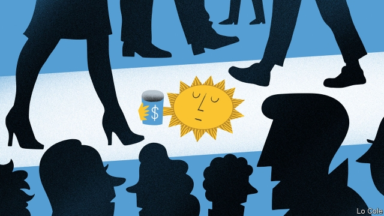

###### Bello

# Argentina’s difficult road to redemption 

 

> print-edition iconPrint edition | The Americas | Oct 3rd 2019 

ON CALLE FLORIDA, in the centre of Buenos Aires, the money-changers are back, offering dollars at a black-market exchange rate. In the villas miserias (shantytowns) on the periphery of the metropolis, demand for food handouts at comedores (soup kitchens) has risen sharply, prompting congress to approve emergency food aid. Poverty now afflicts 35% of Argentines, up from 27% in January-June 2018, say official figures. Even the solidly middle-class districts in a city of slowly fading grandeur are feeling the pinch. “Before, local people helped more,” says Sister Norma Arronda, who runs the Madre Camila comedor in Recoleta, which helps the homeless in late middle-age. “Now we get fewer donations.” 

For the sixth time since the 1980s, Argentina is suffering an economic crisis. Memories are still fresh of the collapse of 2001-02, when after a slump the country defaulted on its debts, savings were frozen, the economy contracted by 15% and the poverty rate reached 56%. In many ways this crisis is less severe and easier to escape. But in others it is more challenging. 

It began last year when investors jibbed at continuing to finance the pro-market but fiscally lax government of Mauricio Macri, prompting a run on the peso. After the IMF stepped in with a $57bn loan, the biggest in its history, things seemed to stabilise. But with inflation at over 50%, real wages falling and the economy in recession, Mr Macri’s chances of winning a second term in an election on October 27th waned. 

In simultaneous primaries on August 11th, he won only 32% of the vote. A Peronist slate headed by Alberto Fernández, whose running mate is Cristina Fernández (no relation), a populist former president, won 48%. The prospect of Ms Fernández returning to high office, even if only as vice-president, prompted panic. The peso has fallen by 25% against the dollar since August 11th. Faced with political limbo, the IMF has suspended disbursements. To alleviate the pain, Mr Macri has reluctantly imposed exchange controls, export taxes and price freezes and offered electricity subsidies. 

Mr Macri’s people insist they still have a chance, because turnout will rise and because of fear of a return to leftist populism. But most insiders in Buenos Aires assume the Fernándezes will win. The big question is what sort of government would emerge. Some fear the worst, with hyperinflation and the expropriation of savings. But Mr Fernández is a pragmatist and a skilled political operator. He has been sounding increasingly moderate. 

He has little choice. “Argentina has exhausted its credit,” says a former official whom Mr Fernández consults. “We finally have to face reality.” Many economists think that requires a comprehensive plan to bring down inflation and generate fiscal and external surpluses. A new IMF agreement and the restructuring of private debt are inevitable. 

“Exporting more is the only way to get dollars,” Mr Fernández told a business audience last month, saying that neither controls nor debt were solutions. His advisers talk, too, of a social pact that would freeze wages, prices, pensions and utility tariffs for at least six months. That is a way of finessing the indexation of pensions to past inflation, for which the government will lack the money. 

Argentina’s macroeconomic plight is less severe than in 2002. The banks are sound. After a belated fiscal squeeze this year, the fiscal deficit will be about 4% of GDP (compared with 6.3%). The recession is shallower and the peso is not wildly overvalued as it was back then. The IMF is more flexible, partly because of the opprobrium it attracted last time. “I think the politicians are a bit more responsible now,” says Daniel Marx, who was the finance secretary in 2001. 

He worries less about Mr Fernández’s intentions than about whether the new government’s economic plan will be sweeping enough and competently executed. If all goes well, the recession could end within a year. 

But in some ways, Argentina is worse off than it was at the beginning of the century. Decades of economic stop-and-go have turned into stagnation since 2010. This is partly because so many people now live, one way or another, off the state. Despite Mr Macri, the economy remains over-protected and many businesses are cheerfully uncompetitive. “It’s sad to see Argentina like this,” says Sister Norma. “We have the memory of our parents and grandparents who worked hard and made progress. We lost the idea of work and of values.”■ 

