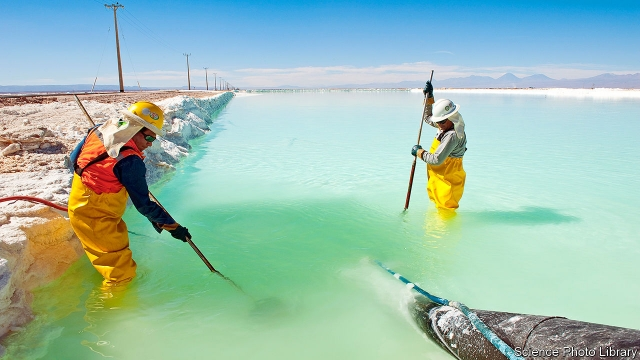

###### Just-in-brine production

# Chile’s attempts to move up the lithium value chain are not working 

 

> print-edition iconPrint edition | The Americas | Oct 3rd 2019 

CHILE’S ECONOMIC boom is copper-bottomed. Since pre-colonial times people have worked the metal. Today Chile produces 28% of the world’s output. The industry accounts for almost 10% of GDP, 48% of exports and a third of foreign direct investment. Copper has helped make Chileans the richest people in South America. 

Politicians, however, dream of doing more than exporting unrefined commodities. In 2016 Michelle Bachelet, then the president, announced a plan to encourage manufacturing and innovation at home through the use of another metal that Chile has in abundance: lithium. This is used in batteries for mobile phones, laptops and electric cars. The idea was for Chile not only to mine the metal but also to make components for car batteries, the fastest-growing part of the market. 

A recent slump in global lithium prices, caused by growth in supply outstripping demand, has sharpened the incentive to move up the value chain. In June Ms Bachelet’s successor, Sebastián Piñera, said that a new national lithium plan is in the works. So far, these ambitions have been unfulfilled, showing how hard it is for small countries to ascend global supply chains. 

Both presidents’ plans involve renegotiating deals with miners to oblige them to help the battery industry. In 2017 Chile’s economic-development agency, Corfo, renegotiated its contract with Albemarle, an American firm that is the world’s biggest lithium producer. The new deal allowed it to expand production at its brine operation in the Salar de Atacama salt flat in northern Chile. In return, the firm agreed to sell up to 25% of its output at low prices to makers of car batteries operating in Chile. 

In July, however, Corfo confirmed that three corporate investors, including Samsung, a South Korean giant, would not go ahead with plans to produce battery cathode materials in the country. Chile is trying again. Under a new contract, SQM, a Chilean firm, is offering a quarter of its production at a discount to buyers who invest in technology for more types of battery, not just the ones used in cars. It is not clear that this plan will fare any better. 

Chile is too far from the manufacturers that are hungriest for batteries, many of which are in China. Carmakers especially need producers close by to co-operate on improving battery capacity. And lithium is only one of the materials required. Chilean battery-makers would have to import other components like nickel and cobalt. 

It does not help that almost nobody in Latin America is yet producing, or indeed buying, electric cars. It might be wiser to focus on producing simpler lithium-rich battery parts for energy-storage systems that could take advantage of the Atacama desert’s large solar-power potential, suggests José Lazuen of Roskill, a consultancy. 

Regulations are another problem. Chile classifies lithium as “strategic”, because it can be used in nuclear fusion. The nuclear-energy commission limits the quantity of metal that can be mined. That is a worry for battery-makers that might want to expand. In the past decade Chile’s share of global lithium production has dropped from 40% to 20%. Although Chile has dozens of salt flats, only a few have been studied for their lithium-bearing potential. Brine-based lithium, of the sort mined in Chile, is more difficult to convert into the chemicals used for car batteries than is Australia’s output, extracted from rock. Mining also risks wrecking salt flats’ ecosystems. 

Even as Chile strives to create a lithium-battery industry, scientists are trying to invent better batteries that use other materials. Moving up from mining is harder than it seems.■ 

