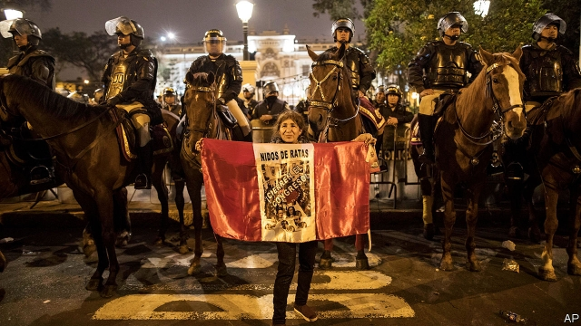

###### Dubious dissolution

# Martín Vizcarra dismisses Peru’s congress 

 

> print-edition iconPrint edition | The Americas | Oct 3rd 2019 

EVER SINCE he became president in March 2018, Martín Vizcarra has been at war with Peru’s congress. This week, on September 30th, their rocky relationship came to a farcical turning point. Mr Vizcarra dissolved congress. The legislature struck back by suspending him from office and choosing the vice-president, Mercedes Aráoz, to replace him. But this looked more like a gesture of defiance than a well-judged counterattack. Ms Aráoz quit within 36 hours. Peru now looks headed towards congressional elections in January. What is not clear is whether this constitutional crackup will break the political deadlock or damage Peru’s democracy. 

Peruvians cannot help but be reminded of the last time congress was closed down, in 1992 by President Alberto Fujimori. His “self-coup” led to more than eight years of authoritarian and often brutal rule. He is now serving a 25-year sentence in a Peruvian jail for human-rights abuses.  

Although Mr Vizcarra’s disbanding of congress is legally questionable, he has not carried out a coup. Unlike Mr Fujimori he has not sent tanks into the streets or dismissed the supreme court. If congress disbands, as now looks likely, a 27-member “permanent committee” will remain to act as a check on him. Most Peruvians share Mr Vizcarra’s view that the legislature is corrupt, obstructive and overdue for dissolution. Nearly 90% disapprove of it.  

The confrontation between powers predates Mr Vizcarra’s promotion to the presidency. It began with the general election of 2016, when Pedro Pablo Kuczynski, a former investment banker, became president. He narrowly defeated Keiko Fujimori, Alberto’s daughter, but her Popular Force party (FP) won a majority in congress. FP and its allies sought to paralyse Mr Kuczynski’s government. 

Corruption allegations have sidelined both protagonists. Ms Fujimori is in prison while she is investigated on suspicion of receiving undeclared campaign donations from Odebrecht, a Brazilian construction company that bribed politicians across Latin America. Mr Kuczynski is under house arrest while prosecutors investigate claims that he had corrupt dealings with the firm when he was finance minister. He resigned as president under threat of impeachment. Mr Vizcarra, then one of two vice-presidents and Peru’s ambassador to Canada, took over.  

His arrival sharpened the conflict and changed its nature. A former governor of the southern department of Moquegua, proud of his provincial roots, Mr Vizcarra entered office determined to reform politics and combat the corruption that has discredited the governing class. All four of his immediate predecessors have been accused of corrupt dealings with Odebrecht. 

What did not change was congress’s determination to thwart the president. Mr Vizcarra used drastic measures to push through his policies. He held a referendum last year on a package of anti-corruption measures, which congress then grudgingly enacted. Congress has since blocked or diluted proposals to improve the quality of Peru’s party system. Many of the country’s two-dozen parties exist just to sell their influence. These include a reform of campaign financing and a requirement that parties hold primaries. In May congress prevented the creation of an independent body that could strip congressmen of their immunity from prosecution. 

Hostilities came to a head last month when congress tried to appoint six judges to the constitutional court from a hastily assembled list, to replace a group whose mandates had expired in June. Mr Vizcarra sought to prevent their appointment by seeking a vote of confidence in his government. A negative vote would have allowed him to dissolve congress. The legislators did not take the bait. So when they voted to appoint the first judge, Mr Vizcarra took that as a denial of confidence in the government and dissolved congress. 

Many constitutional lawyers question whether he had a right to use that pretext. But he will probably get away with it. The heads of the armed forces and the police have publicly backed him, as have the associations representing governors and mayors. His dismissal of a despised congress may lift his approval rating from just under 50%. Preparations for a congressional election in January have already begun. 

The results are unpredictable. The (expired) constitutional court may rule on the legality of congress’s dissolution, perhaps after a new one is elected. That might cause chaos. It is possible that voters will choose a more biddable congress, willing to back Mr Vizcarra’s reforms. But there is little reason to believe that a caretaker congress, which would serve until July 2021, will be more public-spirited than the current one. The dark days of 1992 have not returned, but the future is looking cloudy.■ 

