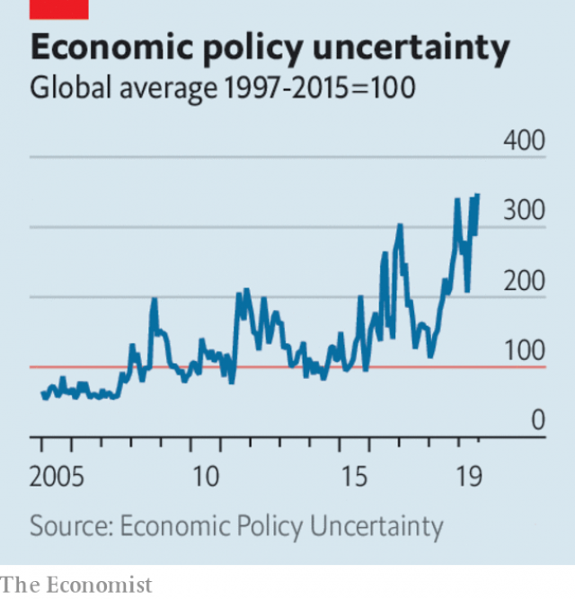

###### Open Future Festival 2019

# Business this week 

> Oct 3rd 2019 

A 15-year dispute over subsidies in the aerospace industry came to a partial climax when the World Trade Organisation ruled that America could levy $7.5bn-worth of tariffs on exports from the European Union because of the illegal aid given to Airbus. Next year the WTO will probably approve European penalties on America because of its aid to Boeing. The decision adds to already heightened trade tensions. America said it would start imposing the tariffs on October 18th, of 10% on aircraft and 25% on a range of other goods, including cheese, olives, wine and whiskey. See article. 

 

Earlier, the WTO said it now expects global trade flows to increase by just 1.2% this year, down from the 2.6% it forecast in April and the slowest pace since the financial crisis. Unresolved trade conflicts have led to greater uncertainty about policy, causing businesses to put off investment. The growth of exports and imports slowed across all regions in the first half of 2019. Meanwhile, an index of American manufacturing fell to its lowest level since June 2009. 

The chairman of Credit Suisse said the bank had been wrong to conduct surveillance on Iqbal Khan, a former executive, over fears he would lure away staff and clients. The bank’s chief operating officer, who admitted to acting alone in ordering the operation, and the head of security, resigned. A review by a law firm called in by Switzerland’s second-biggest bank cleared Tidjane Thiam, the chief executive, of any involvement. Mr Thiam had an acrimonious relationship with Mr Khan; the pair reportedly had a blazing row at a cocktail party in January. See article. 

Wells Fargo named Charles Scharf as its new chief executive, six months after Tim Sloan resigned in the aftermath of a mis-selling scandal. Mr Scharf has led Bank of New York Mellon and Visa and was a senior executive at JPMorgan Chase during the financial crisis. See article. 

India’s central bankreassured the public that the banking system is “safe and stable and there is no need to panic” as another scandal emerged. Curbs had to be imposed on withdrawals by nervous savers from Punjab and Maharashtra Co-operative Bank as it came under scrutiny for financial irregularities. Another bank faced restrictions on its ability to make new loans. 

Faced with a sharp downturn in the country’s housing market, Australia’s central bank cut its main interest rate by a quarter of a percentage point, to 0.75%, the lowest ever. 

A drop in Turkey’s annual inflation rate to 9.3%, the lowest in almost three years, increased the betting that the central bank would cut interest rates again, despite recent remarks by its new governor that there was limited room for manoeuvre. 

PayPal became the first foreign company to enter China’s payments industry when it took a 70% stake in a domestic digital-payments firm. American companies have been trying for years to break into a market that is dominated by Alibaba and Tencent. 

Japan’s sales tax rose from 8% to 10%. The increase had been postponed in 2015 and again in 2017 amid worries of a slump in consumer spending, which happened after a previous raise to the tax in 2014. Food and non-alcoholic drinks continue to be taxed at 8%. 

Novartis announced a partnership with Microsoft to apply artificial-intelligence technology to medicine. In one of the biggest collaborations in the field, the Swiss drugmaker said the research would start with tackling personalised remedies for eye degeneration, cell and gene therapy and drug design. 

Founded in 1969 by two men making surfboards in a garage, Rip Curl, an Australian surfing gear and clothing company, was sold to Kathmandu, a New Zealand outdoor specialist. The men, now in their 70s, sold their firm for A$350m ($235m). 

A report from Kroll, a corporate investigations and consultancy firm, highlighted the reputational risk to businesses from fake news on social media. Across the company bosses surveyed in 13 countries, 84% felt threatened by attempts to manipulate markets with fake stories, either by competitors or short sellers. One American cosmetics company saw sales drop by a fifth after a campaign on Twitter falsely claimed it tested its products on animals. 

The leaked transcript of Mark Zuckerberg’s comments at a staff meeting provided a glimpse into the inner thoughts of Facebook’s boss. Mr Zuckerberg said that Elizabeth Warren’s proposal to break up big tech companies would “suck” and “you go to the mat and you fight” over something so “existential”. When asked about brain-computer interfaces, he joked that disapproving headlines would say “Facebook wants to perform brain surgery”. 

