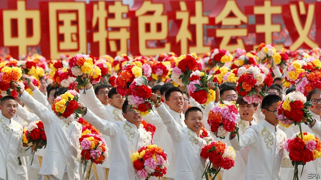
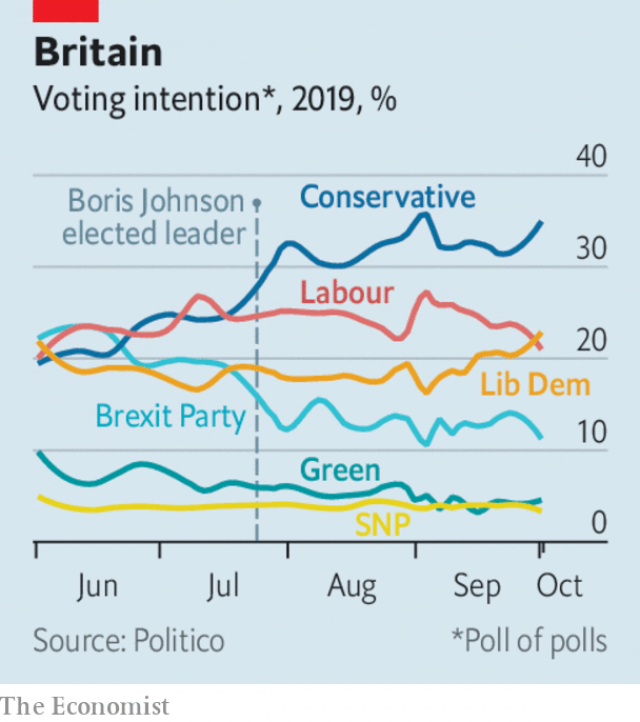

###### Open Future Festival 2019

# Politics this week 

 

> Oct 3rd 2019 

China staged a huge parade to celebrate 70 years of Communist rule. It involved more than 100,000 civilians, 15,000 troops and hundreds of weapons. Some of the equipment had not been shown in public before, including the DF-41 intercontinental ballistic missile, which can hit any part of America. But a “white paper” issued by China said the country had “no intention” of challenging the United States, or supplanting it. See article. 

In Hong Kong, meanwhile, thousands of people marked the occasion as a “day of mourning” by staging an unauthorised march. Some people later clashed with police in several locations. A policeman shot a teenage student in the chest—the first injury involving live ammunition since pro-democracy unrest broke out in the city four months ago. See article. 

Afghans voted in a presidential election. The Taliban had vowed to disrupt the polling, which nonetheless was relatively peaceful. Turnout was extremely low. The results will not be announced until November. See article. 

North Korea agreed to resume disarmament talks with America after a hiatus of eight months. It later tested a missile, which it said it launched from a submarine near its coast into Japanese waters. 

A court in Pakistan sentenced the brother of Qandeel Baloch, a social-media star, to life in prison for her murder. He said he had killed her to preserve the family’s honour, after she posted pictures of herself online. Activists for women’s rights had feared he would be acquitted, since his parents had absolved him of blame, a factor Pakistani courts often take into account. 

Peru’s president, Martín Vizcarra, dissolved the country’s congress, which has obstructed his legislative programme, and proposed to hold a congressional election in January. Congress refused to accept its dissolution and voted to suspend Mr Vizcarra as president. It installed the vice-president in his place, but she quit after just hours in the job. See article. 

Guyana is tohold elections on March 2nd. The government lost a vote of confidence last December. Next year Guyana is expected to begin receiving revenue from vast reserves of oil discovered off shore. The IMF thinks that its economy may grow by 85%. 

Prosecutors in New York alleged that the younger brother of the Honduran president, Juan Orlando Hernández, had accepted $1m from Joaquín Guzmán, a Mexican drug baron known as “El Chapo”, that was intended for the president. Mr Hernández said the claim was absurd, and noted that prosecutors never alleged that he had received the money. 

Democrats in the House of Representatives pushed ahead with an impeachment investigation of Donald Trump’s request to the Ukrainian president to dig up dirt on the son of his rival, Joe Biden. Subpoenas were sent to Mike Pompeo, the secretary of state, and to Rudolph Giuliani, the president’s lawyer. In a Twitter meltdown, Mr Trump claimed the Democrats were staging a “coup”. See article. 

Bernie Sanders cancelled events in his campaign for the Democratic presidential nomination until further notice, after he had heart stents inserted to relieve some chest pains. The 78-year-old has kept up a gruelling campaign schedule. 

In a closely watched case, a judge ruled that Harvard does not discriminate against Asian-Americans in its applications process, finding that it passes “constitutional muster”. The plaintiffs argued that Harvard’s affirmative-action policy favours black and Hispanic applicants. The matter will probably end up in the Supreme Court. See article. 

Boris Johnson, Britain’s prime minister, made a new Brexit offer to the European Union. His proposal includes customs checks, but not at the border in Northern Ireland, plus a regulatory border in the Irish Sea. Mr Johnson is determined to leave the EU on October 31st, but is hampered by Parliament’s legal stipulation that he must ask for an extension if there is no deal. See article. 

 

Brexit is not the only trouble for Mr Johnson. Hard on the heels of the controversy surrounding his relationship with an American businesswoman when he was mayor of London, a female journalist accused Mr Johnson of groping her thigh in 1999, when he was her boss. He denied it happened. Despite its leader’s problems the Conservative Party holds a resilient lead in the polls. See article. 

Sebastian Kurz and his People’s Party were the clear winners in Austria’s snap election, caused after his government collapsed following a scandal connecting his coalition partners, the Freedom Party, and Russian money. However, he is still short of a majority, and is casting around for an alternative to join a new government. See article. 

Some 20,000 people took to the streets in Moscow to demand the release of those arrested in earlier demonstrations over the exclusion of opposition figures from a city council election. 

As many as 25 soldiers were killed and another 60 are missing after jihadists attacked two army bases in Mali. Separately al-Shabab, a jihadist group affiliated with al-Qaeda, attacked a convoy of Italian troops and an air base used by American forces in Somalia. The attacks highlight the deteriorating security across the Sahel and into the Horn of Africa. 

At a pre-trial hearing lawyers for Binyamin Netanyahu, Israel’s prime minister, argued that he should not be charged with corruption. The attorney-general will decide whether to proceed with the indictments. Meanwhile, talks between Mr Netanyahu’s Likud party and Blue and White, a centrist party, over forming a government have stalled. See article. 

Hundreds of people protested in Lebanon as the government grappled with a worsening economic crisis. Enormous debt and shrinking foreign investment have led to fears that the Lebanese pound will be devalued and prices raised. Iraqis also took to the streets to protest against unemployment and corruption. Security forces responded with live fire; at least 18 people were killed and hundreds wounded. See article. 

Software developers in Lagos, Nigeria’s main commercial city, started a campaign against harassment by the police, who single out people carrying laptops or smartphones for extortion. The arrests threaten a boom in startups. 

Uganda banned people from wearing red berets, which are associated with an opposition movement led by Bobi Wine. Mr Wine was recently charged with “annoying” the president. 

