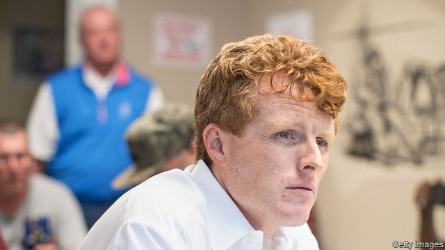

###### Political dynasties

# A Kennedy may be a hard sell in Massachusetts, of all places 

 

> print-edition iconPrint edition | United States | Oct 3rd 2019 

SEEING A MAN with plentiful red hair talking in front of a small crowd and several television cameras in Villa Victoria housing development in Boston’s South End, a young man stopped and asked what was going on. Someone told him, “He’s running for election.” “For president?” he inquired. “No, Senate,” he was told. “Is he famous or something?” “He’s a Kennedy.” The young man nodded, turned around and carried on with his day. 

Joe Kennedy, a congressman who announced last month he was going to run for Senate, has a certain amount of recognition in Massachusetts. His famous surname will help fill fundraising tables and may even get the old faithful to knock on doors. But for many young voters the name does not have the same resonance it once did. It may even end up being a drag. 

Mr Kennedy surprised his fellow-Democrats when he decided to take on Ed Markey, a well-liked Washington veteran. Mr Markey may not be flashy (Thomas Whalen, a political historian at Boston University, says he makes John Kerry, a stiff former senator and secretary of state, look like Mick Jagger), but he is diligent. An environmentalist before it was “cool”, he teamed up with Alexandria Ocasio-Cortez to introduce the Green New Deal in Congress. Some wonder why Mr Kennedy, who is 39, did not wait his turn. After all, Mr Markey is 73. Or why he did not wait to see how Elizabeth Warren, the state’s other senator, does in the Democratic primary. 

“For him, it’s a smart gamble,” says Scott Ferson, a political consultant and Ted Kennedy’s former press secretary. In the past Mr Kennedy would have been a shoo-in for the next available open slot, but the politics and demography of Massachusetts have changed in the decade since Mr Kennedy’s great-uncle Teddy was the Senate’s liberal lion. Mr Kennedy probably thinks Mr Markey easier to defeat in a primary than the plethora of talented young politicians in the state, who include Maura Healey, the state attorney-general; Michelle Wu, a Boston city councillor; Ayanna Pressley, a congresswoman with a national profile; and Seth Moulton, who recently dropped out of the presidential race. But, says Mr Ferson, it is still questionable whether the gamble will pay off. 

Mr Kennedy may have hoped the more seasoned Mr Markey would retire rather than take on a richer and younger challenger. Instead he is digging in. Although Mr Kennedy is ahead in early polls, Mr Markey has the endorsement of most of the powerful Democrats in the state and the majority of the state’s congressional delegation, as well as Ms Ocasio-Cortez. He also has the backing of Ms Warren. She knows Mr Kennedy well; he met his wife in Ms Warren’s law-school classroom. 

Some suspect Mr Kennedy feels entitled to the seat because, in a way, he was bred for politics. His great-great-grandfather was a congressman and a Boston mayor. His father served in Congress for 12 years. His grandfather, Robert, was attorney-general and a senator. He is the great-nephew of a president, and his great-uncle Ted was a Massachusetts senator for 47 years. 

Mr Kennedy’s reluctance to risk waiting may not sit well with many in the party, but that does not mean he is not well-liked or that he has not been a good worker for his constituents. He is an ardent supporter of gay rights and a campaigner for improved mental-health treatment. He has been an outspoken critic of Donald Trump, which pleases rank-and-file Democrats. He and Mr Markey are both progressive. Indeed, on paper there is very little difference between the two men, apart from age. 

So far, Mr Kennedy has not articulated a good reason why voters should vote for him over the incumbent. Instead, he mostly targets Mr Trump in stump speeches. He calls the moment too urgent for “sitting on the sidelines”. For many state Democrats, next year’s presidential election has vital ramifications, so to have an “insider fight among Democrats and a primary seems beneath the moment,” says Erin O’Brien of University of Massachusetts, Boston. People will be more willing to spend time and resources knocking on doors to beat Mr Trump, she says, than to “defeat someone you like, but you like the other guy more.” 

Mr Kennedy launched his campaign in the basement of a community centre, in Boston’s East End, very near where his ancestors disembarked after fleeing the Irish famine in the 1840s. Members of his family lived and worked in the neighbourhood and later represented it in office. The site of the launch was a reminder that his family was not always privileged. The clan has been remarkably resilient—despite scandals galore, no Kennedy has lost a race in the state since 1946. That streak may come to an end next year. “If he loses this race,” predicts Mr Whalen, “it’s all over for the Kennedy dynasty.” ■ 

