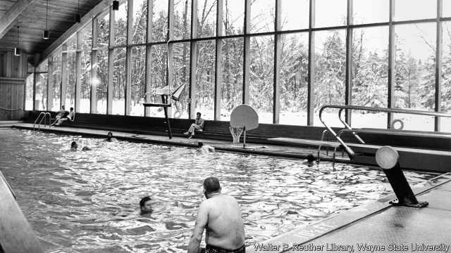

###### In retreat

# A woodland resort symbolises American unions’ diminishing fortunes 

 

> print-edition iconPrint edition | United States | Oct 3rd 2019 

ON THE FACE of it, unions are more emboldened today than they have been for years. About 50,000 members of the United Auto Workers (UAW) continued a national shutdown at General Motors this week, amid unusually hard bargaining over pay and conditions. The strike has now become the union’s longest at the car company since the 1970s (see Schumpeter). Sensing how public attitudes to unions are warming, Democratic presidential candidates have been taking turns to pose with the striking workers, notably at car plants in Detroit. 

Drive four hours from the Motor City, however, to the woodlands of northern Michigan, and an alternative symbol of union fortunes exists. The UAW’s Black Lake resort is in an idyllic, if largely forgotten, spot. On its thousand-acre grounds deer step gingerly between oaks and maples. A few golfers swish along the 18 holes of its tree-lined course. In forest clearings there are sun-dappled log cabins, pine-clad lodges, tennis courts, bars, modernist sculptures and lecture halls. 

An indoor Olympic-size swimming pool is a few steps from a lakeside slipway where holidaymakers may launch speedboats. In a small museum visitors can dutifully study the white hard hat and other memorabilia that belonged to Walter Reuther, the revered president of the UAW in its mid-century heyday, when it had three times as many members as it does today. Mr Reuther’s ashes are spread around the property. 

Yet the resort, owned by the union since 1967, is in dire straits. A worker recalls how, three decades ago, the place bustled with visitors who dined on Alaskan king crab on Tuesdays, then rib-eye steaks and shrimp on Thursdays. During a recent visit the fare was more meagre and the place mostly empty. Few union workers take holidays in the woods any more. And though the resort is open to the public—if visitors drive cars built by union labour—it is run at a steep loss. It is said to owe the union over $61m. 

After the FBI raided the resort in August, union members may conclude its charm has been lost. The feds were investigating a long-running corruption scandal that involves bribery and lavish spending by car companies on the UAW’s recent leaders. One site of interest is a home for a former boss that is still only half-built at Black Lake. 

Other unions have enjoyed similarly grand retreats. Anyone keen on 18 holes and vintage architecture can still book a spot at the United Steelworkers’ splendid-looking mansion at Linden Hall in rural Pennsylvania. The Teamsters had their own golf course and holiday camp in Missouri until they sold the place four years ago. Like the UAW, Teamster membership has fallen from its peak. Unions need to modernise themselves to prove more relevant to the members. Getting rid of rustic retreats could be one small way to do that.■ 

