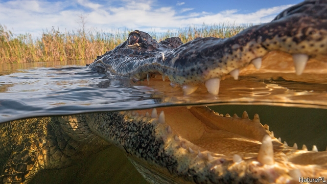

###### Alligators in the desert

# An absurd reckoning of Donald Trump’s border moat 

 

> print-edition iconPrint edition | United States | Oct 5th 2019 

THE PRESIDENT frequently boasts that his Mexican border wall will be beautiful. “Border Wars: Inside Trump’s Assault on Immigration”, a new book by two journalists from the New York Times, suggests it will be menacing, too. The authors claim that Mr Trump asked his advisers about including a moat, infested with snakes or alligators. Aides have reportedly looked into the cost of such a deterrent. Mr Trump denies having said any of this. But to work out the expense to American taxpayers (or Mexican ones, since they are meant to be paying), The Economist totted up the structural and zoological requirements of the plan. 

The president may not catch enough water snakes to patrol the border. But he could call on alligator farms in Louisiana and Florida. In 2015 the Southern Regional Aquaculture Centre estimated that the industry rears 350,000 animals a year for leather and meat. That is more than enough gators to patrol a moat 1,000 miles (1,600km) long. (The border’s remaining 1,000 miles are already blocked by the waters of the Rio Grande.) A fat subsidy for Floridian reptile farmers to supply Customs and Border Protection (CBP) could also win votes in the swing state next year. Perhaps $150m a year would be enough to breed and feed 300,000 fully grown gators (they would need to be much bigger than the three-foot tiddlers killed for handbags). 

Building the moat would be tougher. Few firms make neo-medieval water features. Matt Boring of Texas Ponds, which builds “ecologically balanced ecosystem ponds” for clients in and around Austin, quotes $3m to dig a pond five feet (1.5m) deep and an acre in area. The moat would need constant topping up to counter the effects of evaporation in the Sonoran Desert. If Mr Trump wanted his moat to be 60 feet (20 metres) wide, he would need to dig and line about 8,000 acres’ worth of trench. That would cost about $24bn. 

Of course, the Sierra Madre’s peaks are unsuited to flat canals, and Arizona’s heat might slowly broil the crocs. But the president could surely order a series of pumps to keep the system flowing. After hiring CBP officers to feed the gators, and building a second fence to keep them in, perhaps he could deliver the project for less than $30bn. 

That might seem reasonable for a man who has already accrued about $10bn of public money to build his wall. However, the new book also claims that Mr Trump wants to adorn the barrier with electrified, flesh-piercing spikes, and asked aides whether officers can shoot migrants in the legs to slow them down. Treating that number of gunshot wounds and settling the lawsuits would cost even more. It is almost as if the president is more interested in showing how ferocious he is on immigration than in providing efficient border security.■ 

