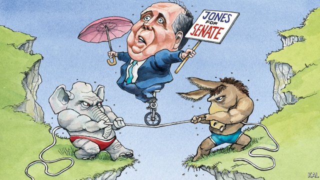

###### Lexington

# The labours of Doug Jones 

 

> print-edition iconPrint edition | United States | Oct 3rd 2019 

NIKI’S WEST, where Senator Doug Jones and his wife Louise arranged to meet your columnist, is the sort of place a glad-handing southern politician would love to frequent. A canteen-style institution in the middle of Birmingham, it serves catfish, liver and onions and turnip greens to a vast, fast-flowing lunch crowd. Yet Mr Jones, a 63-year-old newcomer to politics when he produced a stunning upset in a special election two years ago, appeared oblivious to the occasional glance he drew and only interested in the prospect of lunch. “You’re about to be assaulted by food,” he said with relish, while queuing for a tray. 

His modesty reflects his unusual profile; but also how unloved elected Democrats are in Alabama. Donald Trump is more popular here than in any other state. Notwithstanding Mr Jones’s strong record as a prosecutor and civil-rights campaigner, he was able to become Alabama’s first Democratic senator in a quarter of a century chiefly because his Republican opponent was a scandal-plagued religious crank. And even then Roy Moore won 48% of the vote. This ensured Mr Jones always faced a battle for re-election—and a full six-year term—next year. And that prospect looks even more remote following his party’s move to impeach Mr Trump. “I’m really disappointed in the Democratic Party and I’m very much proud of the president,” a woman interrupted Mr Jones’s lunch to tell him. He nodded glumly, as though he had been expecting worse. 

To try to placate his moderate Republican supporters, whose votes he will again need next year, the senator is trying, as he always does, to find common ground. He says he supports investigating Mr Trump’s alleged abuses. But he also chides his fellow Democrats for rushing to judgment. “I have seen too many cases where what appears to be an incredibly damning piece of evidence turns out to be not so damning when you look at the bigger picture.” At the same time he frets that impeachment proceedings could crowd out the Senate’s legislative work—including the passage of Mr Trump’s redo of NAFTA, which he supports. 

This is classic Jones. In his maiden Senate speech, shortly after a gunman massacred 17 people in a school in Florida, the senator defended the South’s gun culture (“I’m a gun guy,” he says) even as he called for background checks and other sensible restrictions. And he has since thrown himself into lawmaking with gusto, putting his name to over 200, mostly bipartisan, bills, on issues as diverse as road-building and money-laundering. That bespeaks more than a freshman’s naive enthusiasm. Though Democrats are mostly uncompetitive in congressional elections in the South, a few have clung on to state-level office there on the strength of their reputations for getting stuff done and voters’ greater pragmatism as politics moves closer to home. Mr Jones, who had chaired a pre-lunch panel on human trafficking in Birmingham with knowledge and enthusiasm, is trying to persuade Alabamans to extend that pragmatic view to the federal government. “Farmers in Alabama are more dependent on federal than state government,” he says. How much better, then, to have a diligent pragmatist representing them in Washington, DC, than a conservative firebrand. 

The potential flaws in this effort at supra-partisanship were obvious even before Mr Trump’s impeachment loomed into view. On the most divisive issues, including the president, America’s political tribes seem beyond accommodation. And it is hard to improve Alabamans’ view of Washington when most of their representatives and media outlets are bent on rubbishing it. Especially when the Senate’s Republican leadership is so happy to corroborate them. Mitch McConnell has brought hardly any of Mr Jones’s sober, life-enhancing bills to the floor. In such a dispiriting environment, it is no wonder many Democrats, following a path most conservatives have already taken, are now giving up on a moderation altogether. But that conclusion is also politically flawed. 

A leftward turn might not stop the Democrats winning the White House. But it might make it impossible for them to regain control of the Senate, given the disproportionate weighting it gives to relatively small and conservative states. Besides Alabama, they include Arizona, Colorado and North Carolina, which will hold Senate races next year that the Democrats must win to have a hope of unified government. Those on the left who try to deny this reality should note that Mr Jones—who knows more about winning in conservative states than they do—was one of the first congressmen to endorse Joe Biden for president. The moderate former vice-president was also the only senior Democrat he permitted to campaign with him. Constrained though moderation is in the Trump era, ambitious Democrats cannot afford to abandon it. 

To do so in despair would also be to ignore much quiet liberal progress. Mr Jones won on the back of a rising coalition of non-whites and college-educated liberals, as well as disenchanted conservatives. A proponent of gay and abortion rights, he is also markedly more liberal than traditional Democratic moderates, such as Joe Manchin of West Virginia. This suggests such positions need not be as implacably divisive as is often assumed. Beneath the Trump-related clamour, opinions are changing. Asked to list the most polarising issues, Mr Jones says: “Trump-Trump-Trump, abortion—then it really drops off. Guns and gay marriage are nowhere near as big an issue these days.” 

To those Democrats who ask him how to win in Trump country, Mr Jones urges a combination of respectful candour about differences—because voters detest a phoney—and patience. “We’re playing long ball for Alabama and the South because things are changing.” Even if they don’t change fast enough for his re-election hopes, he will have contributed to that process. And so, to give the devil his due, will Mr Moore, who could yet provide another twist in this tale. Not content with getting Mr Jones elected once, he says he is running again. The Lord works in mysterious ways.■ 

