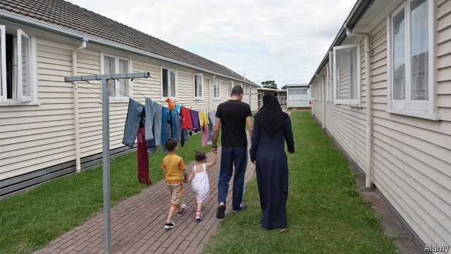

###### More Mr Nice Guy

# New Zealand tries to live up to its welcoming reputation 

 

> print-edition iconPrint edition | Asia | Oct 12th 2019 

“THEY ARE us,” said Jacinda Ardern, New Zealand’s prime minister, of the 51 Muslims, many of them immigrants, who were murdered by a white nationalist in Christchurch in March. She has positioned herself as a leader “with a bit of heart”. So it was embarrassing that her centre-left government had kept a policy that all but excluded any refugees from Africa and the Middle East. The government has announced that it will amend the rules in question, which are “the very definition of discrimination”, according to the immigration minister, Iain Lees-Galloway. 

They were inherited from the conservative National Party, which surreptitiously ordained in 2009 that refugees from the Middle East and Africa could come to New Zealand only if they had relatives living there already. Few did, so their numbers dwindled, even though New Zealand technically allocated 28% of its total intake of refugees to the two regions. Over the past nine years it has accepted just 187 people from the entire continent of Africa—fewer than arrived in the single year before the policy came into force, according to Murdoch Stephens of Massey University. 

Politicians had defended the policy on the basis that it gave priority to people from countries nearer to New Zealand. Over the past decade, 60% of refugees have come from Asia and the Pacific. But official documents show that the government was motivated by “broad security concerns” as well. The rules were racist and Islamophobic, says Guled Mire, an activist who campaigned against them. 

Ms Ardern’s Labour Party might have changed the rules sooner, but its populist coalition partner, New Zealand First, wanted to keep them. It has now been talked into raising the quotas for Africans and Middle Easterners to 15% of the total apiece. Ms Ardern’s government is also lifting the cap on the total number of refugees New Zealand admits each year from 1,000 to 1,500. 

Advocates for refugees say New Zealand should do more. Even relative to its population of 4.8m, the number of asylum-seekers it lets in is tiny. Australia, despite ferociously guarding its borders against unauthorised migrants arriving by boat, lets in close to 20,000 refugees through official channels annually—more than twice as many per person as New Zealand will under the new rules. 

What is more, New Zealand has also resolved to show no quarter to “boat people”—even though no people-smuggling vessels have ever been discovered in its waters. In this year’s “well-being” budget, the government allocated NZ$25m ($16m) to discouraging any from ever attempting the journey. 

