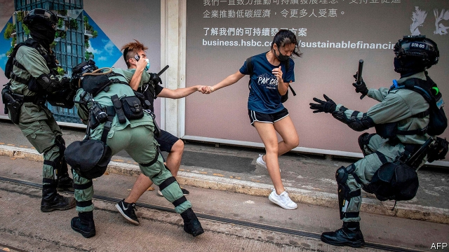

###### A tale of two cities

# Singapore stands to gain from Hong Kong’s troubles 

 

> print-edition iconPrint edition | Asia | Oct 10th 2019 

WHATEVER VIEW is taken on the mayhem in Hong Kong—righteous rebellion or obscene rioting—it is a disaster for the territory’s economy. And if one place stands to benefit from Hong Kong’s troubles, it is that other self-governing, Chinese-majority, financial, commercial and shipping hub in East Asia: Singapore. 

The two places have always seemed to have much in common. Both are commerce-friendly. Thanks to light-touch regulation and efficient, uncorrupt bureaucracies, Singapore comes second and Hong Kong fourth in the World Bank’s ranking of 190 countries for the ease of doing business. Both cities once prided themselves on their adherence to the rule of law and the low level of violence on the streets. 

On all these counts, the events of the past four months have dented Hong Kong’s reputation. Many businesses have been forced into unscheduled closures because mass demonstrations—or in recent days, the suspension of much of its metro system—have kept staff and customers away. As protests have degenerated into street battles, tear-gas, petrol bombs and vandalism have made some parts of town physically hazardous. Hong Kong has sometimes looked closer to anarchy than to the rule of law. 

Some data are already available indicating the short-term impact of the unrest. In August the number of tourists entering Hong Kong fell by 39% overall compared with the same month last year. The number of mainland-Chinese tourists fell by 42%. Singapore, by contrast, saw an annual increase in tourists from China of 4% in August. Mainland China accounts for 21% of tourists visiting Singapore, but nearly 80% of visitors to Hong Kong. 

Some evidence has emerged that people are shifting their money as well as their holidays. An analysis by Goldman Sachs of data for August showed a modest net outflow from bank accounts denominated in Hong Kong dollars, and an inflow into Singapore-dollar accounts. The bank estimated that up to $4bn of deposits may have flowed to Singapore from Hong Kong. 

The rich in Hong Kong and the rest of China have long found Singapore attractive. They like to invest in property there, sometimes as a possible bolthole. Since the beginning of 2017, mainland Chinese buyers have acquired more than 1,000 private homes in Singapore, despite a 20% stamp duty charged to foreigners. 

The bigger picture, even before the recent upheaval, has been of a gradual displacement of institutional financial activity from Hong Kong to Singapore. Hong Kong’s financial industry suffers from competition both from mainland Chinese cities, notably Shanghai and Shenzhen, which are not hampered by its tormented relationship with the central government, and from other big centres in the region that are fully outside China, such as Singapore, Sydney and Tokyo. 

Already, Singapore has a lead in asset-management, with $3.4trn under management at the end of 2018 compared with $3.1trn in Hong Kong. Even (or perhaps especially) for wealthy Chinese who have managed to move capital out of the mainland, Hong Kong may appear uncomfortably within China’s reach. The worry is that Hong Kong will lose its edge in other activities, too, such as investment banking and equities trading. The withdrawal by Hong Kong’s stock exchange on October 8th of its takeover bid for the London Stock Exchange was symptomatic of the strategic bind in which it finds itself. The danger will intensify if Hong Kong’s present troubles inject lasting poison into its relations with China, which is a big source not only of customers and capital, but also commercial perks, such as the special trading link between the stockmarkets of Hong Kong and Shanghai. 

Singapore and Hong Kong have long offered rival political models. Singapore, put crudely, is an illiberal democracy; Hong Kong a liberal autocracy. One has a freely elected government but strict laws limiting, for example, public protest and some political debate. The other has a chief executive “elected” by a few hundred officials, a partially elected and weak legislature, but robust traditions of freedom of speech and assembly. Singapore has been pointing, discreetly, to its relative stability. On October 4th the foreign ministry advised Singaporeans to “defer non-essential travel” to Hong Kong. 

The Straits Times, a pro-government paper, would have felt no embarrassment about its story on a ban on rallies in Singapore in support of the protesters in Hong Kong, on a day of solidarity demonstrations in a number of cities worldwide. The headline read, “Anti-totalitarianism day: No permits for Singapore assemblies”. One protester in Hong Kong, apparently a Singaporean, sparked a fiery debate on social media with a photo of himself holding a placard reading: “Don’t let Hong Kong be like Singapore, where people live in fear.” 

Pro-government commentators in Singapore were quick to condemn him. Even many critics of the government thought he was exaggerating. But, hard though it is to gauge public opinion, a survey in July suggested that 75% of Singaporeans sympathised with the protesters in Hong Kong. 

Writing last month in the Hong Kong Free Press, an online journal, Kirsten Han, an independent Singaporean journalist, guessed that the percentage has probably fallen sharply since then. Leslie Fong, a former editor of the Straits Times, wrote in the South China Morning Post, a Hong Kong paper, of the sorrow many of his compatriots feel “at the sad spectacle of a city smothering itself in full global view”. 

Many Singaporeans, Ms Han noted, believe the argument that Hong Kong’s leaders have been making, that the protests are really about economic gripes, such as unaffordable housing, rather than politics. That ignores the genuine frustration of many in Hong Kong at a political system in which only certain voices seem to be heard. It is a frustration that some in Singapore, despite its very different system, also feel. ■ 

