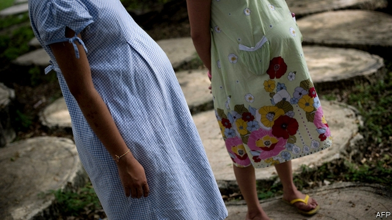
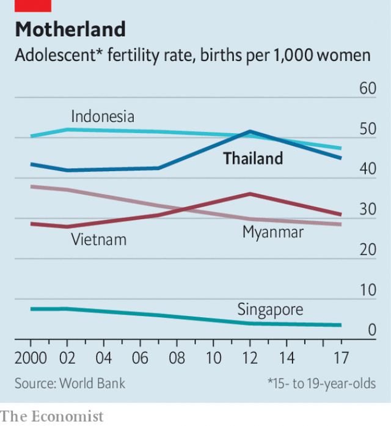

###### A DJ saved my life

# Thailand takes unusual steps to improve sex education 

 

> print-edition iconPrint edition | Asia | Oct 12th 2019 

ONLY IN DESPERATE times do governments enlist the help of teenage disc jockeys. Thailand’s ministry of social development must be in a panic: it has hired more than 500 of them. Its desperation stems from the teenage-pregnancy rate, which has risen even as the overall birth rate has dropped. Thailand has one of the highest teenage-pregnancy rates in South-East Asia (see chart). Hence the DJs, who will promote safe sex on the radio. 

That is not the government’s only initiative to stop teenagers becoming mums. It is also sending health-ministry officials to lecture students about “young love”. It has added sex-education questions to standardised exams. And in 2016 it passed the Prevention and Solution of the Adolescent Pregnancy Problem Act, which gives all adolescents the right to free contraception. The goal is to slash the number of children born to teenagers by a third by 2026. 

 

Supichaya Singhakasem, who had a baby at 18, says she received sex education at school in Bangkok, but it was unenlightening. (She attracted a large online following, of both fans and detractors, after posting photos of herself in school uniform holding her baby.) Her experience is typical: teachers tend to focus on anatomy and deliver clinical lectures rather than practical advice, says Beena Kuttiparambil, who works for the United Nations Children’s Fund (UNICEF) in Thailand. 

UNICEF favours online sex ed. Such schemes have raised awareness of the birds and the bees in Cambodia and Hong Kong. Thais are avid netizens, spending an improbable ten hours online each day, according to the government. Digital platforms provide direct access to teenagers, rather than relying on parents and teachers, who are often reluctant to discuss sex. 

UNICEF has launched Love Care Station, a website through which young people can seek anonymous, one-on-one advice on sexual health. Several companies have released apps that provide some sort of sex ed, too. Some are explicitly informative; others are cloaked in entertainment. The premise of Judies, a Thai video game downloaded more than 720,000 times, is that condoms are life-saving shields for humans against aliens. 

Thailand was once considered a paragon of sexual education. In the 1990s it stemmed an incipient epidemic of HIV. Nearly everyone can get hold of contraception, but 12% of 15-19-year-olds cannot. 

Prayuth Chan-ocha, the coup-leader-turned-prime minister, supported the adolescent-pregnancy law. Yet he believes that equality for women would “make Thai society deteriorate” and has compared scantily clad females to unwrappedsweets. Earlier this year a small political party wanted a Netflix show, “Sex Education”, to be banned. The party reasoned that it is safe for Western teenagers to watch such lewdness, but that Thailand’s young are at greater risk, because they “haven’t learnt the topic correctly”. ■ 

