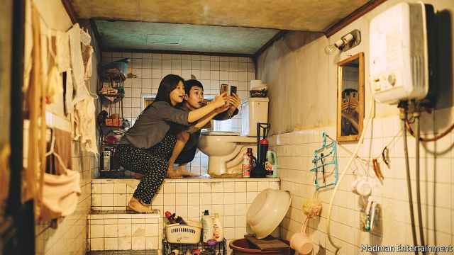

###### One country, two systems

# The president promised South Koreans a meritocracy 

 

> print-edition iconPrint edition | Asia | Oct 12th 2019 

IN AN EARLY scene in “Parasite”, a hit South Korean film, a young woman from a poor family forges a university-enrolment certificate for her brother. He is about to apply for a job tutoring a girl from a rich family and hopes that the false credential will improve his chances. But when he shows up to the interview the girl’s mother barely glances at it, telling him she trusts him because he was recommended by her daughter’s previous tutor—his only posh friend, who has left to study abroad. 

Even more than in most countries, academic credentials are valuable for getting ahead in South Korea. But the scene captures another truth: that if you know the right people, your exam results don’t matter as much. The two siblings in “Parasite” (pictured above, desperately trying to catch a free wi-fi signal) milk that insight for all it is worth, before things inevitably unravel. The film, which won the top prize at the Cannes film festival this year, also struck a chord with South Koreans: in a country of 52m, cinemas have sold 10m tickets for it since it was released at the end of May. 

The resonance of a satirical film about inequality is hardly surprising. Moon Jae-in, the president, promised to make South Korea “fairer” when he was elected in 2017, after his predecessor was impeached (and later given a long prison sentence) for using her authority to help a friend’s child get ahead, among other abuses. Yet over the past couple of months a nepotism scandal has engulfed Cho Kuk, Mr Moon’s new justice minister. Before Mr Cho was appointed, it emerged that his daughter, now in her late 20s, had received some unusual benefits during her studies. Among other things, she allegedly received generous scholarships despite twice failing her exams at medical school, and was listed as the primary author of an academic paper while still in secondary school, even though she had only completed a two-week internship at the lab where the research in question was conducted (which happened to be run by a friend of her mother’s). Mr Cho, who has apologised to young people for causing “disappointment” but has said he will not resign, has been charged by Mr Moon with reforming the prosecutors’ office, to make sure it does not go soft on well-connected crooks. 

For many South Koreans, the story carries echoes of the scandal that brought down Park Geun-hye, the previous president, whose closest confidante persuaded a university to change its admissions criteria to admit her daughter. Outraged students, in particular, have been protesting against Mr Cho’s appointment. “I don’t mind the system being competitive, but it’s the hypocrisy that’s so galling,” says Lee Jong-bae, who is campaigning to reform university admissions. “They promised us a fair and equal society and instead we keep having these scandals that show us that privilege is passed on and you can never succeed unless your parents did.” His disillusionment is typical: nearly two-thirds of South Koreans under the age of 30 believe that they are unlikely to move up the social ladder. Six years ago, it was less than half. 

They have cause to be pessimistic. The social class of children is more closely tied to that of their parents in South Korea than in any other country in the OECD, according to a study published last year. Data from the education ministry show that the percentage of students who receive financial aid at the best universities in Seoul was barely half the national average, suggesting that a large majority of their students are from well-off families. 

The problem is not exclusive to South Korea, says Lee Cheol-sung of Sogang University. “Privilege plays an important role in educational attainment everywhere.” The recent revelation that some rich families in America had secured places for their children at prestigious universities through fraud and bribery caused widespread outrage. But such scandals prompt particular anger in South Korea, he argues, because of the country’s rigid labour market, which offers few opportunities for those starting out. “It’s a systemic problem—there are all these old people with high salaries who are impossible to get rid of, so, to keep paying them, firms avoid hiring young people or only give them irregular contracts.” 

The official youth unemployment rate reached 10.4% this summer. But that does not include those so discouraged that they have stopped looking for work, and those who undertook further studies to put off looking for a job. If these groups are taken into account, some economists reckon, the true unemployment rate for young people may be as high as 25%. 

Mr Moon is trying hard to level the playing field. His government offers generous subsidies to companies that employ young workers, is encouraging employers to convert part-time contracts into regular jobs and pays a monthly stipend of 500,000 won ($420) to some youngsters from poor backgrounds who are unable to find work. It has banned discriminatory hiring practices, too, such as asking for parents’ names and titles on application forms, and tightened rules for lawmakers who want to employ relatives. 

The government is also drafting legislation to criminalise the hiring of ghostwriters or consultants to buff up university applications, a practice which for many epitomises the unfair advantages of the rich. Those who can afford it spend tens of thousands of dollars on such services. Such extravagant and blatant efforts to secure undue advantage in university applications are so common that they have become the subject of a popular television drama, “Sky Castle”. In one episode, a rich father buys a model pyramid to remind his sons of the structure of society. Some South Koreans say the show is so true to life they cannot bear to watch it. ■ 

