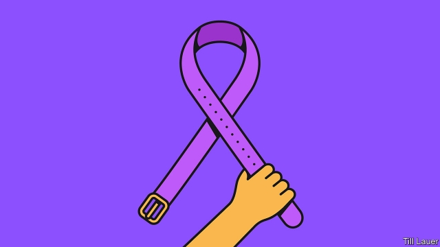

###### Banyan

# The struggle of Asian women not to be abused 

 

> print-edition iconPrint edition | Asia | Oct 12th 2019 

IN SEPTEMBER A woman called police to tell them that the Speaker of Nepal’s parliament, Krishna Bahadur Mahara, had just drunkenly assaulted her in her flat. When, according to local media reports, she later withdrew her allegation in the face of threats and pressure, everything seemed to be following the usual South Asian script. Men, especially powerful ones, rarely have to answer for their actions. Then the UN and foreign embassies put out a statement urging the government to take a stand on violence against women. Within days, Mr Mahara had stepped down. This week the police arrested him. 

Whether this case will count as progress in the abysmal treatment of women in his part of the world will not be clear for some time. Violence against women need not hold back a man going places. A tally in India last year found 48 members of parliament or state assemblies accused or convicted of violent crimes against females. They included members of parties run by women. 

In South Asia the mistreatment starts in the womb, with the selective abortion of girls. It continues after birth. Girls are likelier to die before the age of five or drop out of school. Many marry before they are adults or are beaten by their partners. In the five years to 2015 over 40,000 Indian women died in rows over dowries. That is more than the combined deaths over the same period from conflict in Kashmir, insurrection in the north-east and the Naxalite rebellion. 

Laws and social attitudes have evolved, but not enough. The brutal gang-rape and murder in 2012 of a student in Delhi galvanised India’s middle classes, but the rape of women and girls in villages attracts little attention. 

Most sex crimes everywhere go unreported, so all statistics about them should be treated with caution. But for what it is worth, the UN says Asia and the Pacific have the worst rates of violence against women, with two in three women experiencing it in their lifetime. 

Discrimination is rampant. This year Indonesia’s Supreme Court found a former teacher guilty of “violating decency” by making a lewd recording. She had taped her boss making sexually explicit comments to her, hoping to prove that he was harassing her. Her ordeal ended only with a presidential pardon. Female police officers and army recruits are sometimes required to submit to outrageous physical inspections to “prove” their virginity. 

In China abusive marriages are common, and hard to escape (see article). Activists against harassment are themselves harassed by the state. In Cambodia women’s safety is not helped by the media. A third of television dramas depict physical, sexual or emotional abuse of women. Such problems are not confined to poor countries. South Korea’s K-pop industry has been roiled by a series of cases in which women were drugged and raped. Then there are the thousands of spycams detected each year in women’s lavatories and changing rooms, for which hardly anyone is prosecuted. Recently, a hospital worker killed herself after discovering that a video of her changing into her scrubs had been widely distributed. Reported sex crimes, including child rape, are up sharply in Bangladesh, though this might simply reflect a greater willingness to report such things. 

Across Asia women are finding a voice. In Bangladesh a #MeToo-style movement is growing in the country’s garment factories (though the movement’s leaders still struggle to convince victims to file complaints with the police). In January lawyers in Pakistan launched an online portal called Ab Aur Nahin (“Time’s up”) offering pro bono help for victims of harassment. 

In the Philippines women have taken to social media and the streets to complain about President Rodrigo Duterte’s frequent jokes about rape and groping—a rare case of people standing up to the strongman. And in South Korea more women are speaking up against powerful, violent men in government, business and entertainment. 

They are also, in a “corset-free” movement, challenging the country’s rigid beauty standards, exemplified by employers’ expectation that women should be heavily made-up at work and, at some firms, not even wear glasses. The emergence in South Korea of an aggressive, mainly online force of young men who believe that such movements are proof of the oppression of men is an indication of how long and how hard the battle for security, let alone equality, will be for Asian women. 

