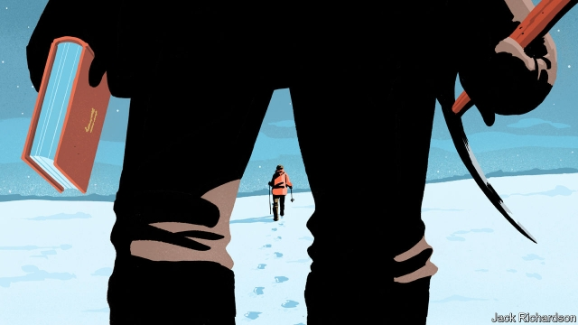

###### The library of ice

# An expedition reveals the perils of reading Dostoyevsky in Antarctica 

 

> print-edition iconPrint edition | Books and arts | Oct 12th 2019 

FORTY YEARS ago, in the autumn of 1979, a group of British explorers set out from London on a seemingly impossible mission: a circumpolar navigation of the Earth. Over the three years of what was known as the Transglobe Expedition, they would struggle against high seas in the Roaring Forties, evade hungry polar bears, negotiate mountainous sand dunes and forbidding jungles. There was another danger, more insidious and less photogenic than any of these, but which nonetheless posed a threat to their endeavour—boredom. This was to be particularly acute in Antarctica, where, after traversing Africa, the group was obliged to spend months huddled in icy darkness. 

Sir Ranulph Fiennes and the team he had assembled undertook their journey in a much less technological age. There was no satellite navigation; messages to and from their base camp were sent in Morse code by Sir Ranulph’s wife, Ginny, who was in charge of communications. Nor were there any Kindles. A big part of the cargo aboard the Benjamin Bowring, the expedition’s ice-breaker, was books. 

Fortified by this reserve, the team undertook two adventures at once—one of the body and one on the page, both involving extreme conditions, endless vistas and unsettling claustrophobia. Both laid bare the personalities of the participants, and both left their marks. 

The plan for Antarctica was to spend the first brief summer getting the main group—Sir Ranulph, Ginny and two former members of the SAS, Charlie Burton and Oliver Shepard—up onto the lofty Antarctic Plateau, where they would wait out the eight-month polar winter before embarking on their crossing of the continent in the spring. They succeeded in establishing themselves on the 3,000-metre-high ice shelf. “I dug an awful lot of snow, dug tunnels, dug slop pits and latrines,” Sir Ranulph, now 75, recalls. The Antarctic leg “required an enormous amount of time crouched over maps. But there was time for reading, and we read a lot.” 

At Eton he had been taught French by David Cornwell, the alter ego of John le Carré: “He developed in me a lasting love of literature, of the sound of great language.” Penguin, the publisher, had offered to sponsor them, Sir Ranulph explains. He took 50 volumes by classic British authors—Dickens, Scott, Thackeray and Trollope (“Dickens was always a bit like coming home”). For his part, Burton requested a boxful of Westerns. Mr Shepard, meanwhile, had “hardly read at all when I went out there”. Before the expedition he had worked in the wine trade; he now lives in France. But “we were in a hut the size of a garden shed,” he recalls, and reading “was the only form of escape I had.” 

His preference was for an epic tale of adventure, played out against a hostile and perilous landscape. “I read ‘The Lord of the Rings’ trilogy seven times,” Mr Shepard says. “It seemed to appertain so closely to what we had decided to undertake.” He believes that this prolonged engagement with literature left a lasting impression. More than simply being a diversion, it “put me on the path of an avid reader”. He remembers “War and Peace” and Kafka as “hard work” but “worth it”. (Ginny Fiennes died in 2004, Burton in 2002.) 

At least the main expedition crew was partly occupied by anticipation of the polar crossing. The team had also established another camp, just inland from the ice-packed Southern Ocean. There two young men, Anto Birkbeck and Simon Grimes, were to guard the fuel and food supplies that would be airlifted to Sir Ranulph and his colleagues when winter was over. 

At the time Mr Birkbeck, who is now a fund manager, was just 22 and straight out of university; he leapt at the chance of spending an exotic winter in the polar darkness. He and Mr Grimes, who had never met before they set out, were crammed into an even smaller hut than their counterparts on the plateau. There were two desks, two bunks and over 200 books. 

“Our hut was a bubble on the ice shelf, miles of flat whiteness with a hundred foot of ice beneath us, and the sky above and the sea beyond,” Mr Birkbeck recollects. These were abnormal—and, it turned out, risky—circumstances. “The more I think about it, the more really odd it was to be parked in a box with some very good books and great ideas…You do end up looking too deeply into the Eye of Sauron,” the malign antagonist of “The Lord of the Rings”. 

Mr Birkbeck started off with a clear plan for his days: an hour of physical exercise in the morning, followed by an hour of physics, an hour of Spanish study and then an hour reading poetry. The rest of the day would be spent with a novel. “As winter wore on,” he says, “the novels took over. I started getting up at midday and just reading a novel until bedtime.” 

He had asked friends to recommend their desert-island books, and duly worked through all of Tolstoy, Hardy and George Eliot, plus “Don Quixote”, “One Hundred Years of Solitude” and Joyce’s “Ulysses” (as well as Homer’s “Odyssey”). As well as the poetry (Chaucer, Milton, T.S. Eliot and “Sir Gawain and the Green Knight”), there was philosophy (Nietzsche, Hegel, Bertrand Russell and Aristotle). And, almost fatefully, he read Dostoyevsky. 

There was one moment, towards the end of the winter, when Mr Birkbeck had just finished reading “Crime and Punishment” and found himself walking behind Mr Grimes on the ice. In his memory, the events of that day are now murky. “I find it very difficult to know whether it is a figment of my imagination or not,” he says. “There’s no question that if you put two people in a hut the size of a caravan and shut them up for nine months, you will generate intense frustration,” for which “the other person is the obvious focus.” 

On this particular day, “I don’t remember ever having a row, but I do remember being intensely irritated by him.” Mr Birkbeck also recalls having an ice-axe in his hand as he trailed his hut-mate through the whiteness. “I remember getting deeply into the mind of Raskolnikov and thinking hard about this cold-blooded murder,” which Dostoyevsky’s anti-hero commits with an axe. At the same time he was pondering the question of whether good and evil truly exist. “I don’t really know whether [Mr Grimes] was in danger or not.” 

Now, thinking back after four decades on what he calls a “Boys’ Own adventure”, Mr Birkbeck says the experience was “more powerful and meaningful” than he had realised. Over the years the two feats involved, one mental and one physical, each formative in its own way, have come to chime and blur. “It was not just about the South Pole,” he concludes. “It was also about Dostoyevsky and James Joyce,” and about “the lasting power of great books”. ■ 

