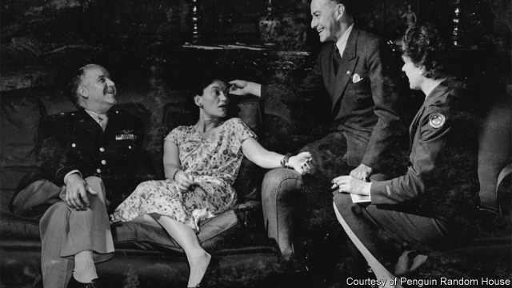

###### Big game hunted

# Gertrude Legendre led a charmed life—until her capture by the Nazis 

 

> print-edition iconPrint edition | Books and arts | Oct 12th 2019 

A Guest of the Reich. By Peter Finn. Pantheon Books; 240 pages; $28.95. 

FOR MUCH of her long life, Gertrude “Gertie” Legendre enjoyed a charmed existence. Born in 1902 to extreme wealth (her father had inherited close to a billion dollars in today’s money), for her the 1920s were “a blur of parties, dances, theatre and music”. Boredom was kept at bay by travel—ranging from Africa, where she and her future husband Sidney dined with Emperor Haile Selassie in Addis Ababa, to Indochina—and by a passion for hunting that kept America’s museums stocked with specimens from around the world. As Peter Finn notes in his beautifully paced book, she inspired a Broadway play and a film starring Katherine Hepburn as “an amusing, cocky, sometimes abrasive society girl who wants to escape the confining expectations of her family’s fabulous wealth”. 

The charmed life came to an abrupt end on September 26th 1944. Legendre’s social connections had wangled her a secretarial role in the Office of Strategic Services (OSS). But employment in this forerunner of the CIA did not requite her yen to “smell the fighting” before Germany’s inevitable defeat; hence a high-spirited trip with three other Americans to Wallendorf, a small town in Luxembourg. Wallendorf turned out to have been taken back from the advancing American forces by the Germans—and Legendre became “the first American woman in uniform captured by the Nazis”. 

The question for her captors was what to do with her. Was she a spy? (The OSS was terrified that she might divulge its secrets.) Should she be exchanged? “If only your side wanted to talk, wanted to stop this useless killing right now,” one of her interrogators complained, “it could be done with the stroke of a pen.” Could she somehow be a link to General George Patton (whom, as it happened, Legendre knew as a dinner and theatre companion)? After six months she “escaped” to neutral Switzerland, almost certainly with the complicity of her captors. 

Using Legendre’s memoirs, diaries and letters, Mr Finn—the author of a fine book about Boris Pasternak and “Dr Zhivago”—paints an entertaining picture of a remarkable woman. She was equally at ease in a flea-infested jail cell as in the comfortable hotel for “special and honoured” prisoners of the SS; the other guests included Charles de Gaulle’s sister and two former prime ministers of France. Mr Finn’s own writing shines in his description of pre-war American high society: the sybaritic circuit of parties, night clubs and restaurants that meant everyone knew everyone. 

The casual racism of the period can still be shocking. Legendre’s journal from a trip that she made with Sidney to Germany in August 1936 makes no reference to the Nazis. A letter to her husband in 1942 praises a Jewish vice-president of CBS, adding: “You know how I hate jews so that is quite a statement from me calling a jew alright.” As for the African-American soldiers who were dating white women while they were in Britain, Gertie had a clear view. “The Coloured Troops are much argued about as you can imagine,” she wrote from London. “We are going to have a time with them when they get home, as they go over big here in the worst way.” 

In the 1930s the couple had renovated a South Carolina plantation that became their home. Sidney, who mainly spent the war in Hawaii, died in 1948. Legendre never got over his death, but did not lose her lust for a life that lasted another 52 years. Sadly for the reader, Mr Finn is too scrupulous a writer to speculate on what she made of the changes to her world. ■ 

