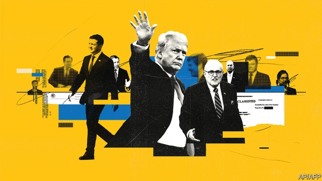
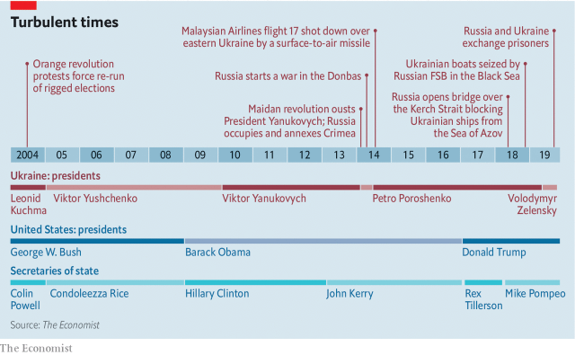
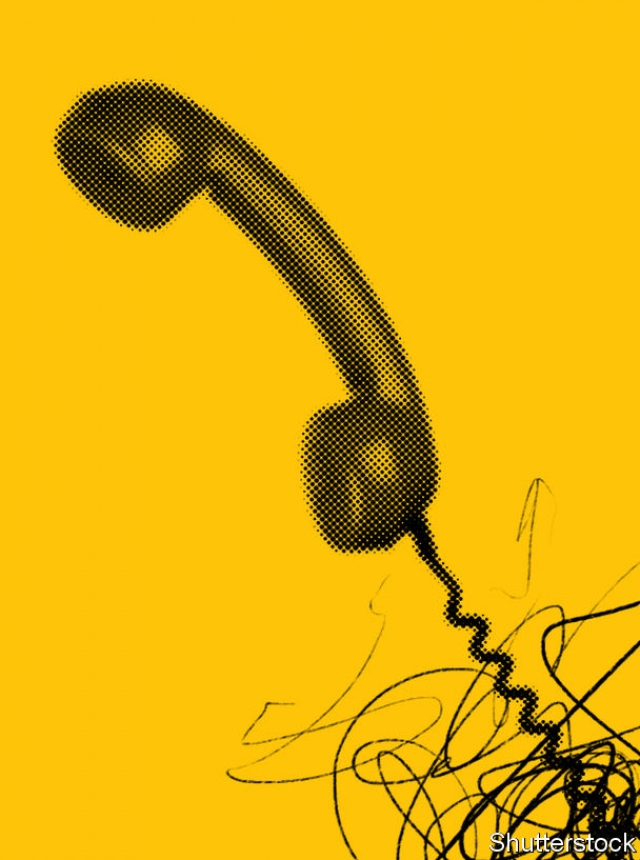

###### The backstory to impeachment

# From Paul Manafort to Donald Trump’s fateful phonecall 

 

> print-edition iconPrint edition | Briefing | Oct 12th 2019 

Editor’s note (October 10th 2019): Shortly after this report was published two people mentioned in it, Lev Parnas and Igor Fruman, were arrested at Dulles airport outside Washington, DC. They have been charged with funnelling foreign money to American political candidates and a pro-Trump election committee. 

VIKTOR YANUKOVYCH, out of office, found himself in a bind. Having become prime minister of Ukraine in 2002, he had expected to be elected president in December 2004. The official count in the election had borne out his expectation. But thousands of orange-clad demonstrators had subsequently taken to the streets of Kiev to protest that the tally had been rigged. The Supreme Court ordered a recount. The result was overturned. 

Post-Soviet Ukraine was just 13 years old, and adrift. A home to hardline Communists and ardent nationalists alike in the 1980s, part of its territory long engaged with Europe, part stalwartly Russian, it had no real tradition of statehood. Oligarchs-in-the-making took advantage of that lack to carve up the country’s considerable rents and assets. Some of these oligarchs went into politics; some cultivated politicians. All sought and bought protection from people with power in Russia, Europe and America. Ukrainian politics and foreign relations became an extension of the oligarchs’ business interests. Its parliament became a market. 

After the election of 2004 Mr Yanukovych’s stock plummeted—which was bad news for Rinat Akhmetov. A coal and steel magnate based in Donbas, an industrial region in eastern Ukraine, Mr Akhmetov was one of the main sponsors of Mr Yanukovych and his Party of Regions. If they were to regain power, Mr Yanukovych would have to win the next election more or less fairly. That would mean overhauling his image. So Mr Akhmetov introduced Mr Yanukovych to Paul Manafort. 

Mr Manafort thought he was on to a good thing. A consultant to Republican politicians in America, he also had a lucrative business tending to unsavoury overseas clients such as Jonas Savimbi, an Angolan guerrilla leader and Mobutu Sese Seko, a Congolese dictator. He and his team had turned Mr Yanukovych, whose nickname during his short stints in prison when young had been kham, or “thug”, from a Kremlin-backed bully into a self-made man with blue-collar roots. Charismatic would have been too much to hope for, but his tailored suits, Politburo hair and deliberate manner gave him a plausibly presidential demeanour. He seemed practical and solid, the salt of the earth. 

The campaign Mr Manafort devised for this remade candidate used tactics he had first seen used in Richard Nixon’s re-election campaign in 1972: exploiting cultural divisions and stoking grievances. Mr Yanukovych was portrayed as a defender of the Russian-speaking east against western Ukrainians who wished to force a new language and culture on them while exploiting their economic resources. He raged against the joint exercises Ukraine was holding with NATO in Crimea. When the American ambassador tried to get Mr Manafort to rein him in, he was rebuffed. 

The election of 2010, which was pretty much above board, saw Mr Yanukovych become president. As such, he made Mykola Zlochevsky, a burly, shaven-headed tycoon, his minister for ecology and natural resources. In the early 2000s Mr Zlochevsky had been chair of the State Committee for Natural Resources at a time when companies he had started had been granted lucrative oil-exploration licences. These licences were cancelled under the new regime that came to power in 2005, though the cancellation was later overturned. 

Oliver Bullough’s book “Moneyland”, which deals with money laundering, records that during Mr Zlochevsky’s second stint in control Burisma, a company he had founded to consolidate his oil and gas interests, was granted nine production licences and saw its natural-gas production increase sevenfold. As Mr Bullough puts it, “There is a marked correlation between Zlochevsky’s period in office and Burisma expanding. He is a classic example of how politics in Ukraine has long been business by other means.”  

Burisma was owned through various holding companies in Cyprus, and Mr Zlochevsky’s lawyers have insisted that their client did not benefit from his own official decisions. But his experience after 2005 must have made him keenly aware that his fortunes might dip under another regime. 

When that other regime arrived, it did so dramatically. Mr Yanukovych’s victory in 2010 had wedged open the country’s divides, unlocking the way to revolution, invasion and bloodshed. In 2014 he was overthrown and fled to Moscow, taking vast wealth with him. Russia, irked at having its man displaced by the “Euromaidan” uprising, responded by annexing Crimea and fomenting insurrection in the east. 

Mr Zlochevsky, out of office, found himself in a bind. The new government wanted to get back the money siphoned off by Mr Yanukovych and his cronies, and enlisted the help of international authorities to that end. After Mr Zlochevsky tried to move $23m to Cyprus from a London account held with BNP, a bank, in March 2015, Britain’s Serious Fraud Office froze his account. The SFO argued in court that there were reasonable grounds to believe Mr Zlochevsky made this money by breaking Ukrainian law. Of specific interest was $20m paid into the account by a company owned by Sergey Kurchenko, who handled money for Mr Yanukovych’s family. 

 

Hunter Biden thought he was on to a good thing. In 2014, Mr Biden was asked to join the board of Burisma, along with Devon Archer, his business partner, and Alexander Kwasniewski. Mr Biden is the son of Joe Biden, then vice president and Barack Obama’s point-man on Ukraine; Mr Archer is a friend of the stepson of John Kerry, then America’s secretary of state; Mr Kwasniewski used to be president of Poland. Mr Biden was reportedly paid $50,000 a month. 

The purpose of expanding Burisma’s board in this well connected way, it seems, was to buy Mr Zlochevsky protection; as well as the money-laundering case in London, he was also facing two investigations in Ukraine, one for tax evasion and one over conflicts of interest involving Burisma’s licences. Mr Zlochevsky, who had fled Ukraine, also wanted leverage in his dealings with Petro Poroshenko, the oligarch elected president in May 2015. 

If such protection was, indeed, Mr Zlochevsky’s plan, it apparently worked. The prosecutor general’s office failed to supply the SFO with the documents needed to keep his account frozen. At the end of the year someone there supplied Mr Zlochevsky’s lawyers with a letter stating that he was not suspected of any crime in Ukraine. The judge in London released the $23m on the grounds that Mr Zlochevsky “was never named as a suspect for embezzlement or indeed any other offence, let alone one related to the exercise of improper influence in the grant of...licences”.  

Vitaly Kasko, who as head of the international department in the prosecutor’s office had been trying to help the SFO, smelled a rat. So did America’s ambassador to Ukraine, Geoffrey Pyatt, “Those responsible for subverting the case by authorising those letters”, he said a few months later, “should—at a minimum—be summarily terminated.” Anti-corruption activists in Ukraine argued that the Burisma case and other attempts to recover laundered loot failed because the government did not really want them to succeed. Oleksandr Onishchenko, a businessman and MP who is now a fugitive abroad, says Mr Poroshenko was far from dismayed when told that Mr Zlochevsky was supplying free natural gas to a glass works run by his right-hand man and might be willing to do more such favours. On a recording Mr Onishchenko claims to have made of this conversation, the president calls Mr Zlochevsky “a good guy” and sends him his greetings. Mr Poroshenko says this recording is a fake. 

With Mr Poroshenko’s credentials as an enemy of corruption in doubt, the American government helped to set up a new National Anti-corruption Bureau (NABU). It was ring-fenced from interference by Ukrainian officials and supervised by the FBI, which set up an office inside the new bureau. But it found its work blocked by Viktor Shokin, who Mr Poroshenko made prosecutor general in February 2015. Pressed by foreign ambassadors and Ukrainian activists, Vice-President Biden became part of an international campaign to remove Mr Shokin. “The office of the general prosecutor desperately needs reform,” Mr Biden told Ukraine’s MPs late in 2015; privately he told Mr Poroshenko that keeping Mr Shokin would cost him $1bn in aid. 

In April 2016 the president replaced Mr Shokin with Yuri Lutsenko. In 2006, as interior minister, Mr Lutsenko had launched an investigation into Mr Zlochevsky. After Mr Yanukovych returned to power in 2010, Mr Lutsenko was jailed in what appeared to be a political vendetta. When he became prosecutor general in 2016, he brought the tax evasion case against Mr Zlochevsky to a conclusion with a fine of $7.4m. The third case, about the licences, was passed to NABU, where it remains unresolved. 

Activists and outsiders hoped that Mr Lutsenko would prosecute cases more vigorously than Mr Shokin had and co-operate more with Artem Sytnik, the fresh-faced head of NABU. Mr Lutsenko disappointed those critics, using his office to attack some of them, and worked to undermine Mr Sytnik and subvert NABU operations. Marie Yovanovitch, a career diplomat recently arrived in Kiev as America’s ambassador, told him to stop attacking anti-corruption activists and former staff such as Mr Kasko, who had co-operated with the SFO in the Burisma case. Mr Lutsenko was not pleased. 

Mr Lutsenko and Mr Poroshenko’s faction pushed on with attempts to remove NABU’s independence and fire Mr Sytnik. Things came to a head during a night of frantic trans-Atlantic calls in December 2017. In part because of pressure from the IMF, which was funding billions of dollars of Ukrainian debt, Mr Poroshenko backed down. Mr Sytnik remained in his job and NABU retained its independence. 

Mr Lutsenko, in office but weakened and humiliated, found himself in a bind. So he looked to a powerful outsider for support: President Donald Trump’s White House. Although this seemed to be on his own initiative, Mr Lutsenko rarely did anything without Mr Poroshenko’s approval. The president, who had favoured Hillary Clinton in the American elections of 2016, was keen to patch things up with Mr Trump. The feeling was not mutual—but Mr Lutsenko was still of interest. 

Rudy Giuliani thought he was on to a good thing. In his role as President Donald Trump’s personal attorney he had made it known that he was interested in digging up dirt about Ukrainian support for Mrs Clinton, and any special favours which might have been done on behalf of Mr Biden. According to Mr Lutsenko, two of Mr Giuliani’s other clients, Lev Parnas and Igor Fruman, got in touch with him at Mr Giuliani’s behest in late 2017. 

Mr Parnas and Mr Fruman are Ukrainian-American businessmen based in Florida. Mr Fruman owns a boutique hotel and a beach club in their native Odessa, as well as a bar in Kiev known for its professional escorts. Mr Parnas was once a stockbroker. The Washington Post has reported that, in 2016, a court ordered him to pay more than $500,000 to an investor in a never-made movie called “Anatomy of an Assassin”; according to court records Mr Parnas is still being pursued over the debt. Yet a complaint in front of America’s Federal Election Commission says that Mr Parnas, Mr Fruman and shell companies with which they are associated have still managed to contribute over $400,000 to various Republican campaigns and organisations, including America First Action, a pro-Trump “superPAC”. 

Mr Lutsenko looked like pay dirt to Mr Giuliani. So did Mr Shokin, his predecessor, who was angry at having been denied a visa to visit his daughter in California, something he blamed on Ms Yovanovitch. On January 23rd 2019 Mr Giuliani had a phone call with Mr Shokin (Mr Parnas acted as interpreter). According to notes Mr Giuliani later provided to the State Department, Mr Shokin alleged that his investigations into Burisma were effectively terminated not because Mr Poroshenko thought he was a “good guy” but because of pressure from Mr Pyatt, the American ambassador, and Vice-President Biden. 

Two days later Mr Giuliani met Mr Lutsenko. Again according to Mr Giuliani’s notes, Mr Lutsenko produced a document from Latvia appearing to show transfers of several million dollars from a Burisma bank account, including $1.15m to Mr Kwasnewski and undisclosed sums to Mr Biden and Mr Archer. He also spoke of a payment of $900,000 to Rosemont Seneca Partners, a consultancy co-founded by Hunter Biden, in return for lobbying services by Mr Biden’s father. On October 9th Andriy Derkach, a former member of the Ukrainian secret service who has now become an MP, repeated that allegation. Mr Derkach has close ties to Mr Lutsenko. There is no evidence that this claim is true. 

On January 26th Mr Giuliani and Mr Lutsenko met again. This time, the talk was of Paul Manafort. After the downfall of Mr Yanukovych, a book that contained records of payments made from a slush fund was passed to the security services. In the spring of 2016 this “black ledger” reached NABU. Soon afterwards details of a payment to Mr Manafort for services for Mr Yanukovych were disclosed to the New York Times. The revelation led to Mr Manafort being fired from his position managing Mr Trump’s campaign and contributed to his later imprisonment. 

Mr Giuliani also noted a claim that Mr Sytnik of NABU had been secretly recorded by Ukraine’s security service saying that he was keen to help Hillary Clinton’s campaign. Mr Derkach now claims he has documents showing that NABU worked closely with the American embassy in 2017. 

In March 2019 Mr Lutsenko went public, telling John Salmon of The Hill, a political website, that Ms Yovanovitch gave him “stop lists” that kept certain people in Ukraine safe from investigation. Ms Yovanovitch was recalled to Washington the following month because, in Mr Giuliani’s words, “she was part of the efforts against the president”. The State Department dismissed this as an “outright fabrication”. 

 

The next month Mr Poroshenko lost the Ukrainian elections to Volodymyr Zelensky, a television comedian. Mr Parnas and Mr Fruman immediately contacted a member of Mr Zelensky’s team to arrange a meeting between him and Mr Giuliani. 

Mr Zelensky, newly installed in office, was in a bind. He had been elected on a promise to overhaul the corrupt system which was undermining Ukraine’s prosperity and security (his government is currently investigating Mr Poroshenko and Mr Lutsenko). And he wanted money, weaponry and symbols of support such as state visits to help him face down Russia. But he did not want to be dragged into using his position to settle American political scores. 

On May 9th, the New York Times reported that Mr Giuliani was on his way to Kiev. Keen to keep his distance, Mr Zelensky declined to meet him. On May 12th, Mr Lutsenko visited Mr Zelensky and urged him to see Mr Giuliani. “He said he had a number for Mr Giuliani and that Giuliani would connect him to Mr Trump,” a person familiar with that meeting says. Again, Mr Zelensky declined. 

Kurt Volker, America’s special envoy to Ukraine charged with resolving the conflict in Donbas, tried to smooth the building tension ahead of a telephone call with Mr Trump. On July 7th he had a breakfast with Mr Giuliani. Later that day he texted Mr Giuliani to introduce him to Andriy Yermak, a top adviser to Mr Zelensky. A few hours later he texted William Taylor, the American representative in Ukraine, and Gordon Sondland, a Republican fund-raiser who had become Mr Trump’s ambassador to the EU: “Had breakfast with Rudy this morning—teeing up call w[ith] Yermak Monday. Must have helped. Most impt [important] is for Zelensky to say that he will help investigation—and address any specific personnel issues—if there are any.” 

On July 25th, Donald Trump probably thought he was on to a good thing. He was about to call the neophyte president of a poor, embattled country—a country whose previous leaders had, in Mr Trump’s mind, conspired to do him down, but which also might hold the key to smearing his possible adversary in the coming election and providing some justification for pardoning Mr Manafort. Mr Zelensky’s weak position meant he had every reason to grant whatever favours Mr Trump might ask of him 

A few hours before the call between the two presidents was scheduled to take place, Mr Volker texted Mr Yermak. “Heard from White House—assuming President Z convinces trump he will investigate/“get to the bottom of what happened” in 2016, we will nail down date for visit to Washington. Good luck!”  

And so, at the end of a decades-long saga of reciprocal corruption, spiralling cynicism and abuse of office, Mr Trump picked up the phone.■ 

