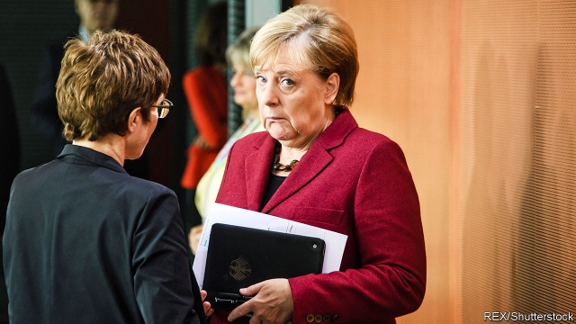

###### Die another day

# As Brexit talks founder, yet another delay looms 

 

> print-edition iconPrint edition | Britain | Oct 10th 2019 

NOBODY SHOULD have been surprised when the European Union objected to Boris Johnson’s Brexit plan, proposed on October 2nd. After all, the proposal resiled from previous British promises that there would be no customs border between Northern Ireland and the south, and it also planned to hand the hardline Democratic Unionist Party a four-yearly right to veto the arrangement. Dublin was unhappy with the plan, as were Northern Irish public opinion and most business leaders. So what were the prime minister’s real goals? 

One may have been to stake out a tough position in hopes of luring a fed-up EU into a compromise closer to his terms. Yet unless Mr Johnson moves much further, this looks increasingly unlikely to work. Hence a second goal that became clear this week: to heap the blame for forcing a no-deal Brexit on intransigence in Brussels. A message to the Spectator magazine from a Downing Street source claimed that Leo Varadkar, the Irish taoiseach, had reneged on earlier promises to back the deal. This was followed by an implausible assertion that Angela Merkel, the German chancellor, had told Mr Johnson that any deal was now “essentially impossible”. 

The EU has been alert to such tactics ever since Mr Johnson became prime minister in July. On October 8th Donald Tusk, president of the European Council, demanded an end to “this stupid blame game”. The British government continues to insist that Brexit will happen on October 31st, “do or die”, and is even planning to mint 3m commemorative coins for the occasion. Yet the EU believes that Mr Johnson is now legally bound by the Benn act, passed by Parliament last month, to ask for an extension if, as expected, he gets no deal at the European Council summit on October 17th and 18th. 

Indeed, unless Mr Johnson gives a lot more ground, the summit is likely to devote most of its time to debate over another extension, not over a deal. Mujtaba Rahman of the Eurasia Group, a consultancy, reports that on this the mood around the EU is calm, not fretful. There is no serious talk of anyone blocking an extension, despite brazen threats in London that Britain will disrupt EU business and even limit future security co-operation if a delay is granted. The only issues are how long the extension should be and what justification to cite for giving it. 

The odds are that, as suggested by the Benn act, an extension will be offered until January 31st, though some are talking of March or even next summer. And the justification will be so that Britain can hold some democratic event—most likely the election that Mr Johnson badly wants, but, if not, conceivably another referendum. Downing Street has said it will summon MPs to Westminster for a rare Saturday sitting the day after the Brussels summit to debate future options. 

The EU knows that Mr Johnson wants to fight an election under the banner of “the people versus Parliament”, and perhaps even on a straight promise that, if he secures a majority, he will at once take Britain out with no deal. But by irredeemably splitting his Conservative Party, such a promise may prove impossible to keep. Eventually, Brussels expects Britain, whether or not still led by Mr Johnson, to have to come back to the negotiating table with a more accommodating approach. Hence its serenity in an otherwise chaotic week. ■ 

