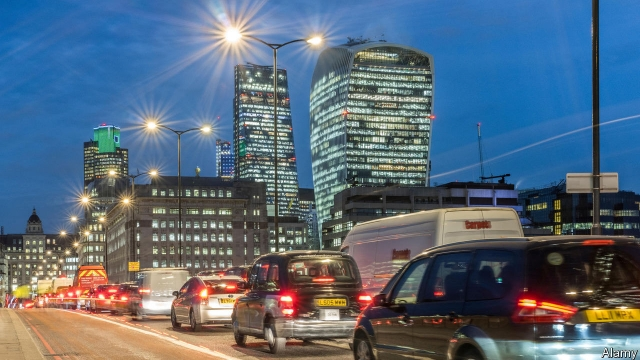
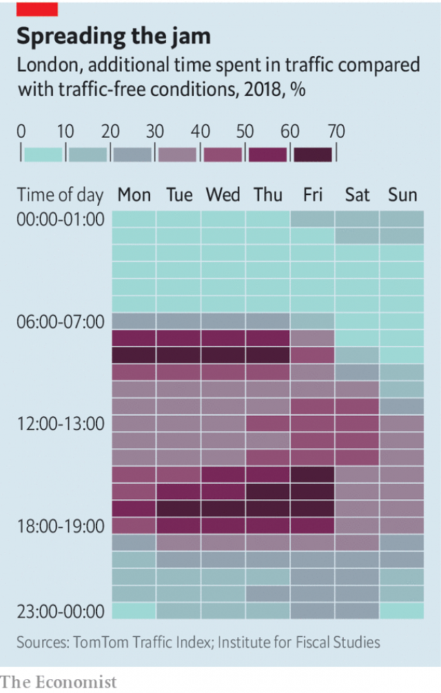

###### Running on empty

# As cars ditch fossil fuels, how can governments tax motorists? 

 

> print-edition iconPrint edition | Britain | Oct 12th 2019 

MOTORING TAXES raise nearly £40bn ($49bn) a year, or about 5% of Britain’s total tax revenue. Nearly 70% of that comes from duty on fuel, levied partly to deter consumers from using too much of the stuff. Yet as drivers take the hint and switch to electric and hybrid vehicles, the government faces a problem in the form of falling tax revenues. Economists are therefore rethinking how to tax motoring in a low-emissions future. 

On October 8th the Institute for Fiscal Studies (IFS), a think-tank, warned that over £33bn could all but disappear as cars become more fuel-efficient or go electric. Revenue from fuel duty has already dropped from 2.2% of GDP in 2000 to 1.3% today (partly because duty has fallen in real terms). This decline is expected to continue as the government aims for “net zero” carbon emissions by 2050. 

Ministers could simply raise money by taxing other things, of course. But taxes are also a way of discouraging behaviour that imposes costs on society, and driving has plenty of these. Beyond emissions, they include accidents, noise and congestion. The latter is much the biggest, accounting for 80% of motoring’s total cost to society, according to the IFS. Last year British drivers wasted an average of 178 hours in traffic, costing them £1,317 each in time that could have been spent on work or leisure. The cost to the economy was £7.9bn, according to INRIX, a transport analyst. 

 

To ease congestion—and raise some cash—the IFS recommends taxing drivers for entering busy areas. Drivers already pay a fee of £11.50 to enter a 34-square-kilometre zone in central London during peak times (see chart). This is estimated to have reduced congestion in the city by 20-30%. Other places have come up with even more sophisticated ways to tax drivers. In Singapore they are charged for where and when they go, their movements tracked by a gadget fitted in their car. Cities in Sweden charge motorists for entering different zones, with fees varying depending on the time of day. As taxes on fuel dry up, expect more levies on congestion. 

