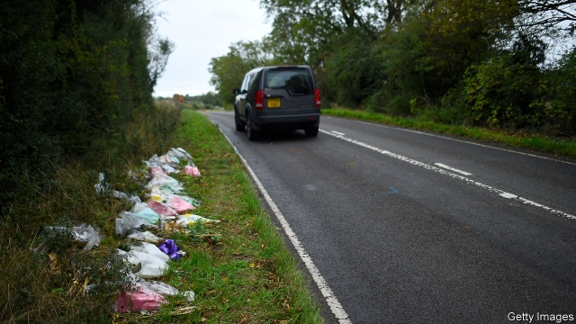

###### Protection racket

# British fury as an American cites diplomatic immunity over a fatal crash 

 

> print-edition iconPrint edition | Britain | Oct 12th 2019 

THE IDEA that diplomats should enjoy protected status in their host country is an ancient one, and the consequences of violating the custom can be bloody. The Mongols destroyed whole cities in response to the mistreatment of their envoys. In Britain, Parliament passed an act preserving diplomats’ privileges in 1708, following a fuss over the arrest for debt of Russia’s man in London. The young United States passed a similar act in 1790. Today diplomats everywhere and their families are protected under a convention signed in Vienna in 1961. 

But immunity was not designed for the sort of incident that has now caused outrage in Britain and friction with its biggest ally. On August 27th a teenage motorcyclist, Harry Dunn, was killed in a collision with a Volvo near an American intelligence base in Northamptonshire. The car’s driver, Anne Sacoolas, who had reportedly arrived in Britain only recently with her diplomat husband and three children, was allegedly driving on the wrong side of the road. At first, it seems, she co-operated with police—but then fled the country with her family. 

Mr Dunn’s parents have been appealing for her to return so that their son’s death can be properly investigated. They say they are prepared to travel to Washington, DC, to make their case. The prime minister, Boris Johnson, has said he does “not think that it can be right to use the process of diplomatic immunity for this type of purpose”. President Donald Trump promised his government would “speak to [Ms Sacoolas] and see what we can come up with so there can be some healing.” But he accidentally flashed his briefing notes which read, “the spouse of the US Government employee will not return to the United Kingdom”. 

Dodgy uses of immunity—to avoid anything from parking fines to charges of sexual abuse—hit the headlines from time to time. Driving offences crop up quite often. And diplomats do not always get away with it. In 1997, for example, Americans were outraged when a Georgian diplomat claimed immunity after causing a pile-up in Washington that killed a 16-year-old girl. Georgia lifted his immunity and he was jailed. 

Will British anger have any impact? America does not want to set a precedent. And it may want to keep a lid on the case if Ms Sacoolas’s husband was indeed a spy. Ms Sacoolas herself has reason to stay away: a possible prison sentence if she were convicted. Scarpering may be understandable, but it doesn’t stop the sense of injustice she leaves behind. 

