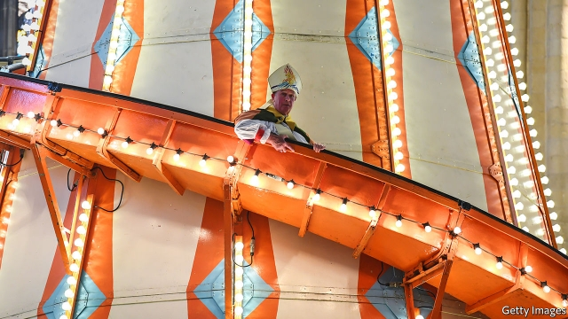

###### The root of all fun

# Cash-strapped English cathedrals become temples of enjoyment 

 

> print-edition iconPrint edition | Britain | Oct 12th 2019 

FROM CERTAIN spots in the north of England, you can half-close your eyes and imagine yourself in a medieval theocracy, where pilgrimage routes, mighty monasteries and the tombs of saints define the landscape. One such place is Durham, where a 1,000-year-old place of worship towers over the narrow streets of a small university town. 

As one of the best-loved of England’s 42 Anglican cathedrals, it attracts not only the devout but history buffs, movie-goers (it has featured in the “Harry Potter” films and the “Avengers” series), fans of choral singing and Asian globetrotters who count the number of UN-protected heritage sites they have seen. A handful, including devout Catholics and Orthodox, come to venerate the remains of Saint Cuthbert and the Venerable Bede, the forefathers of English Christianity. But even in this fairly successful enterprise, maintaining the hallowed stone fabric is a perpetual struggle. 

Durham is not among the eight cathedrals that charge an entrance fee. But the 700,000 people who visit every year are urged, in multilingual signs, to make a contribution of at least £3 ($3.70). This year-old appeal has increased visitor offerings by a third. Well-informed and polyglot guides explain the cathedral’s history and drive home its need for money. But with a payroll of 131 full-time-equivalent staff, supported by 750 volunteers, and a creaking fabric to maintain, neither the contributions of visitors nor the amounts offered by worshippers are anything like enough to cover running costs. Nor can an exhibition of medieval treasures, costing £7.50 to view, or a shop or a café, fill the gap. Only by ever more ingenious devices, ranging from cultural and recreational events to corporate sponsorship and flashy appeals to fund specific repairs, are cathedrals managing to stay in business. 

Andrew Tremlett, the dean of Durham cathedral, reckons his institution has kept the right balance between ancient dignity and 21st-century opportunism. When the “Avengers” film was being shot, the 350 people involved were required to fall silent several times a day when services were held. Whatever the disruption to worshippers, the filming enabled 150m people to enjoy footage of the ancient stonework. 

Other cathedrals have dreamed up even more eccentric ways to make use of the vast, numinous spaces under their control. An injunction by Archbishop Justin Welby, the head of the Anglican church, to “have fun in cathedrals” is being taken very literally. As a summer attraction, Rochester cathedral tucked a miniature golf course inside its soaring Norman arches. In Norwich, a helter-skelter was installed. This supposedly allowed visitors a closer look at a cleverly sculpted roof, but it was mainly a bit of entertainment, for grown-ups as well as children. Lichfield cathedral won higher marks for a light show entitled “Space, God, the Universe and Everything”, which involved transforming the entire floor into a lunar landscape. 

Durham, like other ancient temples including Salisbury and Winchester, is ultimately saved by its handsome endowments, including property holdings whose value has ballooned. These rising asset values allow the cathedrals to run a deficit in their current spending. Durham’s accounts for the latest financial year, published this week, show that its unrestricted-funds account (that is, money that is not tied to a particular purpose) ran an “unsustainable” shortfall of nearly £1m. But net assets have risen from £66m to £76m, and clerical whimsy seems to be doing well. The cathedral restaurant wins praise for its “mouthwatering array of puddings”, prepared for a display of “divine desserts”. 

For all their ingenuity, about half the Anglican cathedrals are under serious financial strain, as was revealed by an inquiry prompted by an acute crisis at Peterborough cathedral in 2016, which led to a round of lay-offs and the resignation of the dean. As a general rule, the newer the cathedral, the worse its financial problems. 

One example is Guildford, south of London, a red-brick structure completed only in 1961. Being in a prosperous area is a mixed blessing, its masters find. A couple of years ago it came close to closure, after plans to sell off land for development were rejected by well-organised locals who feared the loss of green space. 

A new system of governance for cathedrals is likely to come into force next year, after winding its way through the Church of England’s decision-making process. It will aim to reduce the risk of financial disasters like the one at Peterborough, while allowing cathedrals to exploit their assets. 

The Charity Commission, which regulates most other non-profit bodies, will gain a share of responsibility for cathedrals. The bodies which advise deans, known as chapters, will be expanded to include more lay people with financial expertise. But the task of regulation will be shared with the Church Commissioners, a discreetly powerful agency which manages the Church of England’s assets and pays for some cathedral staff. On some matters the Church Commissioners are likely to take a broader view of a cathedral’s remit than the rule-bound Charity Commission. 

The task, church insiders say, is to give free-ish rein to imaginative projects while curbing recklessness. As Mr Tremlett puts it, “The best cathedrals have been a story of excellence, innovation and creative learning, and we do not want a system of governance which quashes that.” ■ 

