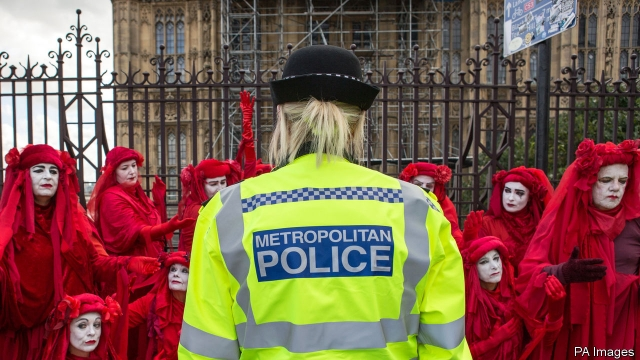

###### Power and protest

# How the anarchists of Extinction Rebellion got so well organised 

 

> print-edition iconPrint edition | Britain | Oct 10th 2019 

EXTINCTION REBELLION is back—and this time it’s political. The environmentalist group, which brought parts of central London to a halt for 11 days in April, has shifted its focus to 12 sites around Westminster, where its members began blockading thoroughfares on October 7th. With its makeshift buildings, meditation sessions and all-night dance marathons, the group has transformed Britain’s political centre. As dozens of mothers staged a mass “nurse in” with their babies on Whitehall, across town at Smithfield meat market a candlelit vigil was held for “all the animals who lost their lives”. Protesters plan to stay put for a fortnight. 

The police, who were caught off-guard in April, are this time better prepared. Some 580 arrests were made in just the first 48 hours, more than half the total made during the April rebellion. Over 80 tonnes of equipment have been seized. Grant Shapps, whose Department for Transport had protesters superglued to its doors, nonetheless complained that officers were just “standing around the edges”. 

They have their work cut out in policing what has become a formidably well organised protest group. Whereas the Occupy movement, a similar outfit, became bogged down in cumbersome “people’s assemblies”, Extinction Rebellion (XR) has adopted an approach called holacracy, a management theory developed in 2007 by Brian Robertson, an American software engineer. Holacracy claims to spread power across employees by ditching traditional management hierarchies in favour of semi-autonomous “circles”. In XR’s case, this amounts to what are in effect franchises of the main brand, which plan and carry out their own protests, following a loose set of rules set out by the main group. “The majority of the protests that happen this week I won’t know about,” says Sam Knights, one of the group’s strategists. 

As well as making the group more nimble, this has helped it avoid the internal divisions that often hamper protest movements. It helps that XR does not ask its members for a joining fee. Funding comes from the likes of Radiohead, a rock band, and Aileen Getty, an oil heiress. XR claims to have spent £1m ($1.2m) on this fortnight’s protests alone. 

Holacracy or not, hierarchies persist. In July a report by Policy Exchange, a right-leaning think-tank, identified two powerful groups within XR, known as the Anchor Circle and the Rapid Response Team (the latter has apparently since been replaced by a Political Circle and Organisational Circle). The report claimed that people in these steering groups had beliefs “rooted in the political extremism of anarchism, eco-socialism and radical anti-capitalist environmentalism”, in contrast to the diverse views of XR’s members. 

XR has tried to keep its public messaging moderate, deleting some of the overly political tweets that occasionally slip out on its Twitter account (“This movement is the best chance we have of bringing down capitalism,” read one in April). Nonetheless, those protesters chanting, “This is what democracy looks like,” might be surprised to learn that their group is being run in a not entirely democratic way. ■ 

