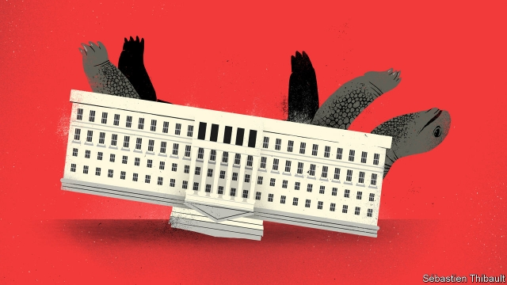

###### A rudderless region

# Northern Ireland reaches 1,000 days without a government 

 

> print-edition iconPrint edition | Britain | Oct 12th 2019 

FANS APPROACHING the Oval football stadium are greeted by a tall, dark-green stand. From seats at the top, supporters of Glentoran FC get a view of the gantry cranes of Belfast’s shipyard. But the rest of the stadium is much smaller, and at two ends there are no stands at all, giving the ground a peculiarly lopsided feel. The concrete is chipped, parts of the stadium are rusting and the crowd is occasionally drowned out by a plane landing at the airport next door. A banner provides a reminder of better days: “Money can run out,” it proclaims, above black and white images of local heroes, “but legends last for ever.” 

If Northern Ireland had a government, money might be more plentiful. Glentoran had been awaiting ministerial approval for a new £10m ($14m) stadium when the region’s devolved executive collapsed in January 2017. The stadium is one of a long list of projects—from a north-south electricity connection to the publication of gender pay-gap data—that have been put on hold in the absence of ministers. The executive was suspended after a precarious power-sharing arrangement between the Democratic Unionist Party (DUP) and Sinn Fein fell through. Since then, various attempts to bridge the gap have failed, with the parties irreconcilable over issues including gay marriage, abortion and the Irish language. On October 6th the region reached 1,000 days without a government. 

When countries like Belgium and the Netherlands go without a government during coalition negotiations, they appoint a caretaker one, points out a recent report by the Institute for Government (IFG), a London-based think-tank. The same is not true in Belfast. The lack of leadership comes at a sensitive time, with Northern Ireland the main sticking point in Brexit negotiations (see article). Cross-border institutions established under the Good Friday peace agreement in 1998 have been put out of action, impeding communication between Northern Ireland and the Republic, says Jess Sargeant of the IFG. Meanwhile, the absence of a government in Northern Ireland has given the DUP something of a monopoly over the debate in Westminster, she adds, since Sinn Fein MPs don’t take their seats on republican principle. 

With the Stormont Assembly not operating, no legislation has been passed. The British government has introduced new laws only when essential, such as for budgets. But Westminster’s backbenchers have not been as reticent. In July MPs hijacked a piece of procedural legislation to add amendments compelling Northern Ireland to allow same-sex marriage, begin to legalise abortion and to make payments to victims of the sectarian Troubles of 1968-98. These changes will be imposed if the devolved government is not restored by October 21st, which few expect to happen. 

Civil servants have had to be considerably less bold. Last year the Northern Irish high court overturned a plan to build an incinerator on the edge of Belfast, on the basis that a minister had already rejected the proposal, thus setting a limit on what bureaucrats could do in the absence of politicians. Afterwards, Westminster passed a law allowing Northern Irish government departments to make decisions in the “public interest” if they had to. But the civil service has not been able to act in areas where the public interest is unclear, such as raising tuition fees or increasing public-sector pay. 

Even where there is political consensus, change has been difficult to achieve. Outrage has been noisiest over the failure to respond to an inquiry into historical abuse in children’s homes, youth detention centres and other institutions. In 2017 the inquiry recommended offering compensation to victims, which has not happened. Unlike in England and Wales, legislation has not yet been passed to speed up criminal trials or to tighten the law on domestic abuse, despite the Northern Irish government’s stated intention to do both before it fell. 

Civil servants are acutely aware of the delicate role they must play. “A typical meeting with a politician, if I’m being absolutely frank, is them complaining about the things we’ve done and complaining about the things we haven’t done,” says one. In places where reforms had been set out by the executive before it collapsed, like those to reshape the health system, bureaucrats have some leeway. Most departments have no such luck, however. 

This is unfortunate in a region where public services are already in bad shape. According to the Nuffield Trust, another think-tank, a person in Northern Ireland is at least 48 times as likely as one in Wales to wait a year or more for health care. The education ministry has estimated there are 50,000 surplus school places in Northern Ireland, equivalent to a sixth of all places (closing schools is hard because of religious segregation). Infrastructure is poor and the economy relies on public-sector jobs. Even at the best of times, local officialdom does not seem up to the job, says Deirdre Heenan of Ulster University. 

In the absence of a government, it is difficult for the civil service to be held accountable unless someone takes it to court. The Northern Ireland Audit Office, a statutory watchdog, has continued to publish reports and senior officials have become more media-friendly (“It’s not the most comfortable thing in the world for a grey-suited civil servant,” admits one). But ministers cannot be asked questions, committees do not sit and Westminster has done little to keep tabs. With relatively little scrutiny of policies by outside institutions, this leaves a vacuum. 

Sir Jonathan Phillips, a former head of the British government’s Northern Ireland Office, has said that leaving the European Union without a deal would probably require bringing back direct rule from Westminster, owing to the volume of decisions that would have to be taken. Few would welcome that. Yet there is little hope of a return to devolved government any time soon. Problems will continue to mount as the civil service struggles to keep things going, putting more strain on the Good Friday agreement that has stood for more than two decades. Not everyone is upset about the stagnation, however. The Oval is old and needs a lot of work, admits David Brownlee, a 53-year-old Glentoran fan, as he approaches the stadium before a Friday-night match against Cliftonville FC. “But I love the wee ground as it is.” ■ 

