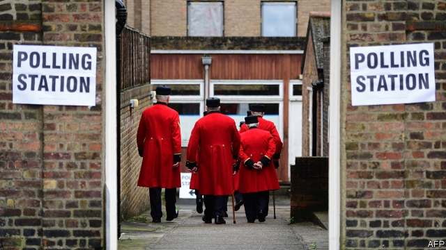
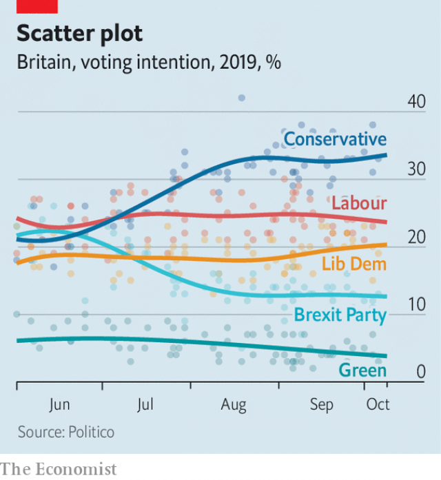

###### Psephology

# The perils of polling Britain’s coming election 

 

> print-edition iconPrint edition | Britain | Oct 12th 2019 

IN DOWNING STREET polls can trigger delight or despair, depending on which one its occupants look at. One pollster, Opinium, suggests the Conservatives are sitting on a handsome 15-point lead. Survation, a rival outfit, gives the Tories a lead of just three points, within the margin of error. Others are scattered between these extremes (see chart). The potential outcomes range from a hung parliament to a stonking Conservative majority. Someone is calling it badly wrong. Why has British politics become so hard to predict? 

For starters, voters are more politically promiscuous than they used to be. In the elections of 2010, 2015 and 2017, only half of voters supported the same party each time, according to the British Election Study, which has looked at every general election since 1964. About four out of ten voters switched parties in 2015. When the next election came in 2017, just two years later, one in three changed. By comparison, between 1964 and 1966 only 13% of voters did. 

 

When voters change their minds they often dabble with smaller parties, which makes things more unpredictable still. Voters see the likes of the UK Independence Party and the Greens as a fling, rather than the start of a long-term relationship. Between 2015 and 2017, 78% of UKIP voters defected. Among the Greens, nearly all did, with 88% of the party’s 2015 voters deserting it in 2017. Tracking these voters as they bounce around the political spectrum is a nightmare for pollsters. On top of this, new cleavages on everything from social liberalism to the future of the union to Brexit now compete with the traditional left-right economic divide. 

This newfound love of switching party is not taking place against a calm political backdrop. A series of electoral shocks has blown British politics off its steady course, explains Jane Green of Oxford University. First came a steep increase in immigration. Then the financial crisis. After that, Britain got its first coalition government since the second world war. Scotland had an independence referendum in 2014, before the Brexit referendum arrived in 2016. Voters are dazed. 

Another shock may be coming. At the end of this month Britain could leave the European Union with a deal, fall out without one or, most likely, delay its exit yet again. This buffet of options provides another problem for pollsters. Asking people how they would vote after, say, a no-deal Brexit, or an extension granted after a case in the Supreme Court, is akin to asking someone what they will want for dinner in six weeks’ time. Their tastes may be the same, but the circumstances are close to unknowable. 

Asking people how they will vote in the future may be difficult, but so is trying to make them honest about who they backed in past. At the start of the 1990s, pollsters had to contend with “shy Tories”, people who would not admit to backing the Conservatives outside the privacy of the voting booth. Now they must deal with “shameful Labour”, people who say they did not vote for Jeremy Corbyn’s party in 2017, when in fact they did. To work out where voters are heading, pollsters need an idea of where they are coming from. 

A big range of results is not necessarily a bad thing. Few pollsters predicted David Cameron’s majority in 2015. Back then, the problem was one of “clustering”, with polling companies reluctant to be outliers. Now they are more ready to stand by their results, even at the risk of being wildly wrong. After all, “it isn’t science”, points out Kevin Cunningham, a pollster who lectures at Technological University Dublin. But it is more complicated than it used to be. Sir David Butler, the 94-year-old doyen of Britain’s pollsters, who studied every British election between 1945 and 2005, summed up the mess: “I have never felt more totally confused.” ■ 

