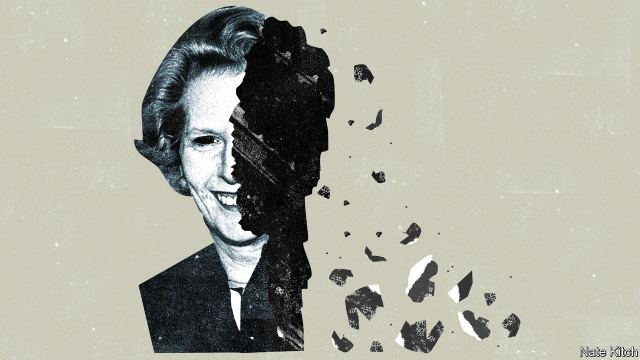

###### Bagehot

# The sad decline of Thatcherism 

 

> print-edition iconPrint edition | Britain | Oct 12th 2019 

ON OCTOBER 7TH a flock of Thatcherites made their way to Banqueting House to celebrate the publication of the third and final volume of Charles Moore’s biography of the great prime minister. The heavens rained cats and dogs. Extinction Rebellion protesters blocked the Mall with makeshift encampments and drumming circles. Rumours of the failure of the latest round of Brexit negotiations filled the air. But nothing could deter our intrepid heroes from feasting on champagne and canapés. 

Boris Johnson was the most intrepid of the lot. He had to make the journey from Downing Street by underground tunnel to avoid being assaulted, verbally if not physically. He praised Mr Moore, his former boss, for displaying the lust for accuracy that is the mark of a great Daily Telegraph journalist. He praised Thatcher for being right about Europe. And he advised the pierced and tattooed “crusties” in the streets to buy the book and learn about the feminist and green warrior who changed the world for the better. 

There is no doubt that Mr Moore’s three-volume biography, 22 years in the making and almost 3,000 pages long, is one of the great political works of our time. Mr Moore has secured his position in perpetuity as the archbishop of Thatcherism. But whether the faith that he presides over survives as anything more than a set of empty incantations is more questionable. 

Thatcherism combined four elements: support for free enterprise; assertive nationalism; a commitment to strengthening the state by using quasi-market mechanisms to increase efficiency; and a belief in Victorian values, in the form of hard work and civic responsibility, which both tempered and underpinned the belief in enterprise. These four principles were accompanied by an establishment-bashing, “they don’t like us, we don’t care” attitude. 

This anti-establishment attitude remains strong. Some ultra-Brexiteer Tories are happy to damage both the Crown and the courts in their determination to take Britain out of the European Union. But what was once a coherent philosophy has decomposed into its component parts, many of which are decomposing in their turn. “Priti Patel”, the unimpressive home secretary, “is all we have left of a once-mighty intellectual movement,” jokes one minister, as he helps himself to another sliver of salmon sashimi. 

Some of Thatcher’s ideas have become so mainstream that they are no longer distinctive. Using market mechanisms to improve the operation of the state has been adopted by so many different countries and parties that people forget its origins. Other ideas have become shop-soiled. In the wake of the financial crisis it is impossible to argue that deregulation is the answer to everything. Still others, like restoring Victorian values and creating a property-owning democracy, have failed. The proportion of people who own individual shares has halved since the early 1980s and among the young the rate of home-ownership has plunged. And some Thatcherite ideas have even backfired. Thatcher contributed to Britain’s problem of over-centralisation with her war on local government, and poisoned the well of privatisation by selling off natural monopolies in ways that favour investors over customers. In Tony Blair’s day, Thatcherites reconciled themselves to opposition by arguing that they had forced Labour to come to terms with capitalism. Today the Labour Party is run by people who spent the 1980s arguing that Michael Foot was insufficiently left-wing. 

The biggest problem with Thatcherism is that its two most important components—belief in free enterprise and belief in nationalism—are at war with each other. Thatcher was a nationalist who believed that the best way to reverse Britain’s decline was to unleash the spirit of enterprise. Freed from the burden of rules and regulations, entrepreneurs would restore Britain to its 19th-century glory. But a striking number of the businesses that took advantage of the free market were foreign. Britain is now the Wimbledon of global capitalism, more successful at hosting world-class players than producing them. 

The battle between business and nationalism is at its most intense with Brexit. Thatcher was the architect of the single market, which tilted the EU towards liberalism. But in her later years she became increasingly critical of the European project and fanned the flames of Euroscepticism, first with her Bruges speech of 1988 (when she warned of a “European superstate”) and then with a fusillade of behind-the-scenes interventions. The tension she stoked is now tearing the Tories apart. Some self-identified Thatcherites argue that the EU is the world’s biggest free-trade area and that a retreat to narrow-minded nationalism would be a disaster. Others say that the EU is a restraint on trade and that national sovereignty would allow Britain to be more global. And still others maintain that Britain needs to put up barriers in order to “take back control” of its destiny. Most big companies oppose Brexit. But some buccaneering capitalists are its biggest cheerleaders. 

The war over Thatcher’s legacy looks as if it will shift her party in a decidedly un-Thatcherite direction. Her Conservatives were all about dynamism and shaking Britain out of its comfortable ways by embracing risk. Some of that spirit remains with the Brexiteers. But to get Brexit done, the party is being forced to woo voters whose overriding desire is for security. The great theme of the recent Tory conference was providing reassurance—putting more bobbies on the beat, building more hospitals, raising the minimum wage and otherwise spraying money all over the place. The target voter is no longer the upwardly mobile striver but the left-behind northerner, and “get on your bike” has been replaced by “climb aboard your mobility scooter”. Thatcherism has not just decomposed. It is in danger of giving birth to its opposite. ■ 

Listen to an interview with Thatcher's biographer, Charles Moore, at economist.com/charlesmoore 

