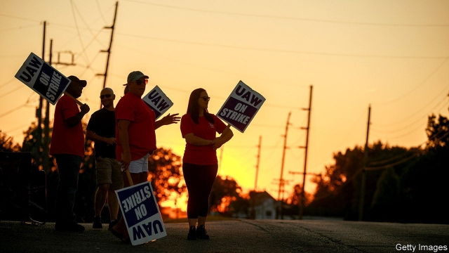

###### Strike force

# A strike at General Motors is hitting its suppliers hard 

 

> print-edition iconPrint edition | Business | Oct 12th 2019 

AMERICA’S BIGGEST carmaker is in the grip of the longest industrial action it has suffered in decades. In 1970 a crippling strike called at General Motors by the United Auto Workers (UAW), the industry’s main labour union, dragged on for 67 days. On September 16th UAW workers at its plants across North America once again walked out. Their chief gripes include GM’s use of temporary workers, health-care benefits and product allocation at various plants. Although the company is highly profitable, its boss, Mary Barra, intends to reduce costs dramatically in order to invest more in electric vehicles. A sudden breakthrough is possible even in such heated negotiations. But as The Economist went to press on October 10th, the strike looked poised to reach the one-month mark. 

GM is already feeling the impact. It makes about 2m vehicles a year in its American factories, which were shut down immediately by the walkout. Most GM plants in Canada and Mexico, which make roughly another 1m vehicles a year, were forced to shut a few days later. By the reckoning of JPMorgan Chase, a bank, this lost output has already slashed GM’s profits this year by over $1bn. It is now costing the firm roughly $82m in earnings each day. 

A healthy cash cushion of nearly $20bn at the end of June should help GM stay afloat. The firm should be able to boost production quickly after the strike ends. The same cannot be said for most of its suppliers. As a consequence, these companies have been hit much harder. 

The outlook for North American makers of car parts was darkening before the GM strike. Moody’s, a credit-rating agency, now forecasts that their earnings before interest, taxes and amortisation will decline by 9.7% this year compared with 2018—a much steeper fall than it predicted at the start of the year. The main reason is its expectation that global car sales will droop by 3.8% this year. 

A prolonged strike will make things worse. Adam Jonas of Morgan Stanley, an investment bank, calculates that by day 22 the strike had already cost suppliers around $3.7bn in total revenue. Every day it goes on they lose another $170m. 

In dollar terms, the hardest hit company is Magna, a Canadian maker of drivetrains and other complex systems with a market capitalisation of $15bn. It is losing $27m in earnings before interest and taxes a week. Smaller suppliers are even less able to withstand shocks. Lear and American Axle, two domestic producers of seats and driveshafts respectively, are losing $16m-17m each a week, according to JPMorgan Chase. Measured as a share of market capitalisation, the hit to American Axle is more than ten times that to bulkier Magna. 

In defending GM’s workers the UAW may be hurting others who are worse off as it is. The Centre for Automotive Research, an industry think-tank, puts the average total labour cost (including benefits and profit-sharing) at GM at $63 an hour, above Ford’s $61, and $55 at Fiat-Chrysler. Suppliers, especially smaller ones, pay far less. 

Dale Rogers, a supply-chain expert at Arizona State University who grew up near Detroit, still has family working at GM. For every worker at a car plant owned by the big carmakers and affected by a strike, he recalls, the rule of thumb used to be that ten workers at suppliers in neighbouring cities like Toledo and Lansing would suffer. “When Detroit catches a cold, Toledo gets pneumonia,” he says, invoking a local adage. The rise of vehicle production in Tennessee and other parts of the American south means that Motor City no longer dominates carmaking. Even so, there is still truth in this old Michigander saying. ■ 

